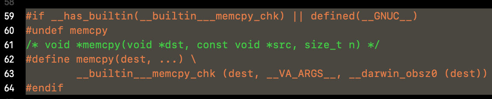
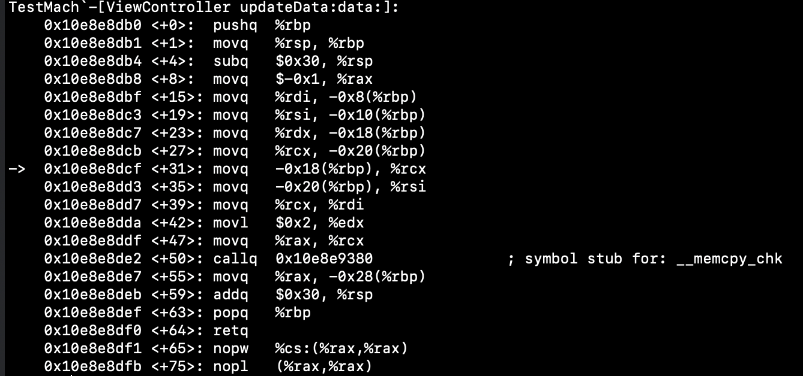
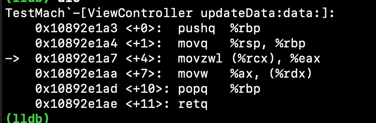

## 前言

今天被一位北美的同事的`comment`了一个`memcpy`使用的代码，大致如下，在解析数据时把数据段的2个字节的数据长度`memcpy`到`NSInteger *`上:

```objective-c
- (void)updateData:(NSInteger *)dataLength data:(uint8_t *)data {
    memcpy(dataLength, data, sizeof(uint16_t));
  	...
}
```

这位同事的`comment`如下:


大意是这样使用`memcpy`不安全并且性能不好，应该采用他建议的方式，那么这里到底有什么门道呢？

<!--more-->

## memcpy

`memcpy`是`string.h`中的声明的一个`Libc`库函数，作用是把第二个参数的内存，按第三个参数的长度拷贝到第一个参数。

```c
void	*memcpy(void *__dst, const void *__src, size_t __n);
```

在`drawin`系统中，则是采用了一个编译器内置函数``__builtin___memcpy_chk``来替换掉了`memcpy`:



首先可以学习一点的是这种用宏命令文本替换非常实用，举个例子，假如不希望工程的`NSLog`或者`printf`打印信息除了符号替换还可以通过宏命令替换的方式干掉:

```c
#if RELEASE
//避免redefined
#undef NSLog
//直接干掉
	#define NSLog(format, ...)
//替换成自己的打印
	#define NSLog MyLOG
#endif
```

总之可以知道是把`memery`替换成了内置的``__builtin___memcpy_chk``，那么这个编译器内置函数是干什么呢？

`gcc`和`clang`等等编译器都有一些`builtin`函数，类似宏命令，会在编译时把原来的函数替换掉，以到达优化。宏命令通常是文本替换，而内置函数通常是指令级别的替换，能够做很多优化以及避免函数调用的开销等等。

`clang`所有的内置函数可以在`Builtins.def`中找到。首先下载[clang源码](https://github.com/llvm-mirror/clang)，先看看`Builtins.def`中的声明，这里只关注``__memcpy_chk``:

```c
BUILTIN(__builtin___memcpy_chk, "v*v*vC*zz", "nF")
```

``Builtins.def``中声明了所有的内置函数，这个`BUILTIN`宏的第一个参数是函数名，第二个参数为函数的参数类型，第三个参数为函数的描述，`nF`表示这是一个`Libc/libm`的函数，并且没有`throw`。更多信息感兴趣的话可以细看一下。

打开`bstring.h`，可以看到对`memcpy`更多的描述。而且非常巧`clang`正好就拿`memcpy`来作为内置函数的例子：

```c
#ifdef VARIANT
//声明__memcpy_chk函数
#define __memcpy_chk BUILTIN(__memcpy_chk)
void *__memcpy_chk(void *restrict s1, const void *restrict s2, size_t n,
                   size_t destlen);
//把memcpy替换成buildin___memcpy_chk
#define memcpy(a,b,c) __memcpy_chk(a,b,c,(size_t)-1)
#else /* VARIANT */
#define memcpy BUILTIN(memcpy)
void *memcpy(void *restrict s1, const void *restrict s2, size_t n);
#endif /* VARIANT */
```

通过反汇编可以看到确实在运行时call的是`__memcpy_chk`这个函数（此时编译器优化并没有开启）：



那么为啥要替换成``__memcpy_chk``呢？

因为memcpy实际是一个很不安全的函数，可能导致踩内存和`overlap`等问题，因此`LLVM`（`GCC`）采用了内置函数``__memcpy_chk``来包装这个方法，会在编译时进行一些检查，编译器前端会在`IDE`上通过警告的方式提示用户使用有误，在`bstring.h`这个例子中可以看到很多使用它的情况，并且会产生的各种各样警告信息。所以内置函数除了提高性能，也可能是是做一些安全保护。

## 两种实现的区别

先思考一个问题，程序在运行时CPU是如何知道变量长度的，怎么知道如何取值的？

这个问题其实很傻。。因为CPU是不需要知道变量长度的。对于程序控制器来讲，他就是一个没有感情的无限循环机器。。。根据汇编指令一条条取指令然后执行，然后取下一条指令然后再执行。对于8字节的变量取值时可能就是一个`movq`，对于1字节的变量可能就是一个`movb`，2个字节的话就是一个`movw`。它只是按着指令一条一条执行。

所谓变量长度只是编译器的魔法，编译器在解析上层语言时会根据变量的类型转换成各种各样的指令，例如按照同事说的写法:

```c
    *dataLength = (NSInteger)*(uint16_t *)data;
```

编译器会转换成什么样呢(Debug无优化下):

```assembly
		...
    0x10fbb9de4 <+20>: movq   -0x20(%rbp), %rcx //先取出data到rcx（拷贝的是指针8个字节）
    0x10fbb9de8 <+24>: movzwl (%rcx), %eax     //拷贝rcx的两个字节到eax的4个字节上
    0x10fbb9deb <+27>: movl   %eax, %ecx  //把eax的4个字节转移到ecx
    0x10fbb9ded <+29>: movq   -0x18(%rbp), %rdx //dataLength指针转义到rdx上
    0x10fbb9df1 <+33>: movq   %rcx, (%rdx)  //把rcx前面得出的结果转移到dataLength指向的地方
```

首先可以看到一点，原来的`call`（甚至第一次可能还需要动态绑定）都没了，完全变成了数据的转移和拷贝，那么`faster`是必然的。

并且由于`uint16_t *`显式类型转换的原因，这里确保只拷贝2个字节，并且由于`dataLength`的类型修饰为`NSInteger`所以拷贝到4个字节中（可以理解就是取出两个字节放到一个4个字节的整数中）。所以数据肯定是没问题的。这里的精华就在于这个`uint16_t *`。

假如去掉显式的`uint16_t *`会怎么样，可以看到去掉后实现变成了下面这样:

```assembly
    0x10836dde4 <+20>: movq   -0x20(%rbp), %rcx
    //去掉的话可以看到，默认是只拷贝1个字节到eax的4字节的
    //那么当数据长度的值是一个大于1字节的数字时, 这里就会出问题了
    0x10836dde8 <+24>: movzbl (%rcx), %eax 
    0x10836ddeb <+27>: movl   %eax, %ecx
    0x10836dded <+29>: movq   -0x18(%rbp), %rdx
    0x10836ddf1 <+33>: movq   %rcx, (%rdx)
```

但是我`memcpy`也是只拷贝了2个字节啊？为啥我就不安全呢？

那是因为字节序，同事提出这种方式相当于把2个字节的数值转换成4个字节的数值，无论大小端，会自己适配好内存布局。

但是`memcpy`只是从起始字节开始拷贝，假如数据长度为`0x10`，`dataLength`初始化为`0x00000000`，则在小端模式下`memcpy`之后:

```c
*dataLength内存为: 10 00 00 00
*dataLength = 0x00000010
```

可见是没有毛病的。但是如果是在大端模式下呢:

```c
*dataLength内存为：10 00 00 00
*dataLength = 0x10000000
```

显然数据就有问题了。

所以它说这里不安全，由于`arm`和`x86`都是小端模式，所以这个数字在进行`memcpy`时会这样并不会出问题，假设是跨平台层的，就可能会导致问题。


## 编译器做的优化 

我们都知道LLVM的优化是很牛逼的，前面都是在没开编译器优化的情况下时进行的反汇编，如果把编译器优化设置为`-Os`呢:



牛逼。。。直接把`memcpy`干没了，直接操作寄存器转移2个字节过去就了事了。。。

那么是不是意味着同事说的代码没啥意义呢?

默认`debug`下是不开编译器优化的，更重要的编程习惯与思考。而且至少在打`release`包时可以编的更快快一点。。。

而且知道了计算器是如何取内存的，还可以有更多的应用场景，例如当我想计算具有`float`变量的类的`hash`时，float变量是无法进行移位的，那么就可以通过取内存的原理，把4个字节的数值都取出来然后转成一个`int`型变量，就可以做位移操作了。当然啦你也可以采用`memcpy`。

```c
float floatValue = 1.0001;
int intValue = *(int *)&floatValue
```

## 参考资料

https://github.com/llvm-mirror/clang

https://my.oschina.net/guonaihong/blog/506102 （mov指令详解）

