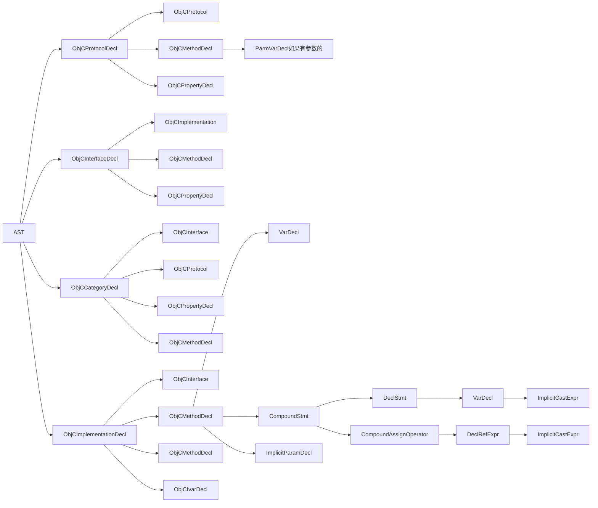
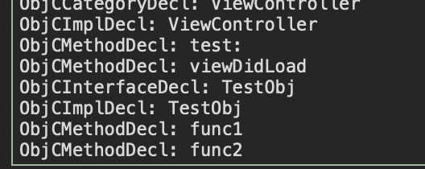
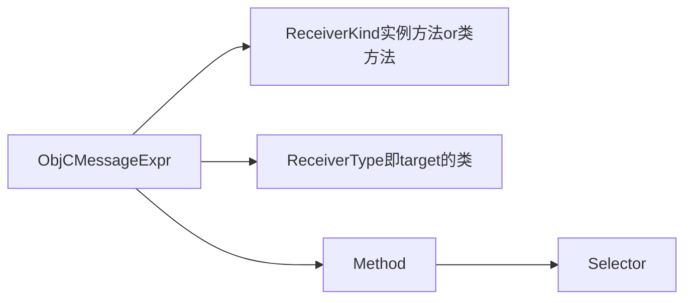
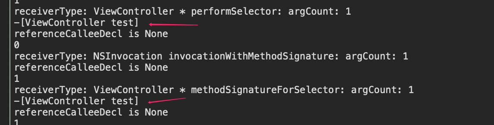
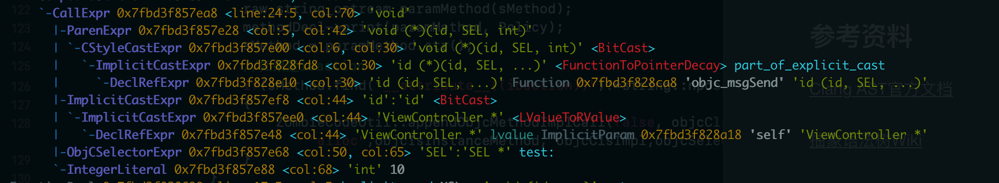

## 前言

OC对象的方法由于运行时系统的存在，不会被Strip掉，而是编译成汇编代码放入程序段，因此找到并去除未使用代码也可以有效的减少包体积。本文对2种查找未使用方法的方案进行了讲解。

<!--more-->

## 方案

一般来说有三种思路：

1.静态扫描

此种方案参考了[戴铭老师的Demo](https://github.com/ming1016/SMCheckProject)，由于很久未更新，可能需要修改一些`buildSetting`,可以直接采用我修改后的[fork版本]()，已经适配了`Swift5`并且可以导出文件。这一种思路主要是实现一个简易的语法解释器，分析出工程中所有的OC类及方法。然后在解析出所有存在的方法调用，取差集找出未使用的代码。

2.基于Clang插件

此种方案参考了[王康老师的Demo](https://github.com/kangwang1988/XcodeZombieCode)。实现了一个基于Clang的语法解析插件。

### 静态扫描

对工程进行深度优先遍历，然后解析所有的类的方法。其中有一些比较麻烦的点，例如宏命令和动态调用等等。尤其是宏命令，由于我们的工程中采用了大量较为复杂的宏命令，解析比较复杂，需要对编译原理的词法分析语法分析有深刻的认知。记录下所有可能的方法调用。然后取差值找出未使用的方法。静态扫描核心部分在于Tokens流解析后的语义分析，这里需要实现一个简易的解析器。

静态扫描的时间成本比较高。不过对于时间成本问题，可以考虑每次扫描后在记录每个子工程的commit点。然后每次只扫描diff的问题，这样可以大大减少每次扫描的时间。

静态扫描的优点是独立于工程，只需要一个文件夹入口即可进行静态扫描，可视化界面使用也比较方便。而且由于记录了未使用代码的位置，还可以利用工具一键注释。

静态扫描的核心在于：

1.找到所有的方法:

找到`@interface`和`@end`之间，`@implementation`和`@end`，然后根据`-`和`+`解析所有的实例方法和类方法，以及`Protocol`。把方法加入到类的列表。

2.识别被使用的方法

在解析时把所有解析到的`method`定义都加入到未使用列表。在解析方法内容时每引用到一个方法，便将方法加入到使用列表。这里使用的规则是`[xxx func]`这样的显式调用。

所以可以大概简化为找到一个`@implementation`和`@end`之间的部分，然后再依次找到每一个方法块进行解析。最复杂的地方在于解析方法内部。由于我们只在乎方法调用，因此不需要像`AST`一样弄懂意思，只需要匹配[]这样的OC方法调用和`Selector`这样的关键字。

但是有几个局限性：

1.动态调用 例如`performSelector`，`NSInvocation`甚至是直接的指针调用等等。（针对特定的解析）

2.DSL语法。在MSDK的代码中有一些DSL的封装的，还有很多封装的框架实现React效果，这些都不是显示的调用。

3.类方法可能的调用方式为UIColor.redColor这种等等。(特定的解析)

4.NSThread，NSTimer，KVO等等非显示的调用。（可以对特定关键字进行解析）

5.IBuilder拖线的类与方法，这一点也是无法分析到的。（此种方法具有``__attribute__((ibaction))``属性）

### 基于Clang的插件

`Clang`在编译时会解析代码转成具有含义的`AST`语法树，站在巨人的肩膀上总是更方便的，在此种方案下可以把避免手动解析的过程，而是直接把重心放在如何利用AST结点上。无论哪种方式要找到未使用的方法，则要找到全部的方法再减去所有被使用的方法，最终得出即为未使用的方法。

其实有没有想过Xcode中为什么能够查看方法的`Callers`和`Callees`，就是因为Clang做了解析并且保存了下来。因此通过拿到`callees`就可以知道哪些方法被调用了。

因此方法的核心在于解析类的方法。

### 语法树

先理解一下解析OC代码时语法树的大致结构，为了方便页面显示做成了从左往右的树形结构:



遍历AST通常需要通过`RecursiveASTVisitor`，它是一个深度优先遍历AST的工具。在生成完AST时，需要把ASTContext传递给vistitor：

```c
class MyASTConsumer : public ASTConsumer
{
private:
    MyASTVisitor visitor;
  //当AST生成之后会回调这个方法
    void HandleTranslationUnit(ASTContext &context) {
      //把ASTContext传递给visitor
        visitor.setContext(context);
      //把AST根节点传递给visitor，然后从这个结点开始先序遍历
        visitor.TraverseDecl(context.getTranslationUnitDecl());
    }
};
```

在visitor中每解析到一个定义都会回调这些方法:

```c++
bool VisitDecl(Decl *decl) {}
```

对于一个.m文件来说，可能就是头文件展开之后的解析的`interface`，`porotocol`。最终才是`implentation`（因为这几个在AST树中都是平级的），在这几个Decl之后是子树的遍历，比如`ObjCMethodDecl`，`ObjCPropertyDecl`等等更低层级的子树。

### 全部的方法

因此如果我们只在意方法，则只需要hook住`implentation`的Decl即可。再此之后的method才是这个类的方法。还有一种特殊情况是一个.m文件中有几个类的实现。 不过这种情况依然是在另一个类的`implementation`之后的子定义才是其方法。因此为了作区分，可以在解析到`ObjCImplDecl`时保存下当前的类名，然后在解析到`ObjCMethodDecl`时和当前的类结合形成`-[ViewController viewDidLoad]`这样的唯一表达形式：



### 显式调用的方法

经过这么一番处理就可以拿到所有的类的方法。拿到类的方法很容易，麻烦的找到有没有caller，如果有则表明该方法被调用了，caller分为两种，一种是显式的调用，一种是隐式的调用。这必须分析OC代码的调用，好在visitor会在解析语句时回调一下接口，同Decl一样，Stmt也是一个模板类，我们只关注OC方法的调用，因此只需要判断``ObjCMessageExpr``：

```c++
bool VisitStmt(Stmt *s) {
  if(isa<ObjCMessageExpr>(s)) { 
//    dosomething...
  }
}
```

这里需要先明确``ObjCMessageExpr``包含哪些东东:



也就是说通过OC语句可以拿到target和selecotor，再结合根节点的`ObjCImplDecl`回调中获取的当前的类，就知道什么类调用了什么类的什么方法。这样就可以拿到显示的调用关系了。由receiverType和calleeSel就可以确认到唯一的方法：

```c++
//获取调用的接受者是类方法or实例方法
ObjCMessageExpr::ReceiverKind kind = objcExpr->getReceiverKind();
//获取callee
string calleeSel = objcExpr->getSelector().getAsString();
//获取调用者的类型
string receiverType =objcExpr->getReceiverType().getAsString();
```

但是所以如果receiverType并不是一个显示的类（类对象）则也是不行的，比如在开发中使用的[self.delegate xxxFunc]，和大量的mock类例如` id <XXXProtocol>`，编译器并不能拿到真正的类。遇到这种情况receiveType是均为:

```c
receiverType: id<TestViewControllerProtocol>
```

所以如果receiverType包含了`<。。。>`需要单独处理，比较好的解决办法就是不处理，直接在前面的方法解析时判断它的protocol链中有没有，如果有就认为方法已经被使用了。

### 隐式调用的方法

上面讲的都是以msgSend方式显式调用的方法，然而实际开发中还有大量显式调用的方法，隐式调用包括:

1.selector类的调用。performSelector系列方法，和NSInvocation。

2.target，action类方法，例如NSTimer，NSTheard，UIResponse等等需要传入Selector的方法。

3.Notification。

4.KVO。

5.openURL系列的调用。

6.类方法直接通过xxx.func这样的调用。

7.一些第三方库等的动态调用。

<b>如果我们找一下规律的话其实是可以省去很多工作的，比如前两种虽然调用形式很多，本质上都离不开selector。那么实际应该在`@selector`和 `NSSelectorFormString`上做文章。</b>

所以这里需要关注的是``ObjCSelectorExpr``。所以实现应该是这样的:

```c++
            //遍历参数
            for (int i = 0; i < paramCount; i ++) {
                Expr *argExpr = objcExpr->getArg(i);
                if (!argExpr) {
                    cout << "argExpr is None" << endl;
                    continue;
                }
                
                //如果某个参数是ObjCSelectorExpr说明通过selector调用
                if (isa<ObjCSelectorExpr>(argExpr)) {
                    ObjCSelectorExpr *selExpr = (ObjCSelectorExpr *)argExpr;
                    //说明是非显式对象调用，应该是通过delegate，这种直接放在后面遍历类的delegate
                    if (!objcExpr->getReceiverInterface()) {
                        cout << "非显式调用: " << receiverType << selExpr->getSelector().getAsString() << endl;
                    }
                    //显式调用，可以直接加到使用的方法的列表中
                    else {
                      //这一这里的sel要取@selector的，而不是本身OC调用的
                       //如果是timer，Notification，NSTread
                        string cls = interfaceDecl->getNameAsString();
                        if (strstr(cls.c_str(), "NSTimer") ||
                            strstr(cls.c_str(), "NSNotificationCenter") ||
                            strstr(cls.c_str(), "NSThread") ||
                            strstr(cls.c_str(), "CADisplayLink")) {
                            cls = ObjcImplementationName;
                        }
                        string sel = selExpr->getSelector().getAsString();
                        string methodID = IsInstanceMethod ? "-" : "+";
                        methodID += ("[" + objcExpr->getReceiverInterface()->getNameAsString() + " ");
                        methodID += (selExpr->getSelector().getAsString() + "]");
                        cout << methodID << endl;
                    }
                }
            }
```

试验一下`performSelector`和`NSInvocation`如下:



可以看到即使是通过performSelector和NSInvocation调用的也能找到调用的selector。（<b>当然这里只针对显式调用了selector的实现，如果动态组装的字符串暂时就不管了，比如MSDK的代码中有些模块全是这样的动态调用，这种可以直接把类加入白名单。</b>>）。

如此一来只需要简单几行代码就可以把绝大多数的通过selector动态调用的方法给hook住了。

如此一来只剩下一些KVO和一些第三方库的调用，以及类默认的`new` ，`alloc`，`init`等等。这些我们可以通过注入白名单来进行检查。

还有一种特殊的情况是显式调用msgSend，我们输出一下AST可以看到:

```shell
xcrun -sdk iphoneos clang -arch arm64 -Xclang -ast-dump -fsyntax-only -F UIKit ViewController.m
```




还是可以按照规则找到`DeclRefExpr`和`ObjCSelectorExpr`。不过由于我们的工程里还没有这样使用，暂时先不考虑了。

### 数据处理

经过分析大致已经确定了解析的逻辑，之后就是数据处理。 由于解析的过程没解析一个Object文件都会创建一个AST语法树。所以需要利用静态变量来把整个编译过程中的数据保存下来，需要保存遍历到的所有类，Protocol，使用到的方法和未使用到方法。

由于在递归AST的过程中，可能只知道当前类的父类符号，或是protocol符号。因此需要把这些信息保存到对应的类里面，所以我们封装`JClass`，`JProtocol`，`JMethod`类来保持过程中发现的数据。类和protocol都可以通过名字作为唯一标志，method则需要通过类和selector，以及`-`还是`+`共同组成唯一标志(Protocol中的方法，就以``-[XXProtocol func]``这样的形式作为id 吧，只不过在判断时需要判断的是selector)。

每一个ASTContext解析完，可以把数据更新写入到本地文件。当build结束时本地文件已经写完了数据。此时写入的数据就是我们将要处理的数据。

由于实际的数据解析方案各有不同，本文给出一个解析[Demo](https://github.com/joey520/Blogs/tree/master/包体积优化/未使用代码检测)。基本可以解析出大多数未被使用的方法，可以根据实际业务的需求进行修改。

## 参考资料

[Clang AST官方文档](http://clang.llvm.org/docs/IntroductionToTheClangAST.html)

[抽象语法树Wiki](https://en.wikipedia.org/wiki/Abstract_syntax_tree)

[王康：Clang检查未使用代码](https://mp.weixin.qq.com/s?__biz=MzUxMzcxMzE5Ng==&mid=2247488360&amp;idx=1&amp;sn=94fba30a87d0f9bc0b9ff94d3fed3386&source=41#wechat_redirect)

[戴铭：静态扫描工程未使用代码](https://github.com/ming1016/SMCheckProject)

[How To write RecursiveASTVisitor](https://clang.llvm.org/docs/RAVFrontendAction.html)


