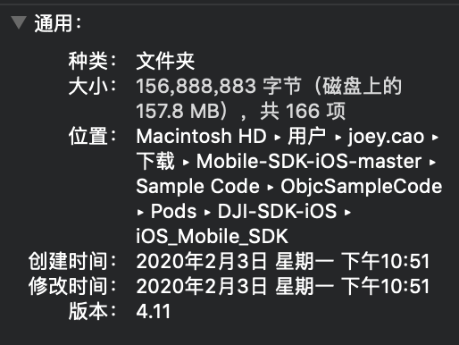
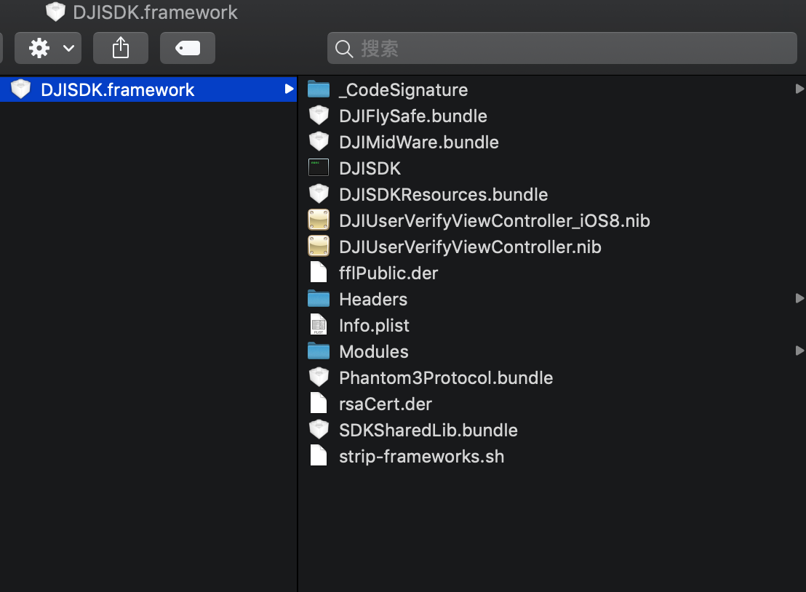

## 前言

这个春节真是有够长，蹭着没事来做一次MSDK包的优化，MSDK包太大已经被吐槽无数次了，前一段时候才做了把一些限飞数据库资源等变成可选项`bundle`让用户进行下载，甚至把一些功能打包成动态库用于动态加载，则不需要这些功能的用户可以不引入。

但是这还远远不够。当前MSDK编译出来的framework为159.6MB。看看优化后到底能缩小到多少。

<!--more-->

## 分析

先看看`DJISDK.Framework`有哪些东西吧:

可以看到有几个除了动态库`DJISDK`还有几个`bundle`存放着一些资源文件。

### 去掉无用的类

要去掉无用的类可以通过静态扫描，也可以同`mach-O`做检查，后者效率更高，而且具有通用性，因此采用后者，具体实现可以参考[文章]()。

经过扫描发现有100多个未使用的类，不过有一些是是特殊的类不能清理，所以需要手动过一遍，然后加入到白名单之中。

这一步之后最终打出包体积减少：

### 清理掉无用的framework

在DJISDK的代码中有少量的`swift`代码存在，虽然打出的`Framework`看不出什么端倪，但是如果是一个纯OC的工程在引入`DJISDK`之后会被动加载

## 参考资料

https://github.com/huanxsd/LinkMap (一个用于解析linkmap的GUI工具)