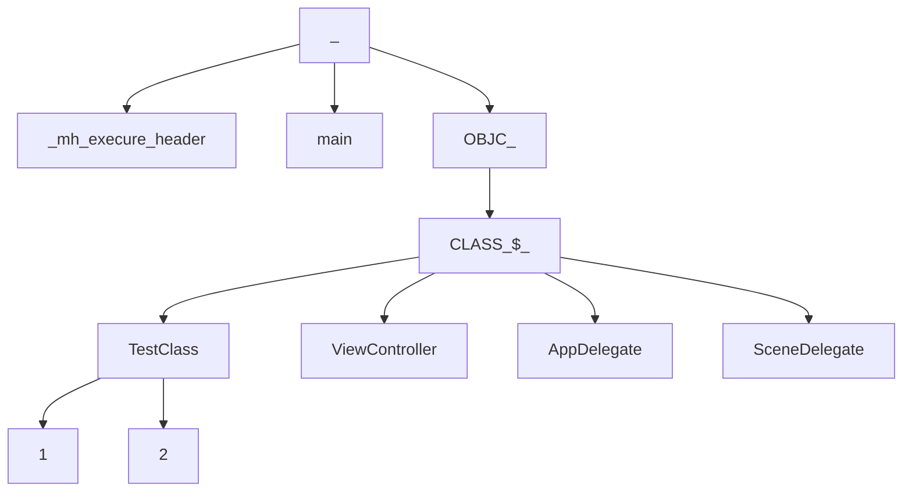

## 前言

趁着这个假期好好补一下基础知识，之前虽然在学习`Bitcode`时了解了`Mach-O`的知识，但是还是模棱两可，这一次借助[mach-o view源码](https://github.com/gdbinit/MachOView)一步步学习。但是这个开源库已经近5年没有更新了,不仅下下来各种无法编译，并且很多`mach-o`信息也无法解析，于是我对它进行一些修改，可以直接拿我fork过来的[工程](https://github.com/joey520/MachOView) ，已经修复了一些问题并兼容了苹果最新的`mach-o`结构。

<!--more-->

## 结构分析

首先大致描述下`Mach-O`文件的结构：


关于`mach-o`的介绍网上很多，这里只针对一些比较重要的点分析：

### LINK EDIT

之前一直弄不懂这个`segment`是干吗的。实践发现无论是那种`Mach-O`文件都有``__LINKEDIT segment``，表示的即是 `sections DATA`段之后的部分，包括符号表，字符串表，动态链接器信息和函数签名等等。也就是说这一段信息其实描述的是链接相关的信息，供`Link Editor`在链接时使用的。

在[FishHook](https://github.com/facebook/fishhook)和[Dyld](http://opensource.apple.com/tarballs/dyld)中查找符号表指针都是这么来的：

```c
//找到__LINKEDIT的基地址 
uintptr_t linkedit_base = (uintptr_t)slide + linkedit_segment->vmaddr - linkedit_segment->fileoff;
//找到符号表的地址
  nlist_t *symtab = (nlist_t *)(linkedit_base + symtab_cmd->symoff);
//找到字符串表的地址
  char *strtab = (char *)(linkedit_base + symtab_cmd->stroff);
//indirect symbol table
  uint32_t *indirect_symtab = (uint32_t *)(linkedit_base + dysymtab_cmd->indirectsymoff);
```

网上有些人包括我第一眼看到这个`linkedit_base`都出现一个错误，认为这玩意就是``__TEXT``段的`vmaddr`。而且我试验那个`Mach-O`还恰好就是这样，所以好奇为啥原作者要这么麻烦。。。

后来经过实践发现犯了如下错误：

有些`mach-O`中`segment`的`vm size`并不等于`file size`。所以这里并不是等于``__TEXT``段的虚拟地址。只有`linkedit_segment->vmaddr - linkedit_segment->vmoffset`才等于``__TEXT``段的虚拟地址。

`vm size`描述是虚拟空间大小，通常等于大于或等于文件真正的大小。而`file size`描述是文件映射过来的段空间大小，也就是`file size`才是真正的文件映射到内存段的数据大小。

我们知道为了程序内存管理通常采用一整块的逻辑地址空间（虚拟空间）来加载程序，虚拟内存空间是以页为单位的，大小为4KB（4096），所以虚拟地址一定是4096的倍数。而时间大小`File size`并不是，这就是`vm size`大于等于`file size`的原因。由于符号表，字符串表和`indirect symbol table`存放在`LINK EDIT`段，由它的`vmaddr - fileoff`才能寻找到真正的文件起始位置对应的逻辑地址。

### 符号表

`LC_SYMTAB`指导链接器如何加载符号表信息，结构如下:

```c
struct symtab_command {
	uint32_t	cmd;		/* LC_SYMTAB */
	uint32_t	cmdsize;	/* sizeof(struct symtab_command) */
  //根据这个字段可以通过linkedit base找到符号表数据
	uint32_t	symoff;		/* symbol table offset */
	uint32_t	nsyms;		/* number of symbol table entries */
  //根据这个字段可以通过linkedit base找到字符表数据
	uint32_t	stroff;		/* string table offset */
	uint32_t	strsize;	/* string table size in bytes */
};
```

但是还有个`LC_DYSYMTAB`是什么呢，这个其实是方便`link editer`的，它对符号进行了详细的划分，把符号表共分为三块：`local symbols`仅仅用于`debug`。`defined symbols`内部定义的符号，`undefined symbols`外部共享库定义的符号（内部未定义的）。然后还保存了一些动态链接库辅助信息，结构如下:

```c
struct dysymtab_command {
    uint32_t cmd;	/* LC_DYSYMTAB */
    uint32_t cmdsize;	/* sizeof(struct dysymtab_command) */
  //内部符号在符号表中的index。
    uint32_t ilocalsym;	/* index to local symbols */
    uint32_t nlocalsym;	/* number of local symbols */
//内部定义的，对外部可见的符号
    uint32_t iextdefsym;/* index to externally defined symbols */
    uint32_t nextdefsym;/* number of externally defined symbols */
//外部共享库的符号
    uint32_t iundefsym;	/* index to undefined symbols */
    uint32_t nundefsym;	/* number of undefined symbols */
  //当且仅当动态库链接的文件才有意义
  //tocoff描述toc的地址，toc中保存一些根据符号名排序的defined external符号
  //modtaboff描述modtab的地址，modtable保存了module的一些信息
  //extrefsymoff。 保存了defined和undefined external符号
    uint32_t tocoff;	/* file offset to table of contents */
    uint32_t ntoc;	/* number of entries in table of contents */
    uint32_t modtaboff;	/* file offset to module table */
    uint32_t nmodtab;	/* number of module table entries */
    uint32_t extrefsymoff;	/* offset to referenced symbol table */
    uint32_t nextrefsyms;	/* number of referenced symbol table entries */
  //indirectSymtable是一个uint32_t数组，每一位都是地址映射到符号表中的符号
  //`symbol pointer`和`routine stubs`section都在reversed1字段保存了符号在符号在indirectSymtable是一个index数组中的位置
  //通过indirectSymtable可以在符号表找到对应的符号，其中的符号跟section中的符号是按相同顺序排布的
    uint32_t indirectsymoff; /* file offset to the indirect symbol table */
    uint32_t nindirectsyms;  /* number of indirect symbol table entries */
  //用于动态库，外部reloaction入口
    uint32_t extreloff;	/* offset to external relocation entries */
    uint32_t nextrel;	/* number of external relocation entries */
  //内部relocation入口
    uint32_t locreloff;	/* offset to local relocation entries */
    uint32_t nlocrel;	/* number of local relocation entries */
};	
```

那么通过`symbol table`我们就可以获取到每个符号的信息，结构如下：

```c
struct nlist_64 {
    union {
      //通过这里再string table取出符号名字符串
        uint32_t  n_strx; /* index into the string table */
    } n_un;
  //符号类型
    uint8_t n_type;        /* type flag, see below */
  //符号所处的section
    uint8_t n_sect;        /* section number or NO_SECT */
  //用于debug时候显示符号的信息
    uint16_t n_desc;       /* see <mach-o/stab.h> */
  //符号值，例如函数则是汇编指令的地址，如果是变量则是值
    uint64_t n_value;      /* value of this symbol (or stab offset) */
};
```

通过以上信息我们可以知道符号是如何在`Mach-O`中保存的。那么怎么找到符号呢?

### 查找符号

动态链接器可以在加载时或者是运行时绑定程序，具体取决于编译时的选项：

`just in time binding`（`lazy binding`）表示动态链接器将会在初次使用符号引用时进行绑定。动态链接器加载动态库依赖于程序加载的时机，并且动态库的符号直到被使用时才被绑定。

`load time binding`表示动态链接器在加载时即绑定所有的符号，使用`ld`的`bind_at_load`选项可以在加载时时绑定所有的外部符号。如果不设置该选项默认为`just in time binding`（`lazy binding`）`。

在预绑定时，符号会被预绑定到一个默认的地址，静态链接器会给每一个`undefined external symbol`设置默认地址来使用，如上一节中了解的默认情况下`nslist`的外部符号会有一个默认的地址。在运行时，动态链接器只会验证这些默认地址没有因为编译或者重计算而改变，如果发生了改变则动态链接器会清除掉`undefined external symbol`预绑定的地址，然后变成`just in time binding`方式进行符号的绑定。

预绑定需要每一个`framework`指明它需要的虚拟内存地址空间，所有预绑定的地址不会发生重复。通过设置`LD`的`prebind`选项可以开启预绑定。弱引用的符号动态链接器如果找不到相应的定义则会设置为`NULL`然后继续加载程序，程序可以运行检查一个引用是否为`NULL`,如果是则不会处理。

在了解两个概念:`non lazy symbols`指的是不能延迟加载的符号，必须在编译时就确定好内存地址，这些符号往往时是动态链接依赖的符号。而`lazy symbols`指的是可以延迟加载的符号。前者存在于``__DATA_CONST segment``的``__got section``，后者存在于``__DATA segment``下的`__la_symbos_ptr setction`。通过它们可以获取到程序中所有引用到的符号，因此如果想通过这里查找符号并进行处理一定得是先使用这个符号，保证在`mach-o`中存在。

#### Non Lazy Symbols

首先分析下`non lazy symbols`。可以看到其实是一个就是一个指针数组，指向的是函数指针或者变量的地址，可以看到由于它们都不在当前`image`内，所以都还是空指针：


那么它是如何映射到符号的，通过的也是`indirect symbol table`，`LoadCommand`中标识了它在`indirect symbol table`中的偏移，


通过`indirect symbol table`对应位置开始遍历即可找到对应的符号信息，找到指针对应的符号在符号表中的`index`为 `0x95 = 149`：


在符号表中找到符号，它是一段`nlist`结构的字节：


<b>注意`indirect symbol table`和指针数组是对应的顺序，但是符号表并不是，因此必须``indirect symbol table``来进行符号的查找。</b>

#### Lazy Symbols

`lazy symbols`标识可以延迟绑定的符号，通常是其它共享库中的符号，当第一次使用时才通过`dyld`进行动态绑定，可以看到它的`data`并不是空的，而是映射到了对应的`stub help section`。


也就是访问延迟加载的指针时触发的`stuber helper`的函数：


其实是通过`dyld`进行动态地址绑定，关于这里的详细在下一篇[深入理解dyld]()中会进行详细分析。

当然延迟加载的函数指针和`indirect symbol table`也是一一对应的，同样可以和上面一样找到对应的符号信息。

### Fishhook的工作原理

[Fishhook](https://github.com/facebook/fishhook)是一个可以通过替换符号函数指针实现方法替换的开源库，本质上通过`Mach-O`找到符号，然后把函数指针替换为想要替换的函数指针。这里我们分析下`fishhook`的核心部分:

1.寻找符号表，`indirect symbols`表:

<details>
  <summary>寻找符号表</summary>

  ```c
  static void rebind_symbols_for_image(struct rcd_rebindings_entry *rebindings,
                                     const struct mach_header *header,
                                     intptr_t slide) {
    //dladdr会读取一个文件的信息，包括所处image,地址和最近的符号等等
    //这里的目的是判断下能否正确读取到image。
  Dl_info info;
  if (dladdr(header, &info) == 0) {
    return;
  }
    //遍历loadcommand
  segment_command_t *cur_seg_cmd;
  segment_command_t *linkedit_segment = NULL;
  struct symtab_command* symtab_cmd = NULL;
  struct dysymtab_command* dysymtab_cmd = NULL;

  uintptr_t cur = (uintptr_t)header + sizeof(mach_header_t);
  for (uint i = 0; i < header->ncmds; i++, cur += cur_seg_cmd->cmdsize) {
    cur_seg_cmd = (segment_command_t *)cur;
//      printf("segname: %s\n", cur_seg_cmd->segname);
    if (cur_seg_cmd->cmd == LC_SEGMENT_ARCH_DEPENDENT) {
      if (strcmp(cur_seg_cmd->segname, SEG_LINKEDIT) == 0) {
          //找到linkedit的LC
        linkedit_segment = cur_seg_cmd;
      }
    } else if (cur_seg_cmd->cmd == LC_SYMTAB) {
    //找到symtab的LC
      symtab_cmd = (struct symtab_command*)cur_seg_cmd;
    } else if (cur_seg_cmd->cmd == LC_DYSYMTAB) {
        //找到dysymtab的LC
      dysymtab_cmd = (struct dysymtab_command*)cur_seg_cmd;
    }
  }
//如果有一个不存在说明Macho文件不是需要处理的直接返回
  if (!symtab_cmd || !dysymtab_cmd || !linkedit_segment ||
      !dysymtab_cmd->nindirectsyms) {
    return;
  }

// Find base symbol/string table addresses
//取出loadcommand的虚拟地址, 以基地址+虚拟地址-fileoff算出程序段
//这里需要注意在有些image时等同于text端的地址，但是在实测中发现向Foundation.framework则不是这样的。
// 注意linkedit_base并不等于textvmaddr。 因为vmsize和filesize并不一定相等
//fileoffset是每一个segment的filesize累加得到。 因此此处并不相等。
  uintptr_t linkedit_base = (uintptr_t)slide + linkedit_segment->vmaddr - linkedit_segment->fileoff;
    //找到符号表的地址
  nlist_t *symtab = (nlist_t *)(linkedit_base + symtab_cmd->symoff);
  char *strtab = (char *)(linkedit_base + symtab_cmd->stroff);

  // Get indirect symbol table (array of uint32_t indices into symbol table)
    //找到indirect_symtab地址。是一个uint32_t的地址数组用于定位符号表
  uint32_t *indirect_symtab = (uint32_t *)(linkedit_base + dysymtab_cmd->indirectsymoff);

  cur = (uintptr_t)header + sizeof(mach_header_t);
    //变量Commands
  for (uint i = 0; i < header->ncmds; i++, cur += cur_seg_cmd->cmdsize) {
    cur_seg_cmd = (segment_command_t *)cur;
    if (cur_seg_cmd->cmd == LC_SEGMENT_ARCH_DEPENDENT) {
      if (strcmp(cur_seg_cmd->segname, SEG_DATA) != 0 &&
          strcmp(cur_seg_cmd->segname, SEG_DATA_CONST) != 0) {
        continue;
      }
        //找到__DATA或者__CONST_DATA并取出其中的lasymbol和nonlasymbol的section
        //因为符号都是存在这里的
      for (uint j = 0; j < cur_seg_cmd->nsects; j++) {
        section_t *sect =
          (section_t *)(cur + sizeof(segment_command_t)) + j;
          //有两个section保存了符号指针,一个是lazySymbolPointers，另一个是NonLazySymbolPointers
        if ((sect->flags & SECTION_TYPE) == S_LAZY_SYMBOL_POINTERS) {
          rcd_perform_rebinding_with_section(rebindings, sect, slide, symtab, strtab, indirect_symtab);
        }
        if ((sect->flags & SECTION_TYPE) == S_NON_LAZY_SYMBOL_POINTERS) {
          rcd_perform_rebinding_with_section(rebindings, sect, slide, symtab, strtab, indirect_symtab);
        }
      }
    }
  }
}
  ```
</details>

2.进行函数替换，与源函数指针的保存：

<details>
  <summary>替换函数指针</summary>

```objc
static void rcd_perform_rebinding_with_section(struct rcd_rebindings_entry *rebindings,
                                               section_t *section,
                                               intptr_t slide,
                                               nlist_t *symtab,
                                               char *strtab,
                                               uint32_t *indirect_symtab) {
    //indirect symbols是一个uin32_t对齐的数组。数据是是一个个index
    //每个index对应到符号表中的一个符号。
    //注意indirect table里面包含了所有的符号的index。 每一个section->reserved1标志了当前section对应的符号index在indirect table中的偏移
    //假如这里是Got的section。这reserved1对应到indirect table重的即GOT相关的符号的偏移
    //也就是这里的indirect_symbol_indices已经位移到了当前section的符号的下标处了
  uint32_t *indirect_symbol_indices = indirect_symtab + section->reserved1;
    //当前section符号指针
  void **indirect_symbol_bindings = (void **)((uintptr_t)slide + section->addr);
    //section size描述了size对应的大小，由于内部都是一个个指针以8字节对齐，所以除以sizeof(void *）
  for (uint i = 0; i < section->size / sizeof(void *); i++) {
      //取出每一个每个符号对应的index。data描述的是在符号表中的index
    uint32_t symtab_index = indirect_symbol_indices[i];
    if (symtab_index == INDIRECT_SYMBOL_ABS || symtab_index == INDIRECT_SYMBOL_LOCAL ||
        symtab_index == (INDIRECT_SYMBOL_LOCAL   | INDIRECT_SYMBOL_ABS)) {
      continue;
    }
      //通过index去符号表中取出对应的符号nlist
      //然后找到符号对应字符在string table中的偏移
    uint32_t strtab_offset = symtab[symtab_index].n_un.n_strx;
      //找到当前符号的name
    char *symbol_name = strtab + strtab_offset;
      //遍历当前要重新绑定的符号链表
    struct rcd_rebindings_entry *cur = rebindings;
    while (cur) {
      for (uint j = 0; j < cur->rebindings_nel; j++) {
          //如果找到了需要重新绑定的符号
        if (strlen(symbol_name) > 1 &&
            strcmp(&symbol_name[1], cur->rebindings[j].name) == 0) {
          if (cur->rebindings[j].replaced != NULL &&
              indirect_symbol_bindings[i] != cur->rebindings[j].replacement) {
              //把旧的符号保存到replaced
            *(cur->rebindings[j].replaced) = indirect_symbol_bindings[i];
          }
            //把新的符号指针赋给需要重新绑定的符号指针。
          indirect_symbol_bindings[i] = cur->rebindings[j].replacement;
            //跳出本次循环
          goto symbol_loop;
        }
      }
      cur = cur->next;
    }
  symbol_loop:;
  }
}
```

</details>

### 高效使用FishHook

可以看到`FishHook`的替换是一个暴力查找的过程，加载的`image`越多，符号越多耗时越多，通常符号只会存在与一个image中，因此指定image可以一定的减少耗时，好在`fishhook`提供了指定`mach-o header`的接口，只是仍然需要我们手动去进行查找，例如替换`NSLog`，知道是在`libSystem.b.dylib`则可以直接指定:

```objective-c
    uint32_t count = _dyld_image_count();
    NSLog(@"image count: %@", @(count));
    double begin = CFAbsoluteTimeGetCurrent();
    rcd_rebind_symbols(rebs, 1);
    double end = CFAbsoluteTimeGetCurrent();
    old_nslog(@"不指定image耗时: %lf", end * 1000 - begin * 1000);
    
    double begin1 = CFAbsoluteTimeGetCurrent();
    //这一步也算进耗时里
    count = _dyld_image_count();
    for (int i = 0; i < count; i ++) {
        //找到
        if (strstr(_dyld_get_image_name(i), "libSystem.b.dylib")){
            rcd_rebind_symbols_image((void *)_dyld_get_image_header(i), _dyld_get_image_vmaddr_slide(i), rebs, 1);
            break;
        }
    }
    double end1 = CFAbsoluteTimeGetCurrent();
    old_nslog(@"指定image耗时: %lf", end1 * 1000 - begin1 * 1000);
    NSLog(@"验证替换成功了");
```

查看运行结果如下:

```shell
2020-02-02 00:54:49.630144+0800 LearnHook[78136:2951341] image count: 339
2020-02-02 00:54:49.639330+0800 LearnHook[78136:2951341] 不指定image耗时: 9.021973
2020-02-02 00:54:49.639558+0800 LearnHook[78136:2951341] 指定image耗时: 0.094971
2020-02-02 00:54:49.639688+0800 LearnHook[78136:2951341] 替换成功了
```

虽然单位是毫秒，由于我这个demo是一个空程序，如果是一个更复杂的程序，替换的符号更多，指定`image`还是很有必要的。

注意`dyld`提供的遍历`image`方法并不是线程安全的，可以用`dladdr`替换，在`FishHook`也出现了这个函数，但是只是用于检测image是否存在。。。 正常使用时大概不会出现线程问题8。。。

## OC相关数据

对于包含OC代码的`mach-o`文件，则会单独存在一些`oc`相关的`section`，为了方便就直接以`demo`截图为例:


可见`clang`分析出了`OC`数据并和其它信息分开放置了,根据`section name`可以很容易看出都是什么信息。由于我现在使用的`libobjc.framework`已经是`runtime2.0`所以`mach-o`和`1.0`已经发生了很多变化，最显著的就是新增了`image_info`段，以及去掉了`__OBJC`段，而是把信息挪到了``__objc_data``段，`__objc_const`存放的是一些只读的信息，例如类的原始数据等等。

通过[runtime源码](https://github.com/opensource-apple/objc4)和[dyld源码](http://opensource.apple.com/tarballs/dyld)可以发现，`dyld`负责加载`mach-o`文件，然后每加载一个`image`就通知到`runtime`解析其中的`OC`相关数据然后放入`runtime`哈希表中，包括类表，`protocol`表等等。

### 类与分类

在之前的文章中我们探究过类与分类的区别与编译时的小问题，出发的点是查看符号表信息，这一次主要看一下在`mach-o`的表现以及如何使用。同样看到`mach-o`符号表中只有源类的符号`_OBJC_CLASS_$_TestClass1`，因为说白了我们在代码中使用的还是类名来做事情，分类只是`OC`的一个特殊概念而已，只是`runtime`在解析后把分类中的数据插入到源类，所以本质上只有源类存在，因此缺少分类参与编译在编译过程并不会产生任何问题，唯一就是运行时缺少了分类里的一些数据。分类在编译时由编译器解析，根据符号找到对应的类之后就变成了类原始数据中的`categorys`这个指针数组的一员了。因此分类的加载一定依赖类的加载，类的`+load`一定被优先调用。

每一个类在符号表中都有一个符号存在，它的`value`指向的就是类数据的指针，而类的数据信息都存在`_objc_data`这个`section`，通过`classlist`中的指针和符号表中`OC`类的符号的`value`都指向的是这里。类的结构如下，通过符号`address`可以找到这样一个数据，就可以知道符号的类结构。

在`OC`世界里对象都是`objc_object`结构体指针，共同特点是都有`isa`，id也不过是一个`typedef`的别名而已，因此是万能指针。

```c++
/// A pointer to an instance of a class.
typedef struct objc_object *id;
```

类也是`objc_object`的子结构体:

```c
struct objc_class : objc_object 
{
  //继承了isa
  //uint64_t isa;               // class_t * (64-bit pointer)
  uint64_t superclass;        // class_t * (64-bit pointer)
 // 方法缓存，优化查找速度
struct cache_t {
    // 存储bucket_t的哈希表，注意这里用的链表加数组实现的哈希表
		struct bucket_t *_buckets;
    // 占用的总大小，每次扩容翻倍。通过SEL与MASK的按位与作为哈希表的key，bucket_t作为View
    mask_t _mask;
    // 已使用大小
    mask_t _occupied;
}
  uint64_t data;              // class_ro_t * (64-bit pointer)
};
    struct bucket_t {
    		cache_key_t _key;
    		IMP _imp;
    }
```

``data`指针指向`objc_const`这个`section`某一段，结构如下如`class_ro_t`保存着编译时获取的类的原始数据，是不允许运行时修改的，也就是一个类产生的实例大小，以及成员变量的布局在编译时已经决定了：

```c
struct class64_ro_t 
{
  uint32_t flags;
  uint32_t instanceStart;
  uint32_t instanceSize;
  uint32_t reserved;
  uint64_t ivarLayout;        // const uint8_t * (64-bit pointer)
  uint64_t name;              // const char * (64-bit pointer)
  uint64_t baseMethods;       // const method_list_t * (64-bit pointer)
  uint64_t baseProtocols;     // const protocol_list_t * (64-bit pointer)
  uint64_t ivars;             // const ivar_list_t * (64-bit pointer)
  uint64_t weakIvarLayout;    // const uint8_t * (64-bit pointer)
  uint64_t baseProperties;    // const struct objc_property_list * (64-bit pointer)
};
```

不过`OC`作为一们动态语言必须得支持动态修改类信息，因此又存在一个可变的`class_rw_t`，结构如下。它在`realizeClass`时会把`readonly`的数据拷贝进来，并且会在此时把所有`category`中数据加载进来，因此类就具有了分类的能力。

```objc
struct class_rw_t {
    // Be warned that Symbolication knows the layout of this structure.
    uint32_t flags;
    uint32_t version;
//class_ro_t保存了类原始的信息，新类只需要指向这里即可，const修饰了不能改变
    const class_ro_t *ro;
//这些是可读可写的，因此运行时可以修改类。采用模板构造。
//因为还有2级指针lists,因此运行时修改不会改变类大小
    method_array_t methods;
    property_array_t properties;
    protocol_array_t protocols;
  //子类链表
    class firstSubclass;
  //兄弟类
    class nextSiblingClass;
    char *demangledName;
#if SUPPORT_INDEXED_ISA
    uint32_t index;
#endif
}
```

由此可知类的结构在编译时已经确定，只有`class_ro_t`能通过`ivar layout`和`instancesize`决定一个类的大小，而它又是只读的，所以运行时无法修改一个确定的类结构，所以`category`中无法添加成员变量，虽然可以添加属性，但是请注意属性只是一种快捷创建成员变量及其`get`，`set`方法的方式。但是由于`category`在运行时并不能吧`ivar`拷贝到类中，所以属性也就成了一个空架子，所以当你在分类中添加属性时，属性虽然存在，但是与之匹配的成员变量即`get set`方法并不产生，因此还是没有意义的，而且可以观察符号表，与之相关符号一个都没有，也就是说一个空的属性。

可以认为分类就是一个可以挂载在任何类上的`class_rw_t`的子集。如果在分类中添加成员变量，`Clang`直接会报错，所以如果有一天能在分类中添加成员变量，只能在编译时就做到分类的合并才行，但是如果这么做了分类和类还有什么区别呢，尤其是分类真正牛在可以对动态链接的类进行扩展，这在编译时是根本无法做到的。

类的构成可视化如下，可以看到所有方法和属性变量在编译时已经处理好了：


方法调用时从`method list`中找到找到`method`，然后找到`imp`。`imp`指向的只是``__TEXT``段的汇编指令。但是可以发现的一个问题是类方法并没有存在于`methodlist`，那么类方法怎么调用呢？需要通过元类。

### 元类与isa

`isa`是`OC`的一个概念，描述的是类到底是什么。通常类在编译时就确定了`isa`，在`mach-o`中表现为指向另一个类一样长的数据段，被编译器以``_OBJC_metaclass_$_``符号标注的东东，经过分析`mach-o`中它是一个和类一模一样结构的数据，有自己类似`class_t`一样的结构以及自己的`class_ro_t`结构`data`。

那一张经典的`isa`指向图这里就不上了，通过数据也可以看出元类的`isa`指向的是父类的元类，而元类的父类指向的也是父类的元类，此时我们从数据上详细分析`metaclass`到底是什么：


元类有自己的数据，即`ro`数据。通过`flag`标识了自己是元类：


元类在面向用户的开发时是不可见的（除了`runtime`的部分接口暴露这个概念）。通常它只有一些类方法的指针，因为`protocol`中也可能存在类方法，所以`protocol`字段也是存在的。在编译时编译器把类方法放在元类的`methodlist`中，同样元类`protocol`的存在也让开发者可以调用协议中的类方法。

通过前面分析我们知道方法调用只需要指定到类或者`metaclass`的一个`method`即可。而类在编译时实例的大小已经确定了，为了减少内存消耗，实例中只保存了`isa`和成员变量所需要的空间，<b>这也是为什么`instance start`永远都是8，要给isa留位置啊。</b>那么一个实例在调用时怎么确定到指定的`method`的呢，便是通过`isa`和`selector`共同决定。

调用程序是只需要通过`isa`找到对应的类，然后查找方法列表即可找到对应的汇编指令了，所以调用的本质是由`isa`和`selector`，这也是为什么`KVO`通过`isa swizzing`实现方法替换。编译时编译器会把`OC`的代码转换为`msgSend`，这个函数有默认两个，一个调用的对象，另一个是`selector`。在汇编的角度看，即入栈对象的地址，`selector`地址以及剩余的参数。`selector`是运行时系统创造的抽象概念，只给出了`objc_selector`这么一个不透明的东西，并没给出结构定义，不过根据`runtime`提供`sel`的内存构造可以猜测出它的结构就是这样的，是的就是仅仅只是一个字符串。。。

```c++
struct objc_selector {
    char *name;
};
```

那么怎么一个简单的字符串怎么实现调用呢？便是通过`isa`，调用时传入的第一个参数为对象地址，取第一个字节获取`isa`。通过`isa`来决定从哪里开始查询方法，类的`isa`指向的是元类，元类的`isa`指向的是父类的元类。那么实例呢，实例的创建都是通过调用`new`或者`alloc`在运行时实现的，也就是它的isa是由运行时系统决定的，而运行时系统在创建实例是会把它的`isa`指向类本身，首先看下`arm64`架构下`isa`具体的结构:

```c++
union isa_t 
{
    Class cls;
    uintptr_t bits;
  ....
#   define ISA_MASK        0x0000000ffffffff8ULL
#   define ISA_MAGIC_MASK  0x000003f000000001ULL
#   define ISA_MAGIC_VALUE 0x000001a000000001ULL
    struct {
        uintptr_t nonpointer        : 1;  //是否开启了指针优化
        uintptr_t has_assoc         : 1;  //是否有关联的对象
        uintptr_t has_cxx_dtor      : 1;  //否有C++或Objc的析构器，在对象析构时会进行调用
      //arm64系统中mach最大
        uintptr_t shiftcls          : 33; // MACH_VM_MAX_ADDRESS 0x1000000000
        uintptr_t magic             : 6;  //
        uintptr_t weakly_referenced : 1;  //是否被指向或者曾经指向一个ARC的弱变量
        uintptr_t deallocating      : 1;  //是否正在被析构
      //为了优化，默认引用计数直接保存在isa中，但是当引用计数过大无法保存，这一位会标志出来
      //此时引用技术会保存在slidetable中
        uintptr_t has_sidetable_rc  : 1;  
        uintptr_t extra_rc          : 19; //是否保存在弱引用表中
#       define RC_ONE   (1ULL<<45)
#       define RC_HALF  (1ULL<<18)
    };
  ....
}
```

可以发现`isa`不单单是指针，还保留了很多信息，之所以这么做是因为虽然64位系统，但是至少一半的地址是小于等于33位的，所以`isa`做了一个优化，使用第一个`bit`，`nonpointer`来标志是否开启了指针优化，当地址小于等于33位时，`nonpointer`置为1，元类地址保存在`shiftcls`。其它位保存了更多信息。当大于时，isa指向的是内存元类的地址。

所以即使`selector`只是一个字符串，对实例调用时，`isa`可以找到类的地址，查询的是类中的方法列表（-开头的实例方法）。对类调用时，`isa`为元类查询的是元类中的方法列表(+开头的类方法)所以即使当前类找不到查找父类时，实例的调用也只会在实例方法中找。而类的调用只会在类方法中查找。所以即使`selector`相同，实例方法和类方法也不会冲突。

当然`runtime`也做了 一些`cache`的优化，以及查找不到时候的方法转发，就不赘述了。至于为啥`OC`对空对象发调用不会`crash`，也是`runtime`系统的处理，以`arm64`下`runtime`的汇编实现为例:

```assembly
//cmp表示检查x0和0这个立即数，x0为地址，如果为则正是0x0
	cmp	x0, #0			// nil check and tagged pointer check
 //b.le汇编指令表示对LNilOrTagged进行判断。LNilOrTagged判断的tagged pointer
	b.le	LNilOrTagged		//  (MSB tagged pointer looks negative)
	ldr	x13, [x0]		// x13 = isa
	//通过`ISA_MASK`获取到class（或者是metaclass）
	and	x16, x13, #ISA_MASK	// x16 = class	
LGetIsaDone:
    //通过isa查找方法的实现
	CacheLookup NORMAL		// calls imp or objc_msgSend_uncached
```


### Protocol

`protocol`在`OC`开发非常常用，它可以实现`mock`对象，也可以实现类似多继承的等等效果。那么`protocol`到底是什么呢，在`OC`世界几乎所有东西都是``_objc_object_t``的子类，显著特点就是有个`isa`标注自己是什么东东，`protocol`虽然长的奇怪，但是它也是``objc_objct_t``的子类，因此它也有`isa`，它的结构如下:

```c++
struct protocol_t : objc_object {
  //由于继承objc_object，因此这里隐含了一个ISA
    //ISA
    const char *mangledName;
  //这里可以理解为父类，protocol实际也是可以继承的，利用的就是这个指针进行遍历
    struct protocol_list_t *protocols;
    method_list_t *instanceMethods;
    method_list_t *classMethods;
    method_list_t *optionalInstanceMethods;
    method_list_t *optionalClassMethods;
    property_list_t *instanceProperties;
    uint32_t size;   // sizeof(protocol_t)
    uint32_t flags;
    // Fields below this point are not always present on disk.
  //注意这些在Mach-O中是不存在的，类似class_rw_t，时都是runtime做的一些优化手段
    const char **_extendedMethodTypes;
    const char *_demangledName;
    property_list_t *_classProperties;
    const char *demangledName();
    }
```

编译器解析到`@Protocol`格式的`Protocol`定义然后在`mach-o`中以上面的格式记录，注意在编译器的世界里万物皆符号，此时会创建``__OBJC_Protocol_$_NSObject``的符号，`address`指向的就是存在具体信息的地址。而解析到类时如果发现`conforms`某些协议，则会把这个符号对应的`Protocol`地址指针加入到当前类的`protocols`指针数组。可以发现虽然`Protocol`的数据里有`method list`，`property list`等，并且每一项都有具体的描述，但是却没有指向具体实现。下面是`NSObject`协议的`method list`。可以看到`address`都是空的：


也就是`protocol`只是一个描述文件，描述了类具有什么特性，但是真正的实现并不一定存在，只是绕过了编译器的静态检查。可以当做一种软继承，字面上的继承，但是实际怎么样要看类本身。因此它的编程哲学就很明确了就是面向接口，甚至根据不需要对象。

当然这只是`OC`的`protocol`，很明显有一个缺点就是缺乏一个默认的实现，把全部的任务都交由了具体类实现。而在`swift`中可以通过对`protocol`进行扩展添加默认实现，也算是对`OC`的痛点的一个解决。

还有一点是编译时`protocol`的`isa`字段 都是空的，只是在`runtime`加载时才把`protocol`类本身作为它isa，因为它并不需要元类，也可以说它就是自己的元类。

由于`protocol`结构中的`protocols`使得它也有了继承的能力，编译器在解析`protocol`时会把它父类（并不是类）加入到这个`protocols`指针数组中来提升它的能力。

### 动态链接信息

`LC_DYLD_INFO`也是`LINK EDIT`段的一部分，提取出来是方便`dyld`快速找到，而且位于符号表，字符表等信息之前。`dyld`通过它进行进行`rebase`，首先看一下结构:

```c
struct dyld_info_command {
   uint32_t   cmd;		/* LC_DYLD_INFO or LC_DYLD_INFO_ONLY */
   uint32_t   cmdsize;		/* sizeof(struct dyld_info_command) */
//rebase偏移。ASLR技术会导致slide的变化，dyld通过修正内部segment偏移
    uint32_t   rebase_off;	/* file offset to rebase info  */
    uint32_t   rebase_size;	/* size of rebase info   */
//绑定偏移，外部符号绑定时候使用    
    uint32_t   bind_off;	/* file offset to binding info   */
    uint32_t   bind_size;	/* size of binding info  */
//弱符号绑定偏移
    uint32_t   weak_bind_off;	/* file offset to weak binding info   */
    uint32_t   weak_bind_size;  /* size of weak binding info  */
//延迟加载符号绑定偏移    
    uint32_t   lazy_bind_off;	/* file offset to lazy binding info */
    uint32_t   lazy_bind_size;  /* size of lazy binding infs */
    uint32_t   export_off;	/* file offset to lazy binding info */
    uint32_t   export_size;	/* size of lazy binding infs */
};
```

苹果为了数据安全提供了[ASLR]()，所谓地址空间随机化即虽然每个`image`加载时虚拟地址是一整块，但是`ASLR`技术就使得起始地址并不唯一，每次都是随机的，这样即使知道`mach-o`的结构也不能根据起始地址+偏移来修改函数。所以我们再取mach-o`中数据时都需要通过`dyld`获取`slide`，再结合虚拟地址获取:

```c++
_dyld_get_image_vmaddr_slide(i)
```

#### Rebase Info

所以每次`dyld`加载`image`都需要先`rebase`，`dyld`中是通过寻找一块能容纳下所有`segment`的内存之后，

```c++
		uintptr_t lowAddr = (unsigned long)(-1);
		uintptr_t highAddr = 0;
	  //遍历segement，累加segment的的vm size
		for(unsigned int i=0, e=segmentCount(); i < e; ++i) {
      //取出segment虚拟地址
			const uintptr_t segLow = segPreferredLoadAddress(i);
      //取出segment vm size，这里限制必须以4KB向上取整。
			const uintptr_t segHigh = dyld_page_round(segLow + segSize(i));
			if ( segLow < highAddr ) {
				if ( dyld_page_size > 4096 )
					dyld::throwf("can't map segments into 16KB pages");
				else
					dyld::throwf("overlapping segments");
			}
			if ( segLow < lowAddr )
				lowAddr = segLow;
			if ( segHigh > highAddr )
				highAddr = segHigh;
				
			if ( needsToSlide || !imageHasPreferredLoadAddress || inPIE || !reserveAddressRange(segPreferredLoadAddress(i), segSize(i)) )
				needsToSlide = true;
		}
		if ( needsToSlide ) {
			// find a chunk of address space to hold all segments
      //找到一块可以容纳全部segment的内存地址并返回作为slide
			uintptr_t addr = reserveAnAddressRange(highAddr-lowAddr, context);
			slide = addr - lowAddr;
```

之后根据这逐个对segment进行地址偏移映射：

```c++
//获取原来的文件偏移
vm_offset_t fileOffset = (vm_offset_t)(segFileOffset(i) + offsetInFat);
//文件大小
vm_size_t size = segFileSize(i);
//计算rebase之后之后segment的address
uintptr_t requestedLoadAddress = segPreferredLoadAddress(i) + slide;
//利用mmap重新映射内存
void* loadAddress = xmmap((void*)requestedLoadAddress, size, protection, MAP_FIXED | MAP_PRIVATE, fd, fileOffset);
```

这样就解决了`ASLR`技术导致的内存偏移问题。而`rebase info`中则保留了segment是如何偏移的：


每一个`rebase info`都是一个字节的数即`0x00-0xFF`，分别表示操作数和数据，通过和`mask`按位与获取信息，高4位表示操作字，低4非表示立即数，具体的枚举可以参考`<mach-o/loader.h>`:

```c
#define REBASE_OPCODE_MASK					0xF0
#define REBASE_IMMEDIATE_MASK			  0x0F
```

这里分以一个0x11为例。 所以操作为`REBASE_OPCODE_SET_TYPE_IMM`，type为`REBASE_TYPE_POINTER`。而第二个`0x22`表示操作数为`REBASE_OPCODE_SET_SEGMENT_AND_OFFSET_ULEB,值为2，即表示对`segment 2`偏移，紧跟着是偏移值为数值。一般`DO_REBASE`命令时才会根据前面一段的重定位信息进行`rebase`。

而`codesign`则是另一个安全策略，用于验证`app`是没有被恶意篡改过的，简单说就是根据开发者的证书加密源代码数据的哈希，这样第一保证了确定是没有第三方动过App，第二保证了再审核过后开发者也不能动`App`。`codesign`是位于`mach-o`最后一段数据，但是其实它并不是对全部数据一次性的哈希然后加密，而是针对每个数据页进行的。

#### Bind info

而绑定信息则描述的是在通过`dyld`绑定之后的符号的信息，此时会根据这里找到源符号指针，然后把地址赋给源指针，这样动态绑定只需要绑定一次即可：


例如这里是`_objc_msgSend`在动态绑定完后`BIND_OPCODE_SET_SEGMENT_AND_OFFSET_ULEB`和`offset`共同标识了要写回的位置，即第二个`segment`的0偏移处，即`_got`的d一个函数指针，恰好就是`_objc_msgSend`的函数指针，所以这时候前面看到的`Non-Lazy symbol ptr`就不再是空指针了，而是指向了对象的内存，下一次访问该符号时便可直接把指针指向的数据插入。

`Lazy bind info`和`bind info`基本上是一样的就不在详述了。

#### Export Info

根据官方描述，它是一个树状结构，`terminal size`描述节点的大小，`chindren count`描述子节点的个数，flag描述节点的属性。`next node`描述下一个节点。大致可以简略如下:



每个结点都通过`next node`指向下一个节点，每个节点都有`child count`描述有几个分支，`Node Label`描述节点的字符串。`Terminal size`描述节点最终大小，当且仅当叶子节点的值才大于0，此时`flag`存放了节点属性，`symbol offset`存放符号对应数据的偏移，例如`TestClass1`根据偏移找到数据为`objc_data`里的类信息。例如`mian`根据偏移找到的就是函数在`TEXT`段的汇编代码。

这样所有的符号字符就成了一个字典树，提高字符查找效率。之前一直好奇怎么通过符号找到指针，原来这样即可以通过这个来进行快速的查找。

## 探究的意义

我们观察一下`classlist`和`classrefs`，两者都是指针数组区别在于前者保存了所有存在的类，而后者则只保存了被引用的类（是符号被引用而不只是`import`），所以可以通过差集来判断哪些类存在但是未被使用，但是实践可以发现有一个坑点是仅仅通过`NSClassFromString`等`runtime`的方式使用的类也不会出现在这里，因为`mach-o`显示的只是编译后的信息，只是检查了代码中有没有对这些类符号进行使用。而`runtime`这些高级的东西，在编译时认为就是一坨字符串而已。

理解了动态加载的过程可以知道，移除不需要的库文件可以提高加载的速度。过度使用分类也会影响加载速度。

理解了符号在`mach-o`中如何找到函数指针的，我们就可以动态的改变`C`函数的实现，处理`Fishkook`这样的应用场景，甚至可以进行一些热更新的效果。

理解了内存布局可以知道，对象时如何在内存中存在的，方法的调用原理，可以让我们写出更高效的代码。


## 参考资料

https://developer.apple.com/library/archive/documentation/DeveloperTools/Conceptual/MachOTopics/0-Introduction/introduction.html#//apple_ref/doc/uid/TP40001519

https://developer.apple.com/library/archive/documentation/System/Conceptual/ManPages_iPhoneOS/man3/dyld.3.html

https://developer.apple.com/library/archive/documentation/Performance/Conceptual/CodeFootprint/Articles/MachOOverview.html


https://github.com/facebook/fishhook

http://opensource.apple.com/tarballs/dyld

https://github.com/opensource-apple/objc4