## 前言

趁着这个假期好好补一下基础知识，之前虽然在学习`Bitcode`时了解了`Mach-O`的知识，但是还是模棱两可，这一次借助[mach-o view源码](https://github.com/gdbinit/MachOView)一步步学习。但是这个开源库已经近5年没有更新了,不仅下下来各种无法编译，并且很多`mach-o`信息也无法解析，于是我对它进行一些修改，可以直接拿我fork过来的[工程](https://github.com/joey520/MachOView) ，已经修复了一些问题并兼容了苹果最新的`mach-o`结构。

<!--more-->

## 结构分析

首先大致描述下`Mach-O`文件的结构：


关于`mach-o`的介绍网上很多，这里只针对一些比较重要的点分析：

### LINK EDIT

之前一直弄不懂这个`segment`是干吗的。实践发现无论是那种`Mach-O`文件都有``__LINKEDIT segment``，表示的是 `sections DATA`段之后的部分，包括符号表，字符串表，动态链接器信息和函数签名等等。也就是说这一段信息其实描述的是链接相关的信息，供`Link Editor`在链接时使用的。

在[FishHook](https://github.com/facebook/fishhook)和[Dyld](http://opensource.apple.com/tarballs/dyld)中查找符号表指针都是这么来的：

```c
//找到__LINKEDIT的基地址 
uintptr_t linkedit_base = (uintptr_t)slide + linkedit_segment->vmaddr - linkedit_segment->fileoff;
//找到符号表的地址
  nlist_t *symtab = (nlist_t *)(linkedit_base + symtab_cmd->symoff);
//找到字符串表的地址
  char *strtab = (char *)(linkedit_base + symtab_cmd->stroff);
//indirect symbol table
  uint32_t *indirect_symtab = (uint32_t *)(linkedit_base + dysymtab_cmd->indirectsymoff);
```

网上有些人包括我第一眼看到这个`linkedit_base`都出现一个错误，认为这玩意就是``__TEXT``段的`vmaddr`。而且我试验那个`Mach-O`还恰好就是这样，所以好奇为啥原作者要这么麻烦。。。

后来经过实践发现犯了如下错误：

有些`mach-O`中`segment`的`vm size`并不等于`file size`。所以这里并不是等于``__TEXT``段的虚拟地址。只有`linkedit_segment->vmaddr - linkedit_segment->vmoffset`才等于``__TEXT``段的虚拟地址。

`vm size`描述是虚拟空间大小，通常等于大于或等于文件真正的大小。而`file size`描述是文件映射过来的段空间大小，也就是`file size`才是真正的文件映射到内存段的数据大小。

我们知道为了程序内存管理通常采用一整块的逻辑地址空间（虚拟空间）来加载程序，虚拟内存空间是以页为单位的，大小为4KB（4096），所以虚拟地址一定是4096的倍数。而实际大小`File size`并不是，这就是`vm size`大于等于`file size`的原因。由于符号表，字符串表和`indirect symbol table`存放在`LINK EDIT`段，由它的`vmaddr - fileoff`才能寻找到真正的文件起始位置对应的逻辑地址。

### 符号表

`LC_SYMTAB`指导链接器如何加载符号表信息，结构如下:

```c
struct symtab_command {
	uint32_t	cmd;		/* LC_SYMTAB */
	uint32_t	cmdsize;	/* sizeof(struct symtab_command) */
  //根据这个字段可以通过linkedit base找到符号表数据
	uint32_t	symoff;		/* symbol table offset */
	uint32_t	nsyms;		/* number of symbol table entries */
  //根据这个字段可以通过linkedit base找到字符表数据
	uint32_t	stroff;		/* string table offset */
	uint32_t	strsize;	/* string table size in bytes */
};
```

但是还有个`LC_DYSYMTAB`是什么呢，这个其实是方便`link editer`的，它对符号进行了详细的划分，把符号表共分为三块：`local symbols`仅仅用于`debug`。`defined symbols`内部定义的符号，`undefined symbols`外部共享库定义的符号（内部未定义的）。然后还保存了一些动态链接库辅助信息，结构如下:

```c
struct dysymtab_command {
    uint32_t cmd;	/* LC_DYSYMTAB */
    uint32_t cmdsize;	/* sizeof(struct dysymtab_command) */
  //内部符号在符号表中的index。
    uint32_t ilocalsym;	/* index to local symbols */
    uint32_t nlocalsym;	/* number of local symbols */
//内部定义的，对外部可见的符号
    uint32_t iextdefsym;/* index to externally defined symbols */
    uint32_t nextdefsym;/* number of externally defined symbols */
//外部共享库的符号
    uint32_t iundefsym;	/* index to undefined symbols */
    uint32_t nundefsym;	/* number of undefined symbols */
  //当且仅当动态库链接的文件才有意义
  //tocoff描述toc的地址，toc中保存一些根据符号名排序的defined external符号
  //modtaboff描述modtab的地址，modtable保存了module的一些信息
  //extrefsymoff。 保存了defined和undefined external符号
    uint32_t tocoff;	/* file offset to table of contents */
    uint32_t ntoc;	/* number of entries in table of contents */
    uint32_t modtaboff;	/* file offset to module table */
    uint32_t nmodtab;	/* number of module table entries */
    uint32_t extrefsymoff;	/* offset to referenced symbol table */
    uint32_t nextrefsyms;	/* number of referenced symbol table entries */
  //indirectSymtable是一个uint32_t数组，每一位都是地址映射到符号表中的符号
  //`symbol pointer`和`routine stubs`section都在reversed1字段保存了符号在符号在indirectSymtable是一个index数组中的位置
  //通过indirectSymtable可以在符号表找到对应的符号，其中的符号跟section中的符号是按相同顺序排布的
    uint32_t indirectsymoff; /* file offset to the indirect symbol table */
    uint32_t nindirectsyms;  /* number of indirect symbol table entries */
  //用于动态库，外部reloaction入口
    uint32_t extreloff;	/* offset to external relocation entries */
    uint32_t nextrel;	/* number of external relocation entries */
  //内部relocation入口
    uint32_t locreloff;	/* offset to local relocation entries */
    uint32_t nlocrel;	/* number of local relocation entries */
};	
```

通过`symbol table`我们就可以获取到每个符号的信息，结构如下：

```c
struct nlist_64 {
    union {
      //通过这里再string table取出符号名字符串
        uint32_t  n_strx; /* index into the string table */
    } n_un;
  //符号类型
    uint8_t n_type;        /* type flag, see below */
  //符号所处的section
    uint8_t n_sect;        /* section number or NO_SECT */
  //用于debug时候显示符号的信息
    uint16_t n_desc;       /* see <mach-o/stab.h> */
  //符号值，例如函数则是汇编指令的地址，如果是变量则是值
    uint64_t n_value;      /* value of this symbol (or stab offset) */
};
```

通过以上信息我们可以知道符号是如何在`Mach-O`中保存的。那么怎么找到符号呢?

### 查找符号

动态链接器可以在加载时或者是运行时绑定程序，具体取决于编译时的选项：

`just in time binding`（`lazy binding`）表示动态链接器将会在初次使用符号引用时进行绑定。动态链接器加载动态库依赖于程序加载的时机，并且动态库的符号直到被使用时才被绑定。

`load time binding`表示动态链接器在加载时即绑定所有的符号，使用`ld`的`bind_at_load`选项可以在加载时时绑定所有的外部符号。如果不设置该选项默认为`just in time binding`（`lazy binding`）`。

在预绑定时，符号会被预绑定到一个默认的地址，静态链接器会给每一个`undefined external symbol`设置默认地址来使用，如上一节中了解的默认情况下`nslist`的外部符号会有一个默认的地址。在运行时，动态链接器只会验证这些默认地址没有因为编译或者重计算而改变，如果发生了改变则动态链接器会清除掉`undefined external symbol`预绑定的地址，然后变成`just in time binding`方式进行符号的绑定。

预绑定需要每一个`framework`指明它需要的虚拟内存地址空间，所有预绑定的地址不会发生重复。通过设置`LD`的`prebind`选项可以开启预绑定。弱引用的符号动态链接器如果找不到相应的定义则会设置为`NULL`然后继续加载程序，程序可以运行检查一个引用是否为`NULL`,如果是则不会处理。

符号又分为两种:`non lazy symbols`指的是不能延迟加载的符号，必须在编译时就确定好内存地址，这些符号往往时是动态链接依赖的符号。而`lazy symbols`指的是可以延迟加载的符号。前者存在于``__DATA_CONST segment``的``__got section``，后者存在于``__DATA segment``下的`__la_symbos_ptr setction`。通过它们可以获取到程序中所有引用到的符号，因此如果想通过这里查找符号并进行处理一定得是先使用这个符号，保证在`mach-o`中存在。

#### Non Lazy Symbols

首先分析下`non lazy symbols`。可以看到其实是一个就是一个指针数组，指向的是函数指针或者变量的地址，可以看到由于它们都不在当前`image`内，所以都还是空指针：

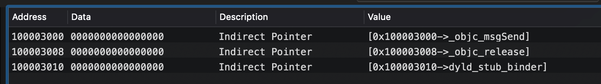

那么它是如何映射到符号的，通过的也是`indirect symbol table`，`LoadCommand`中标识了它在`indirect symbol table`中的偏移，

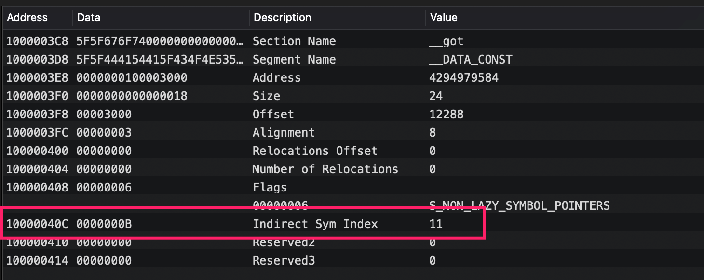

通过`indirect symbol table`对应位置开始遍历即可找到对应的符号信息，找到指针对应的符号在符号表中的`index`为 `0x95 = 149`：

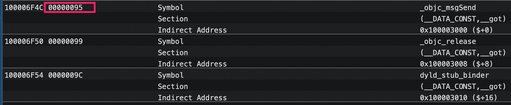

在符号表中找到符号，它是一段`nlist`结构的字节：

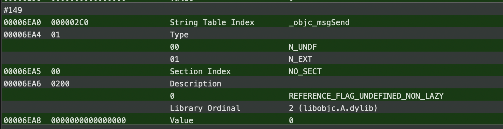

<b>注意`indirect symbol table`和指针数组是对应的顺序，但是符号表并不是，因此必须``indirect symbol table``来进行符号的查找。</b>

#### Lazy Symbols

`lazy symbols`标识可以延迟绑定的符号，通常是其它共享库中的符号，当第一次使用时才通过`dyld`进行动态绑定，可以看到它的`data`并不是空的，而是映射到了对应的`stub help section`。

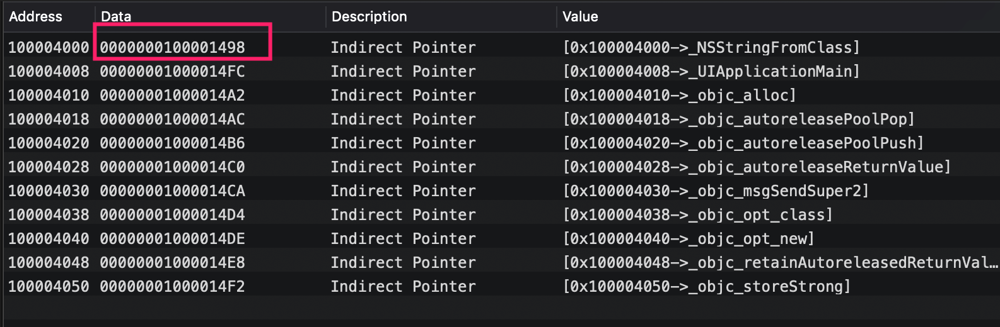

也就是访问延迟加载的指针时触发的`stuber helper`的函数：

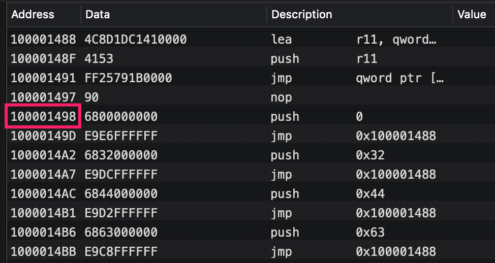

其实是通过`dyld`进行动态地址绑定，关于这里的详细在下一篇[深入理解dyld]()中会进行详细分析。

当然延迟加载的函数指针和`indirect symbol table`也是一一对应的，同样可以和上面一样找到对应的符号信息。

### Fishhook的工作原理

[Fishhook](https://github.com/facebook/fishhook)是一个可以通过替换符号函数指针实现函数替换的开源库，本质上通过`Mach-O`找到符号，然后把函数指针替换为想要替换的函数指针。这里我们分析下`fishhook`的核心部分:

1.寻找符号表，`indirect symbols`表:

<details>
  <summary>寻找符号表</summary>

  ```c
  static void rebind_symbols_for_image(struct rcd_rebindings_entry *rebindings,
                                     const struct mach_header *header,
                                     intptr_t slide) {
    //dladdr会读取一个文件的信息，包括所处image,地址和最近的符号等等
    //这里的目的是判断下能否正确读取到image。
  Dl_info info;
  if (dladdr(header, &info) == 0) {
    return;
  }
    //遍历loadcommand
  segment_command_t *cur_seg_cmd;
  segment_command_t *linkedit_segment = NULL;
  struct symtab_command* symtab_cmd = NULL;
  struct dysymtab_command* dysymtab_cmd = NULL;

  uintptr_t cur = (uintptr_t)header + sizeof(mach_header_t);
  for (uint i = 0; i < header->ncmds; i++, cur += cur_seg_cmd->cmdsize) {
    cur_seg_cmd = (segment_command_t *)cur;
//      printf("segname: %s\n", cur_seg_cmd->segname);
    if (cur_seg_cmd->cmd == LC_SEGMENT_ARCH_DEPENDENT) {
      if (strcmp(cur_seg_cmd->segname, SEG_LINKEDIT) == 0) {
          //找到linkedit的LC
        linkedit_segment = cur_seg_cmd;
      }
    } else if (cur_seg_cmd->cmd == LC_SYMTAB) {
    //找到symtab的LC
      symtab_cmd = (struct symtab_command*)cur_seg_cmd;
    } else if (cur_seg_cmd->cmd == LC_DYSYMTAB) {
        //找到dysymtab的LC
      dysymtab_cmd = (struct dysymtab_command*)cur_seg_cmd;
    }
  }
//如果有一个不存在说明Macho文件不是需要处理的直接返回
  if (!symtab_cmd || !dysymtab_cmd || !linkedit_segment ||
      !dysymtab_cmd->nindirectsyms) {
    return;
  }

// Find base symbol/string table addresses
//取出loadcommand的虚拟地址, 以基地址+虚拟地址-fileoff算出程序段
//这里需要注意在有些image时等同于text端的地址，但是在实测中发现向Foundation.framework则不是这样的。
// 注意linkedit_base并不等于textvmaddr。 因为vmsize和filesize并不一定相等
//fileoffset是每一个segment的filesize累加得到。 因此此处并不相等。
  uintptr_t linkedit_base = (uintptr_t)slide + linkedit_segment->vmaddr - linkedit_segment->fileoff;
    //找到符号表的地址
  nlist_t *symtab = (nlist_t *)(linkedit_base + symtab_cmd->symoff);
  char *strtab = (char *)(linkedit_base + symtab_cmd->stroff);

  // Get indirect symbol table (array of uint32_t indices into symbol table)
    //找到indirect_symtab地址。是一个uint32_t的地址数组用于定位符号表
  uint32_t *indirect_symtab = (uint32_t *)(linkedit_base + dysymtab_cmd->indirectsymoff);

  cur = (uintptr_t)header + sizeof(mach_header_t);
    //变量Commands
  for (uint i = 0; i < header->ncmds; i++, cur += cur_seg_cmd->cmdsize) {
    cur_seg_cmd = (segment_command_t *)cur;
    if (cur_seg_cmd->cmd == LC_SEGMENT_ARCH_DEPENDENT) {
      if (strcmp(cur_seg_cmd->segname, SEG_DATA) != 0 &&
          strcmp(cur_seg_cmd->segname, SEG_DATA_CONST) != 0) {
        continue;
      }
        //找到__DATA或者__CONST_DATA并取出其中的lasymbol和nonlasymbol的section
        //因为符号都是存在这里的
      for (uint j = 0; j < cur_seg_cmd->nsects; j++) {
        section_t *sect =
          (section_t *)(cur + sizeof(segment_command_t)) + j;
          //有两个section保存了符号指针,一个是lazySymbolPointers，另一个是NonLazySymbolPointers
        if ((sect->flags & SECTION_TYPE) == S_LAZY_SYMBOL_POINTERS) {
          rcd_perform_rebinding_with_section(rebindings, sect, slide, symtab, strtab, indirect_symtab);
        }
        if ((sect->flags & SECTION_TYPE) == S_NON_LAZY_SYMBOL_POINTERS) {
          rcd_perform_rebinding_with_section(rebindings, sect, slide, symtab, strtab, indirect_symtab);
        }
      }
    }
  }
}
  ```
</details>

2.进行函数替换，与源函数指针的保存：

<details>
  <summary>替换函数指针</summary>

```objc
static void rcd_perform_rebinding_with_section(struct rcd_rebindings_entry *rebindings,
                                               section_t *section,
                                               intptr_t slide,
                                               nlist_t *symtab,
                                               char *strtab,
                                               uint32_t *indirect_symtab) {
    //indirect symbols是一个uin32_t对齐的数组。数据是是一个个index
    //每个index对应到符号表中的一个符号。
    //注意indirect table里面包含了所有的符号的index。 每一个section->reserved1标志了当前section对应的符号index在indirect table中的偏移
    //假如这里是Got的section。这reserved1对应到indirect table重的即GOT相关的符号的偏移
    //也就是这里的indirect_symbol_indices已经位移到了当前section的符号的下标处了
  uint32_t *indirect_symbol_indices = indirect_symtab + section->reserved1;
    //当前section符号指针
  void **indirect_symbol_bindings = (void **)((uintptr_t)slide + section->addr);
    //section size描述了size对应的大小，由于内部都是一个个指针以8字节对齐，所以除以sizeof(void *）
  for (uint i = 0; i < section->size / sizeof(void *); i++) {
      //取出每一个每个符号对应的index。data描述的是在符号表中的index
    uint32_t symtab_index = indirect_symbol_indices[i];
    if (symtab_index == INDIRECT_SYMBOL_ABS || symtab_index == INDIRECT_SYMBOL_LOCAL ||
        symtab_index == (INDIRECT_SYMBOL_LOCAL   | INDIRECT_SYMBOL_ABS)) {
      continue;
    }
      //通过index去符号表中取出对应的符号nlist
      //然后找到符号对应字符在string table中的偏移
    uint32_t strtab_offset = symtab[symtab_index].n_un.n_strx;
      //找到当前符号的name
    char *symbol_name = strtab + strtab_offset;
      //遍历当前要重新绑定的符号链表
    struct rcd_rebindings_entry *cur = rebindings;
    while (cur) {
      for (uint j = 0; j < cur->rebindings_nel; j++) {
          //如果找到了需要重新绑定的符号
        if (strlen(symbol_name) > 1 &&
            strcmp(&symbol_name[1], cur->rebindings[j].name) == 0) {
          if (cur->rebindings[j].replaced != NULL &&
              indirect_symbol_bindings[i] != cur->rebindings[j].replacement) {
              //把旧的符号保存到replaced
            *(cur->rebindings[j].replaced) = indirect_symbol_bindings[i];
          }
            //把新的符号指针赋给需要重新绑定的符号指针。
          indirect_symbol_bindings[i] = cur->rebindings[j].replacement;
            //跳出本次循环
          goto symbol_loop;
        }
      }
      cur = cur->next;
    }
  symbol_loop:;
  }
}
```

</details>

### 高效使用FishHook

可以看到`FishHook`的替换是一个暴力查找的过程，加载的`image`越多，符号越多耗时越多，通常符号只会存在于一个`image`中，因此指定`image`可以一定的减少耗时，好在`fishhook`提供了指定`mach-o header`的接口，只是仍然需要我们手动去进行查找，例如替换`NSLog`，知道是在`libSystem.b.dylib`则可以直接指定:

```objective-c
    uint32_t count = _dyld_image_count();
    NSLog(@"image count: %@", @(count));
    double begin = CFAbsoluteTimeGetCurrent();
    rcd_rebind_symbols(rebs, 1);
    double end = CFAbsoluteTimeGetCurrent();
    old_nslog(@"不指定image耗时: %lf", end * 1000 - begin * 1000);
    
    double begin1 = CFAbsoluteTimeGetCurrent();
    //这一步也算进耗时里
    count = _dyld_image_count();
    for (int i = 0; i < count; i ++) {
        //找到
        if (strstr(_dyld_get_image_name(i), "libSystem.b.dylib")){
            rcd_rebind_symbols_image((void *)_dyld_get_image_header(i), _dyld_get_image_vmaddr_slide(i), rebs, 1);
            break;
        }
    }
    double end1 = CFAbsoluteTimeGetCurrent();
    old_nslog(@"指定image耗时: %lf", end1 * 1000 - begin1 * 1000);
    NSLog(@"验证替换成功了");
```

查看运行结果如下:

```shell
2020-02-02 00:54:49.630144+0800 LearnHook[78136:2951341] image count: 339
2020-02-02 00:54:49.639330+0800 LearnHook[78136:2951341] 不指定image耗时: 9.021973
2020-02-02 00:54:49.639558+0800 LearnHook[78136:2951341] 指定image耗时: 0.094971
2020-02-02 00:54:49.639688+0800 LearnHook[78136:2951341] 替换成功了
```

虽然单位是毫秒，由于我这个demo是一个空程序，如果是一个更复杂的程序，替换的符号更多，指定`image`还是很有必要的。

注意`dyld`提供的遍历`image`方法并不是线程安全的，可以用`dladdr`替换，在`FishHook`也出现了这个函数，但是只是用于检测image是否存在。。。 正常使用时大概不会出现线程问题8。。。

## OC相关数据

对于包含OC代码的`mach-o`文件，则会单独存在一些`oc`相关的`section`，为了方便就直接以`demo`截图为例:

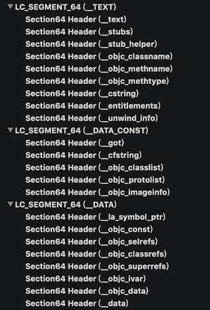

可见`clang`分析出了`OC`数据并和其它信息分开放置了,根据`section name`可以很容易看出都是什么信息。由于我现在使用的`libobjc.framework`已经是`runtime2.0`所以`mach-o`和`1.0`已经发生了很多变化，最显著的就是新增了`image_info`段，以及去掉了`__OBJC`段，而是把信息挪到了``__objc_data``段，`__objc_const`存放的是一些只读的信息，例如类的原始数据等等。

通过[runtime源码](https://github.com/opensource-apple/objc4)和[dyld源码](http://opensource.apple.com/tarballs/dyld)可以发现，`dyld`负责加载`mach-o`文件，然后每加载一个`image`就通知到`runtime`解析其中的`OC`相关数据然后放入`runtime`哈希表中，包括类表，`protocol`表等等。

### 类与分类

在之前的文章中我们探究过类与分类的区别与编译时的小问题，出发的点是查看符号表信息，这一次主要看一下在`mach-o`的表现以及如何使用。同样看到`mach-o`符号表中只有源类的符号`_OBJC_CLASS_$_TestClass1`，因为说白了我们在代码中使用的还是类名来做事情，分类只是`OC`的一个特殊概念而已，只是`runtime`在解析后把分类中的数据插入到源类，所以本质上只有源类存在，因此缺少分类参与编译在编译过程并不会产生任何问题，唯一就是运行时缺少了分类里的一些数据。分类在编译时由编译器解析，根据符号找到对应的类之后就变成了类原始数据中的`categorys`这个指针数组的一员了。因此分类的加载一定依赖类的加载，类的`+load`一定被优先调用。

每一个类在符号表中都有一个符号存在，它的`value`指向的就是类数据的指针，而类的数据信息都存在`_objc_data`这个`section`，通过`classlist`中的指针和符号表中`OC`类的符号的`value`都指向的是这里。类的结构如下，通过符号`address`可以找到这样一个数据，就可以知道符号的类结构。

在`OC`世界里对象都是`objc_object`结构体指针，共同特点是都有`isa`，id也不过是一个`typedef`的别名而已，因此是万能指针。

```c++
/// A pointer to an instance of a class.
typedef struct objc_object *id;
```

类也是`objc_object`的子结构体:

```c
struct objc_class : objc_object 
{
  //继承了isa
  //uint64_t isa;               // class_t * (64-bit pointer)
  uint64_t superclass;        // class_t * (64-bit pointer)
 // 方法缓存，优化查找速度
struct cache_t {
    // 存储bucket_t的哈希表，注意这里用的链表加数组实现的哈希表
		struct bucket_t *_buckets;
    // 占用的总大小，每次扩容翻倍。通过SEL与MASK的按位与作为哈希表的key，bucket_t作为View
    mask_t _mask;
    // 已使用大小
    mask_t _occupied;
}
  uint64_t data;              // class_ro_t * (64-bit pointer)
};
    struct bucket_t {
    		cache_key_t _key;
    		IMP _imp;
    }
```

data`指针指向``__objc_const``这个段的数据，结构如下如`class_ro_t`保存着编译时获取的类的原始数据，是不允许运行时修改的：

```c
struct class64_ro_t 
{
  uint32_t flags;
  uint32_t instanceStart;
  uint32_t instanceSize;
  uint32_t reserved;
  uint64_t ivarLayout;        // const uint8_t * (64-bit pointer)
  uint64_t name;              // const char * (64-bit pointer)
  uint64_t baseMethods;       // const method_list_t * (64-bit pointer)
  uint64_t baseProtocols;     // const protocol_list_t * (64-bit pointer)
  uint64_t ivars;             // const ivar_list_t * (64-bit pointer)
  uint64_t weakIvarLayout;    // const uint8_t * (64-bit pointer)
  uint64_t baseProperties;    // const struct objc_property_list * (64-bit pointer)
};
```

不过`OC`作为一门动态语言必须得支持动态修改类信息，因此运行时系统在加载的过程又创建了一个可变的`class_rw_t`，结构如下。它在`realizeClass`时会把`ro`的数据拷贝进来，并且会在此时把所有`category`中数据加载进来，因此类就具有了分类的能力。

```objc
struct class_rw_t {
    // Be warned that Symbolication knows the layout of this structure.
    uint32_t flags;
    uint32_t version;
//class_ro_t保存了类原始的信息，新类只需要指向这里即可，const修饰了不能改变
    const class_ro_t *ro;
//这些是可读可写的，因此运行时可以修改类。采用模板构造。
//因为还有2级指针lists,因此运行时修改不会改变类大小
    method_array_t methods;
    property_array_t properties;
    protocol_array_t protocols;
  //子类链表
    class firstSubclass;
  //兄弟类
    class nextSiblingClass;
    char *demangledName;
#if SUPPORT_INDEXED_ISA
    uint32_t index;
#endif
}
```

由此可知类的结构在编译时已经确定，只有`ro`中有`ivar layout`和`instancesize`决定一个类的大小，而它又是只读的，所以运行时无法修改一个确定的类结构，所以`category`中无法添加成员变量，虽然可以添加属性，但是请注意属性只是一种快捷创建成员变量及其`get`，`set`方法的方式。但是由于`category`在运行时并不能吧`ivar`拷贝到类中，所以属性也就成了一个空架子，所以当你在分类中添加属性时，属性虽然存在，但是与之匹配的成员变量即`get set`方法并不产生，因此还是没有意义的，而且可以观察符号表，与之相关符号一个都没有，也就是说一个空的属性。

分类就是一个可以挂载在任何类上的`class_rw_t`的子集。如果在分类中添加成员变量，`Clang`直接会报错，所以如果有一天能在分类中添加成员变量，只能在编译时就做到分类的合并才行，但是如果这么做了分类和类还有什么区别呢，尤其是分类真正牛在可以对未知源码的类进行扩展，这在编译时是根本无法做到的。

类的构成可视化如下，可以看到所有方法和属性变量在编译时已经处理好了：

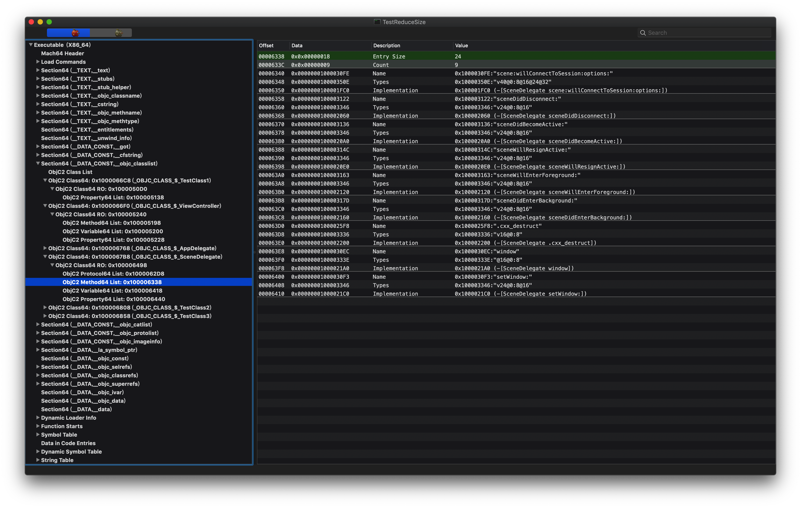

方法调用时从`method list`中找到找到`method`，然后找到`imp`。`imp`指向的只是``__TEXT``段的汇编指令。但是可以发现的类方法并没有存在于`methodlist`，那么类方法怎么调用呢？需要通过元类`metaclass`。

### metaclass与isa

`isa`是`OC`的一个概念，实例的`isa`描述的是实例到底是什么类，表现为`_OBJC_class_$_`。类的`isa`描述的是类的元类`metaclass`,通常类在编译时就确定了`isa`，在`mach-o`中表现为指向另一个类一样长的数据段，被编译器以``_OBJC_metaclass_$_``符号标注的东东，经过分析`mach-O`中它是一个和类一模一样结构的数据，有自己类似`class_t`一样的结构以及自己的`class_ro_t`结构`data`。

那一张经典的`isa`指向图这里就不上了，通过数据也可以看出元类的`isa`指向的是父类的元类，而元类的父类指向的也是父类的元类，此时我们从数据上详细分析`metaclass`到底是什么：

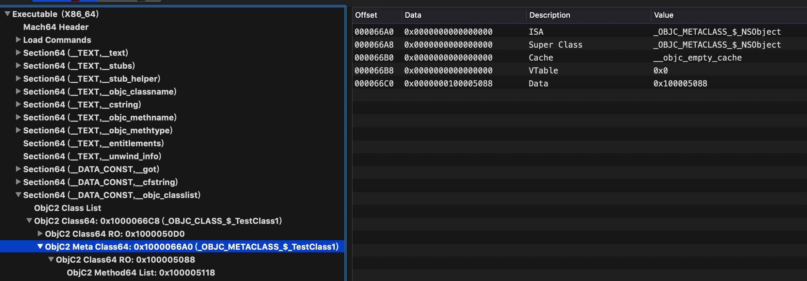

元类有自己的数据，即`ro`数据。通过`flag`标识了自己是元类：

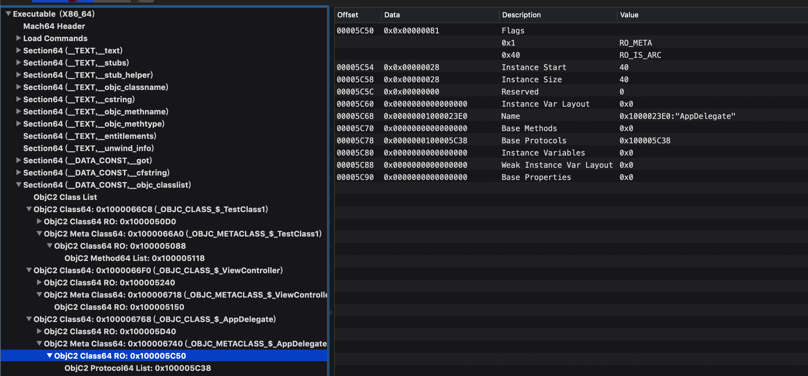

元类在面向用户的开发时是不可见的（除了`runtime`的部分接口暴露这个概念）。通常它只有一些类方法的指针，因为`protocol`中也可能存在类方法，所以`protocol`字段也是存在的。在编译时编译器把类方法放在元类的`methodlist`中，同样元类`protocol`的存在也让开发者可以调用协议中的类方法。

所以运行时系统中对每一个类保存了唯一的一份类数据和元类数据，所有的方法调用，协议，属性等等都只有一份。实例中只保存了`isa`和成员变量所需要的空间，<b>这也是为什么`instance start`永远都是8，要给isa留位置啊。</b>

那么一个实例在调用时怎么确定到指定的`method`的呢，便是通过`isa`和`selector`共同决定。调用程序是只需要通过`isa`找到对应的类或元类，然后查找方法列表即可找到对应的汇编指令了。所以调用的本质是由`isa`和`selector`，这也是为什么`KVO`通过`isa swizzing`实现方法替换。

编译时编译器会把`OC`的方法调用转换为`msgSend`，这个函数有默认两个，一个调用的对象，另一个是`selector`。在汇编的角度看，即入栈对象的地址，`selector`地址以及剩余的参数。`selector`是运行时系统创造的抽象概念，只给出了`objc_selector`这么一个不透明的东西，并没给出结构定义，不过根据`runtime`提供`sel`的内存构造可以猜测出它的结构就是这样的，是的就是仅仅只是一个字符串。。。

```c++
struct objc_selector {
    char *name;
};
```

那么怎么一个简单的字符串怎么实现调用呢？便是通过`isa`，调用时传入的第一个参数为对象地址，取第一个字节获取`isa`。通过`isa`来决定从哪里开始查询方法，类的`isa`指向的是元类，元类的`isa`指向的是父类的元类。

那么实例呢，实例的创建都是通过调用`new`或者`alloc`在运行时实现的，也就是它的isa是由运行时系统决定的，而运行时系统在创建实例是会把它的`isa`指向类本身，首先看下`arm64`架构下`isa`具体的结构:

```c++
union isa_t 
{
    Class cls;
    uintptr_t bits;
  ....
#   define ISA_MASK        0x0000000ffffffff8ULL
#   define ISA_MAGIC_MASK  0x000003f000000001ULL
#   define ISA_MAGIC_VALUE 0x000001a000000001ULL
    struct {
        uintptr_t nonpointer        : 1;  //是否开启了指针优化,为1时才会存储信息
        uintptr_t has_assoc         : 1;  //是否有关联的对象
        uintptr_t has_cxx_dtor      : 1;  //否有C++或Objc的析构器，在对象析构时会进行调用
      //arm64系统中mach最大
        uintptr_t shiftcls          : 33; // MACH_VM_MAX_ADDRESS 0x1000000000
        uintptr_t magic             : 6;  //
        uintptr_t weakly_referenced : 1;  //是否被指向或者曾经指向一个ARC的弱变量
        uintptr_t deallocating      : 1;  //是否正在被析构
      //为了优化，默认引用计数直接保存在isa中，但是当引用计数过大无法保存，这一位会标志出来
        uintptr_t has_sidetable_rc  : 1;  //引用计数是否保存在slidetable中
        uintptr_t extra_rc          : 19; //引用计数
#       define RC_ONE   (1ULL<<45)
#       define RC_HALF  (1ULL<<18)
    };
  ....
}
```

可以发现`isa`不单单是指针，它是一个`union`结构，既可以单纯的指向`class`的地址，也可以附带更多的信息。之所以这么做是因为虽然64位系统，但是至少一半的地址是小于等于33位的，所以`isa`做了一个优化，使用第一个`bit`，`nonpointer`来标志是否开启了指针优化，当地址小于等于33位时，`nonpointer`置为1，元类地址保存在`shiftcls`。其它位保存了更多信息。当大于时，isa指向的是内存元类的地址。

所以实例调用方法时，`isa`可以找到类的地址，查询类中的方法列表（`-`开头的实例方法）。对类调用时，`isa`为元类查询的是元类中的方法列表(`+`开头的类方法)。如果当前类找不到方法，则查找父类时，实例的调用也只会在实例方法中找。而类的调用只会在类方法中查找。所以即使`selector`相同，实例方法和类方法也不会冲突。这样就通过元类和类把实例方法和类方法区分开了。

<b>所以在实例方法中self为第一个参数即实例本身。而在类方法中self也为第一个参数，即类本身</b>。

当然`runtime`也做了 一些`cache`的优化，以及查找不到时候的方法转发，就不赘述了。至于为啥`OC`对空对象发调用不会`crash`，也是`runtime`系统的处理，以`arm64`下`runtime`的汇编实现为例:

```assembly
//cmp表示检查x0和0这个立即数，x0为地址，如果为则正是0x0
	cmp	x0, #0			// nil check and tagged pointer check
 //b.le汇编指令表示对LNilOrTagged进行判断。LNilOrTagged判断的tagged pointer
	b.le	LNilOrTagged		//  (MSB tagged pointer looks negative)
	ldr	x13, [x0]		// x13 = isa
	//通过`ISA_MASK`获取到class（或者是metaclass）
	and	x16, x13, #ISA_MASK	// x16 = class	
LGetIsaDone:
    //通过isa查找方法的实现
	CacheLookup NORMAL		// calls imp or objc_msgSend_uncached
```


### Protocol

`protocol`在`OC`开发非常常用，它可以实现`mock`对象，也可以实现类似多继承的等等效果。那么`protocol`到底是什么呢，在`OC`世界几乎所有东西都是``_objc_object_t``的子类，显著特点就是有个`isa`标注自己是什么东东，`protocol`虽然长的奇怪，但是它也是``objc_objct_t``的子类，因此它也有`isa`，它的结构如下:

```c++
struct protocol_t : objc_object {
  //由于继承objc_object，因此这里隐含了一个ISA
    //ISA
    const char *mangledName;
  //这里可以理解为父类，protocol实际也是可以继承的，利用的就是这个指针进行遍历
    struct protocol_list_t *protocols;
    method_list_t *instanceMethods;
    method_list_t *classMethods;
    method_list_t *optionalInstanceMethods;
    method_list_t *optionalClassMethods;
    property_list_t *instanceProperties;
    uint32_t size;   // sizeof(protocol_t)
    uint32_t flags;
    // Fields below this point are not always present on disk.
  //注意这些在Mach-O中是不存在的，类似class_rw_t，时都是runtime做的一些优化手段
    const char **_extendedMethodTypes;
    const char *_demangledName;
    property_list_t *_classProperties;
    const char *demangledName();
    }
```

编译器解析到`@Protocol`格式的`Protocol`定义然后在`mach-o`中以上面的格式记录，注意在编译器的世界里万物皆符号，此时会创建``__OBJC_Protocol_$_NSObject``的符号，`address`指向的就是存在具体信息的地址。而解析到类时如果发现`conforms`某些协议，则会把这个符号对应的`Protocol`地址指针加入到当前类的`protocols`指针数组。可以发现虽然`Protocol`的数据里有`method list`，`property list`等，并且每一项都有具体的描述，但是却没有指向具体实现。下面是`NSObject`协议的`method list`。可以看到`address`都是空的：

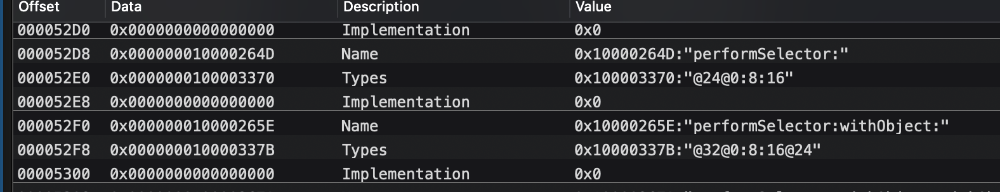

也就是`protocol`只是一个描述文件，描述了类具有什么特性，但是真正的实现并不一定存在，只是绕过了编译器的静态检查。可以当做一种软继承，字面上的继承，但是实际怎么样要看类本身。因此它的编程哲学就很明确了就是面向接口，甚至根据不需要对象。

当然这只是`OC`中的`protocol`，很明显有一个缺点就是缺乏一个默认的实现，把全部的任务都交由了具体类实现。而在`swift`中可以通过对`protocol`进行扩展添加默认实现，也算是对`OC`的痛点的一个解决。

<b>还有一点是编译时`protocol`的`isa`字段 都是空的，只是在`runtime`加载时才把`protocol`类本身作为它isa，因为它并不需要元类，也可以说它就是自己的元类</b>。

由于`protocol`结构中的`protocols`数组使得它也有了继承的能力，编译器在解析`protocol`时会把它父协议加入到这个`protocols`指针数组中来提升它的能力。因此即使方法的符号在当前的`protocol`中找不到，还会沿着继承链查找。

那么方法到底是怎么一个东东呢？

### 方法

通过对类的分析可知，在`class`的数据中即`runtime`中所谓的`ro`有一个`baseMethods`字段，然而在此处只是一个指针，以下面这个类为例：

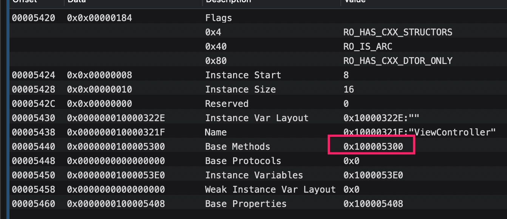

首先需要了解下`method`的数据结构，通过`runtime`源码可知大致如下:

```c
struct method_list_t {
//单个method占用的内存大小
    uint32_t entsizeAndFlags;
//method数量
    uint32_t count;
//第一个method指针
    method_t first;
}
struct method_t {
  //方法名，实际就是一个字符串
    SEL name;
  //方法类型，即typeEncoding，实际也是字符串
    const char *types;
  //函数指针，指向的是程序段的汇编实现。
    MethodListIMP imp;
}
```

可以发现指向的是``__objc_const``段的数据（可以发现基本字符串相关信息都在`TEXT`段，指针之类的数据都放在`DATA`段）。找到指针所指的数据如下:

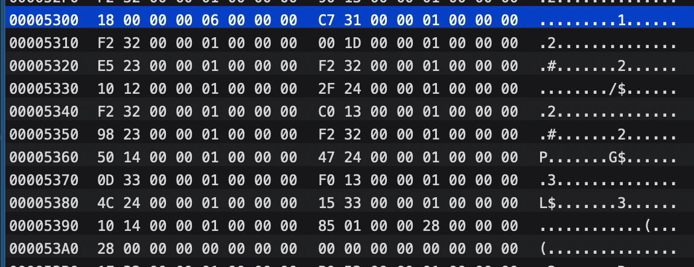


所以要解读这段代码就得按着格式来：

1.前4个字节表示为`method`结构占用内存大小，每一块尺寸为`(0x18 & ~0x03 = 24)` 。由于`method_t`实际就是3个指针在64位系统下占用24个字节。这里的计算规则是`runtime`源码来的。

2.接下来4个字节表示方法个数为`0x06`。这个类里共两3个实例方法，一个属性，多出来这个方法为`.cxx_destruct`（后面会分析它）。

3.之后3个字节表示第一个`method`的信息。

4.后续是剩下5个`method`的信息。

我们来查看一下这些`Method`是如何在`mach-O`中保存的，这里`method`是3个字节大小分割的，共6个，先以第一个为例，第一个字节指向``__objc_methname`段来获取方法名，即`SEL`:

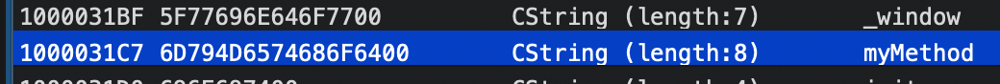

第二个字节指向`__objc_methtype`段来获取方法的`typeencoding`，表明返回值为`void`，第一个参数为`OC`对象(NSObject*)，其实就是`self`。第二个参数为`selctor`（:）：

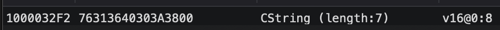

第三个字节指向方法具体实现，即`__TEXT`段的汇编实现：

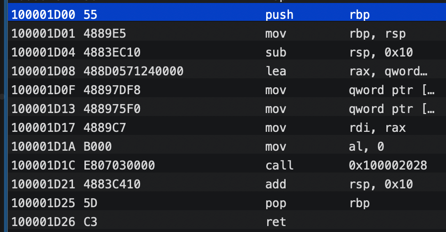

这里可以得出结论：方法最终对应的都是汇编代码，在实际运行时即转换为对应的机器指令。所以无论`OC`的方法还是`C`的函数说白了都是指向的一段机器指令，符号（仅仅指函数相关的符号）只是辅助编译器找到这一段机器指令。

至此我们已经知道了方法在`mach-O`中的呈现形式，那么在运行时又是怎么加载到运行时系统的呢。在运行时库加载`image`之后会对类进行解析，将这一段方法相关数据转换为`method_list_t`，之后将`mach-O`转换来的`ro`数据copy到运行时的`rw`中，同时把分类以及运行时添加的方法等等动态添加到`rw`的`methods`中:

```c
    void attachLists(List* const * addedLists, uint32_t addedCount) {
        if (addedCount == 0) return;
        if (hasArray()) {
            // many lists -> many lists
            uint32_t oldCount = array()->count;
            uint32_t newCount = oldCount + addedCount;
            setArray((array_t *)realloc(array(), array_t::byteSize(newCount)));
            array()->count = newCount;
          //把旧的链表放在后面，新的加在前面
            memmove(array()->lists + addedCount, array()->lists, 
                    oldCount * sizeof(array()->lists[0]));
            memcpy(array()->lists, addedLists, 
                   addedCount * sizeof(array()->lists[0]));
        }
        else if (!list  &&  addedCount == 1) {
            // 0 lists -> 1 list
          //初次添加方法时，放在list数组的0号位
            list = addedLists[0];
        } 
        else {
            // 1 list -> many lists
            List* oldList = list;
            uint32_t oldCount = oldList ? 1 : 0;
            uint32_t newCount = oldCount + addedCount;
            setArray((array_t *)malloc(array_t::byteSize(newCount)));
            array()->count = newCount;
          //新加入的method放在了前面。旧的method放在后面
            if (oldList) array()->lists[addedCount] = oldList;
            memcpy(array()->lists, addedLists, 
                   addedCount * sizeof(array()->lists[0]));
        }
    }
```

编译时得到仅仅是`ro`，在运行时我们所做的修改都在`rw`上，所以可以动态添加方法。可以看到`rw`上的`methods`实际为一个链表数组。并且新加入的`methodlist`都是放在链表最前面。因此由于分类晚于类加载，所以分类里的`methodlist`反而放在`methods`前面，如果有运行时添加方法，则放的更前。

而方法在进行动态调用时，在`methods`中查找时按顺序遍历所有的`methodlist`，因此后加入的`method`反而优先遍历，如果有重复的方法，则后加入先响应，因此分类中方法一定不要和原类重复，否则调用的是分类中的方法：

方法查找过程

```c
static method_t *
getMethodNoSuper_nolock(Class cls, SEL sel)
{
    runtimeLock.assertLocked();

    assert(cls->isRealized());
    // fixme nil cls? 
    // fixme nil sel?
    //遍历methodlist
    for (auto mlists = cls->data()->methods.beginLists(), 
              end = cls->data()->methods.endLists(); 
         mlists != end;
         ++mlists)
    {
      //在methodlist中查找
        method_t *m = search_method_list(*mlists, sel);
        if (m) return m;
    }
    
    return nil;
}
static method_t *search_method_list(const method_list_t *mlist, SEL sel)
{
    int methodListIsFixedUp = mlist->isFixedUp();
    int methodListHasExpectedSize = mlist->entsize() == sizeof(method_t);
  //在预处理时会对methodlist进行排序
  //如果对方法列表根据方法名进行了排序（好处就是查找更快）
    if (__builtin_expect(methodListIsFixedUp && methodListHasExpectedSize, 1)) {
        return findMethodInSortedMethodList(sel, mlist);
    } else {
        // Linear search of unsorted method list
      //根据方法名来查找
        for (auto& meth : *mlist) {
            if (meth.name == sel) return &meth;
        }
    }
    return nil;
}
```

由此可知：方法名相同时只会调用最后加载进来的方法（分类，运行时加载的等等）。因此可以利用分类计数覆盖原来的实现。当然如果想调用所有的实现，还可以通过`runtime`遍历全部方法再调用。

### 成员变量

`OC`的类本质上就是结构体的封装，每个类在实例化时只有数据段是私有的，而代码段是共享的（通过`isa`找到类的`methods`）。所以只需要几个字节存放成员变量的数据即可。<b>在编译时即需要确认类的实例所需要空间，并且绝对不允许运行时修改，因为如果运行时可以随意修改，那么同一个类的多个实例空间不一致，在进行赋值等操作时必然可能导致严重的内存问题</b>。当然这里不包括运行创建的类，它的`ivarlayout`可以在类`register`之前随意修改。但是一旦确定之后都是不允许再修改的了，就如同字节序一样，类的内存布局也是禁忌，随意修改可能会导致踩内存的崩溃，甚至整个代码数据错乱。

`ro`文件中有4个字段与实例相关:

`Instance start`在64位系统上永远都是8，因为要第一个字节指向的一定是`ISA`。

`Instance Size`描述了这个类实例的大小，即成员变量在经过字节对齐之后的内存和+8。

`Ivar layout`描述了内存布局。

`instance variables`指向了实例变量结构地址。

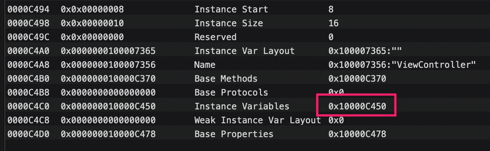

类在进行实例化是即使通过`runtime`中存储的类的信息进行的，根据类再编译时获取的实例大小来开辟内存空间：

```c
uint32_t unalignedInstanceSize() {
        assert(isRealized());
  //返回的是Mach-O中的实例大小
        return data()->ro->instanceSize;
    }
//extraBytes为调用createInstance时自行指定的，默认为0
size_t instanceSize(size_t extraBytes) {
        size_t size = alignedInstanceSize() + extraBytes;
        // CF requires all objects be at least 16 bytes.
        if (size < 16) size = 16;
        return size;
    }
```

可以发现虽然实例大小在编译时确定了，但是运行时系统根据`CoreFoundation`的要求，必须大于等于16字节，即没有任何成员变量的类也至少得占用16个字节，虽然通过`runtime`获取的的值可能为8（无任何成员变量）。

`Ivars`信息存在在`__objc_const`段，不过在不同的架构下还不一样，结构体的定义如下:

```c
struct ivar_list_t 
{
  uint32_t entsize;
  uint32_t count;
  // struct ivar_t first;  These structures follow inline
};

struct ivar_t {
#if __x86_64__
    // *offset was originally 64-bit on some x86_64 platforms.
    // We read and write only 32 bits of it.
    // Some metadata provides all 64 bits. This is harmless for unsigned 
    // little-endian values.
    // Some code uses all 64 bits. class_addIvar() over-allocates the 
    // offset for their benefit.
#endif
    int32_t *offset;
    const char *name;
    const char *type;
    // alignment is sometimes -1; use alignment() instead
    uint32_t alignment_raw;
    uint32_t size;
}
```

我们找到上图中的`ivars`指向的内存可以看到如下，此时我们采用的是`arm64`的结构进行观察：

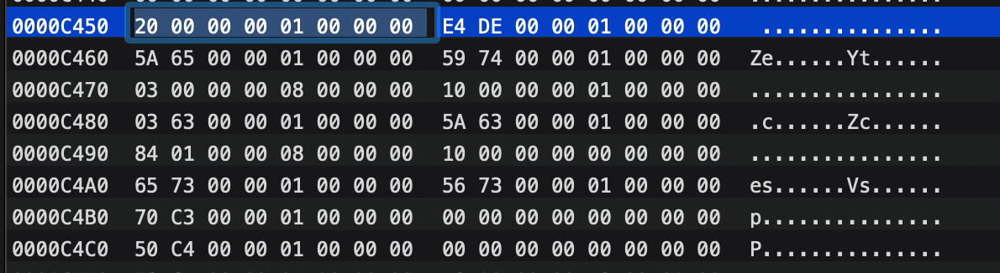

前8字节为`ivar_list`的数据，前4个字节描述了`ivar`结构体块大小为`0x20`即32个字节，就是64为系统下`ivar_t`的结构体大小。后4个字节描述了`ivar`数量为1。

后面跟随的则是每个`ivar`的信息。根据上图可知：

1.前8个字节`0x10000DEE4`指向的的数据为偏移。可以在`__objc_ivar`段找到，即0x08：

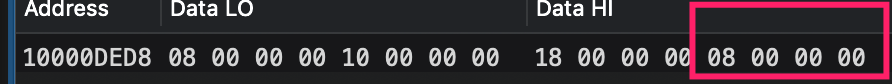

2.`name`为`0x10000655A`指向字符串。竟然也是放在`__objc_methname`段，可见这个段处理`OC`的方法名，还是存放了实例变量名，这也就是成员变量为啥是`_`修饰的：


3.`type`为`0x100007459`指向字符串。竟然是放在`__objc_methtype`段：

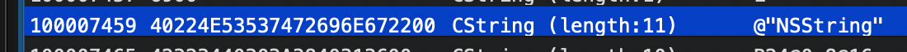

4.偏移为0x03，**这里是的偏移实际是位，即二进制左移3位即以8字节对齐，这里再次体现了设计哲学，通过位域运算使用小数字表达大数**。

5.大小为`0x08`，因为它就是一个`NSString`的指针。

那么运行时系统又是怎么添加`Ivar`的呢，过程代码如下:

```c
    ivar_list_t *oldlist, *newlist;
//如果已经有ivars数组了（运行时依次添加）
//先把旧的保存下来，注意顺序
    if ((oldlist = (ivar_list_t *)cls->data()->ro->ivars)) {
        size_t oldsize = oldlist->byteSize();
        newlist = (ivar_list_t *)calloc(oldsize + oldlist->entsize(), 1);
        memcpy(newlist, oldlist, oldsize);
        free(oldlist);
    } else {
        newlist = (ivar_list_t *)calloc(sizeof(ivar_list_t), 1);
        newlist->entsizeAndFlags = (uint32_t)sizeof(ivar_t);
    }
//获取当前类的实例大小，然后计算新的ivar的offset。即在后面续上
    uint32_t offset = cls->unalignedInstanceSize();
    uint32_t alignMask = (1<<alignment)-1;
    offset = (offset + alignMask) & ~alignMask;
//依次添加
    ivar_t& ivar = newlist->get(newlist->count++);
#if __x86_64__
    // Deliberately over-allocate the ivar offset variable. 
    // Use calloc() to clear all 64 bits. See the note in struct ivar_t.
    ivar.offset = (int32_t *)(int64_t *)calloc(sizeof(int64_t), 1);
#else
    ivar.offset = (int32_t *)malloc(sizeof(int32_t));
#endif
    *ivar.offset = offset;
//这里和method name类似，一旦确定是不允许修改的，所以不能为可变内存的字符串
    ivar.name = name ? strdupIfMutable(name) : nil;
    ivar.type = strdupIfMutable(type);
    ivar.alignment_raw = alignment;
    ivar.size = (uint32_t)size;
    ro_w->ivars = newlist;
//更新类实例大小
    cls->setInstanceSize((uint32_t)(offset + size));
```

运行时系统支持都对运行时添加的类动态添加`Ivar`，但是一旦注册后不能再次改变，并且不能重复添加，那么是如何做到的呢：

```c
//一旦类被realized之后，运行创建类被register之后就不能添加了
    if (!(cls->data()->flags & RW_CONSTRUCTING)) {
        return NO;
    }
//如果ivar已经被添加，或者尺寸过大，可以发现是不能超过UINT32_MAX
    if ((name  &&  getIvar(cls, name))  ||  size > UINT32_MAX) {
        return NO;
    }
```

### property

`property`也是`OC`里的一个特别概念，可以理解为对成员变量的包装，通过`@property`声明的变量在编译时会被添加到`property`列表，同时产生成员变量和`set get`方法，编译器会自动将成员变量和`property`合成，例如通过`_name`和`self.name`都可以对成员变量`name`进行修改和访问。

由于`property`可以自定义属性，导致比成员变量更大的定制性，所以通常推荐在头文件中公开的成员变量采用`property`方式来公开。例如头文件中设置为只读。又或者在利用`@dynamic`来禁止自动合成，又或者采用`copy`来修饰字符串成员变量等等。。。

`property`的在`Mach-O`中的结构就不详细分析了，和成员变量类似的结构体数组。只需要知道`property`的结构如下，名字和成员变量名相同，属性设置则用于辅助编译器来限制开发者行为，或是一些别的功能。

```c
struct property_t {
    const char *name;
    const char *attributes;
};
```

这里探究一下`property`和成员变量到底有什么区别：

通过访问类的成员变量值有两种方式，一种是直接`_name`这种修改成员变量，一种是`self.name`这种方式通过`property`生成的`get`方法来访问。两种到底哪种好呢，记得在我刚接触`iOS`开发时总是听人说用`self.name`这种方式无论是修改还是访问都比较好，那么事实真的是这样吗？

通过`LLDB`来反汇编出这两种的汇编实现，当通过`_name`方式访问成员变量时的汇编指令如下:

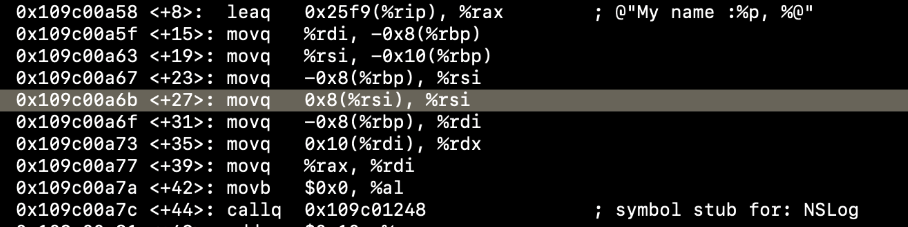

可以发现通过`_name`直接访问成员变量利用的是位移，只需要几行机器指令，而且具有原子性，因为`_name`实际上会转换为`self->_name`。

当通过`self.name`访问成员变量值的时候汇编指令如下:

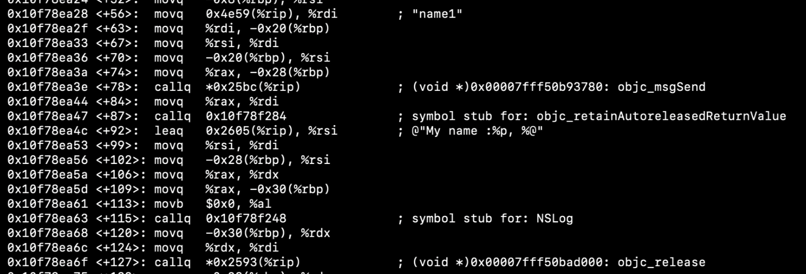

可见此时访问成员变量时走的`runtime`调用`get`方法（如果没有重写`get`方法则调用的是`objc_getProperty`方法）,然后在返回了一个值，在使用完之后还需要释放掉（**因为这里的属性是`noatomic`修饰的**）：

```c
id objc_getProperty(id self, SEL _cmd, ptrdiff_t offset, BOOL atomic) {
    if (offset == 0) {
        return object_getClass(self);
    }
    // Retain release world
  //实际上还是通过地址偏移来获取的
    id *slot = (id*) ((char*)self + offset);
    if (!atomic) return *slot;
        
    // Atomic retain release world
    spinlock_t& slotlock = PropertyLocks[slot];
    slotlock.lock();
    id value = objc_retain(*slot);
    slotlock.unlock();
    
    // for performance, we (safely) issue the autorelease OUTSIDE of the spinlock.
    return objc_autoreleaseReturnValue(value);
}
```

不过本质上还是通过地址偏移来获取的成员变量值，只是走了一套`runtime`的流程，所以看起来反而性能损耗会更大。

但是采用和属性式访问和修改还是有很多优点的：

1.调用动态的`get set`方法给了开发者自定义的机会，例如懒加载这种。

2.对于KVO的值必须通过`self.name =`方式来触发`set`方法。

3.可以实现非原子性的操作，由于成员变量时直接赋值是原子性的操作，而`noatomic`的修饰的属性相当于单独copy了一份。

4.通过属性修饰成员变量，例如`readonly`，`copy`等等。

所以可以得出结论，如果没有特殊需求，采用直接访问成员变量的方式获取或者设置成员变量值会更快，但是存在`KVO`，懒加载等等时必须使用`self.name`形式。


### 引用计数与sidetable

`C，C++，OC`这些语言优良的性能有一部分原因得益于其垃圾回收机制，尤其是这种使用指针的语言，可以做到内存的极致优化。而引用计数技术就是他们的的垃圾回收机制核心，原理是通过一个数字来记录对象被引用的次数，一旦引用计数为0则释放内存。

它的原则是谁创建谁销毁，需要开发者来管理引用计数（`arc`计数除外），所以必定需要有一个东西来记录引用计数，通常得是一个`map`。当然这样就有一个问题就是每次都得查询，而运行时系统做了个很好的优化，把引用计数保存在了`isa`里面，前面分析知道`isa`的64个bit并没有完全占用，会保存引用计数信息在`extra_rc`字段。这样直接访问`isa`就可以知道当前对象的引用计数避免每次都取查询引用计数表。

`isa`里面的`nonpoint`描述了是否通过`isa`保存信息，当这里是开启的，则可以在`isa`中保存引用计数。`extra_rc`字段描述当前引用计数，因为`bit`位有限，因此当操作能表示的最大数值时，就无法保存了。`has_sidetable_rc`字段描述是否采用`sidetable`保存引用计数，此时`has_sidetable_rc`会被置为1，则再对该实例修改引用计数时就得去`sidetable`中查找了：

```c
# if __arm64__
//是否采用的是sidetable保存引用技术表
  uintptr_t has_sidetable_rc  : 1;    
  //arm64下extra_rc有19个bit
  uintptr_t extra_rc          : 19
# elif __x86_64__
  uintptr_t has_sidetable_rc  : 1;   
  //x86_64下extra_rc有8个bit
  uintptr_t extra_rc          : 8
```

引用计数的查询如下：

```c
inline uintptr_t objc_object::rootRetainCount()
{
    if (isTaggedPointer()) return (uintptr_t)this;
	//锁住，由于引用计数查询非常频繁，这里采用了自旋锁
    sidetable_lock();
  //获取isa
    isa_t bits = LoadExclusive(&isa.bits);
    ClearExclusive(&isa.bits);
    if (bits.nonpointer) {
      //先获取isa中保存的引用计数
        uintptr_t rc = 1 + bits.extra_rc;
      //如果已经满了，则加上引用计数表中的计数
        if (bits.has_sidetable_rc) {
            rc += sidetable_getExtraRC_nolock();
        }
      //开锁
        sidetable_unlock();
        return rc;
    }

    sidetable_unlock();
    return sidetable_retainCount();
}
```

前面分析过了标志是使用`isa`表示更多信息，所以如果没有开启，则引用计数就不可能保存在`isa`里面，只能通过`slidetable`保存了。反之引用计数优先保存在`isa`，如果`isa`保存满了，则放到`slidetable`里面。

`sidetable`是一个广泛的概念，结构如下，不仅保存了引用计数表`refcnts`还保存了弱引用表`weak_table`：

```c
struct SideTable {
    spinlock_t slock;
    RefcountMap refcnts;
    weak_table_t weak_table;
}
```

实际上运行时系统中保存的是一个8/64个`SideTable`长度的数组`SideTables()`中:

```c
alignas(StripedMap<SideTable>) static uint8_t 
    SideTableBuf[sizeof(StripedMap<SideTable>)];
//SideTable的构造，就是一个静态的sidetable数组
static StripedMap<SideTable>& SideTables() {
    return *reinterpret_cast<StripedMap<SideTable>*>(SideTableBuf);
}

//在运行时系统首次被dyld激活时才会调用。用于初始化sidetables
static void SideTableInit() {
    new (SideTableBuf) StripedMap<SideTable>();
}

//一个用于构造的模板工具类，此处用于构建SideTable数组
class StripedMap {
//如果是iphone并且不是模拟器
#if TARGET_OS_IPHONE && !TARGET_OS_SIMULATOR
    enum { StripeCount = 8 };
#else
    enum { StripeCount = 64 };
#endif

    struct PaddedT {
        T value alignas(CacheLineSize);
    };
//其实是一个SideTable的数组。这里是通过模板构造的
    PaddedT array[StripeCount];
}
```

可见`SideTables`就是由`StripeMap`这个模板创建出来的包含`SideTable`数组的结构题，内存占用在`iPhone`上就是一个8个元素的`sidetable`数组。其他为64，可以理解有这么多张表来存放引用计数和弱引用。

`StripeMap`重载了运算符`[]`,这里既是如何通过实例对象查找到对应`slidetable`的原理：

```c
    T& operator[] (const void *p) { 
        return array[indexForPointer(p)].value; 
    }
    const T& operator[] (const void *p) const { 
        return const_cast<StripedMap<T>>(this)[p]; 
    }
//按该计算规则把对象地址映射成数组的index
    static unsigned int indexForPointer(const void *p) {
        uintptr_t addr = reinterpret_cast<uintptr_t>(p);
        return ((addr >> 4) ^ (addr >> 9)) % StripeCount;
    }
```

所以在`runtime`里可以看到`SideTables()[self]`这种方式来找到`sidetable`，所有的对象都根据地址影视到`SideTable`数组中的某一个，即某一个表中。

<b>至于为什么要这么做，1.是为了防止单个`SideTable`过大维护不方便，查找不易。2是由于每一次操作或者查询引用计数都需要对表进行上锁，如果全部在一个表锁住，会非常影响性能</b>。

引用计数的记录也是通过位运算来实现的，并且有几个特殊的为用于表示信息:

```c
// The order of these bits is important.
//bit0 记录当前对象是否在存在弱引用
#define SIDE_TABLE_WEAKLY_REFERENCED (1UL<<0)
//bit1记录是否处于deallocing状态
#define SIDE_TABLE_DEALLOCATING      (1UL<<1)  // MSB-ward of weak bit
//所以真正计数是从bit2开始的
#define SIDE_TABLE_RC_ONE            (1UL<<2)  // MSB-ward of deallocating bit
//表示所能记录的最大值
#define SIDE_TABLE_RC_PINNED         (1UL<<(WORD_BITS-1))
//将isa中的数值转换为sidetable，因为前两个bit用于表示别的了，所以要移位2
#define SIDE_TABLE_RC_SHIFT 2
#define SIDE_TABLE_FLAG_MASK (SIDE_TABLE_RC_ONE-1)
```


此时再回过头看一下查询引用技术表的实现:

```c
size_t objc_object::sidetable_getExtraRC_nolock()
{
    assert(isa.nonpointer);
  //找到self所在的引用计数表
    SideTable& table = SideTables()[this];
  //然后查找refncts，key为实例的地址
  //由于运行时系统没有使用STL，这里是自己实现的哈希表。
    RefcountMap::iterator it = table.refcnts.find(this);
    if (it == table.refcnts.end()) return 0;
  //如果找到返回引用计数
    else return it->second >> SIDE_TABLE_RC_SHIFT;
}
```

自此引用计数技术是如何在运行时系统是使用的已经基本弄懂了。通常引用计数技术伴随的是对象内存的自动析构，那么对象内存的析构是怎么实现的呢？

### dealloc与.cxx_destruct

`dealloc`方法是一个与`alloc`方法相对应的`NSObject`基类方法，在对象实例被释放前由运行时系统自动触发以供在此时做一些操作，比如移除观察者等等。

当引用计数变为0时运行时系统自动调用该方法。此时的对象`isa`的的`deallocating`字段会被标记为1。表示对象将要被释放了，如果此时

```c
    ...省略...
    //引用计数为0了，通过runtime调用dealloc方法。
    if (performDealloc) {
        ((void(*)(objc_object *, SEL))objc_msgSend)(this, SEL_dealloc);
    }
```

运行时系统会进行保护，如果对一个已经处于`deallocating`的对象进行释放会触发crash，结果如下:

```c
//如果已经处于deallocting，
    if (slowpath(newisa.deallocating)) {
        ClearExclusive(&isa.bits);
        if (sideTableLocked) sidetable_unlock();
      //这里会触发crash，调用下面的方法
        return overrelease_error();
        // does not actually return
    }

NEVER_INLINE bool objc_object::overrelease_error()
{
  //触发exception
    _objc_inform_now_and_on_crash("%s object %p overreleased while already deallocating; break on objc_overrelease_during_dealloc_error to debug", object_getClassName((id)this), this);
    objc_overrelease_during_dealloc_error();
  //
    return false;  // allow rootRelease() to tail-call this
}
```

**这也是在开发中比较常见的一种crash，通常发生于多线程情况下对单例的属性进行修改时，因为运行时系统中的赋值不是一个原子性操作，还伴随着`retain`和`release`。 因此可能导致导致`retain`和`release`次数没有匹配上，如果碰见这种错误就要考虑对通过加锁等方式**

**同样在dealloc方法中不要在对self做过多操作了，避免触发`release`引起该崩溃**。

对代码分析可知`dealloc`实际是一个内存释放的前置操作，真正根源上的内存释放则是通过基类的`dealloc`实现，在`arc`下回自动依次调用父类的`dealloc`方法，这是析构的特性决定的，因此最终会自动调用`NSObject`的`dealloc`方法，在此时才进行真正的数据析构过程，分好几步：

```c
id object_dispose(id obj)
{
    if (!obj) return nil;
//释放实例中的变量
    objc_destructInstance(obj);    
  //最终释放对象内存
    free(obj);
    return nil;
}
//释放OC实例相关的内存
void *objc_destructInstance(id obj) 
{
    if (obj) {
      //这里是编译时就已经确定的保存在isa中
        bool cxx = obj->hasCxxDtor();
      //这个是运行时修改的，也保存在isa中，当有管理对象时这里就被置为1
        bool assoc = obj->hasAssociatedObjects();
      //首先释放实例中的变量
        if (cxx) object_cxxDestruct(obj);
      //会自动清理掉关联，所以我们不需要手动清理关联
        if (assoc) _object_remove_assocations(obj);
      //如果是清理掉弱引用表中的数据，并置空指针。
      //从引用计数表中清理掉
        obj->clearDeallocating();
    }
    return obj;
}
```

`object_cxxDestruct`做的事情如下的具体实现如下，它会依次从子类到父类调用其`cxx_destruct`方法:

```c
static void object_cxxDestructFromClass(id obj, Class cls)
{
    void (*dtor)(id);

    // Call cls's dtor first, then superclasses's dtors.
  //注意析构是一个从子类到父类的过程的，所以还需要遍历父类的cxxDestruct实现
    for ( ; cls; cls = cls->superclass) {
     //遇到一个cls没有cxxDtor标志就可以终止了，因为此时其所有父类均没有cxxDestruct实现
        if (!cls->hasCxxDtor()) return; 
      //找到cxx_destruct的实现，在编译时就已经添加到类的methodlist了
        dtor = (void(*)(id))
            lookupMethodInClassAndLoadCache(cls, SEL_cxx_destruct);
        if (dtor != (void(*)(id))_objc_msgForward_impcache) {
            if (PrintCxxCtors) {
                _objc_inform("CXX: calling C++ destructors for class %s", 
                             cls->nameForLogging());
            }
          //调用该实现
            (*dtor)(obj);
        }
    }
}
```

但是至此我们仍然未知`cxx_destruct`到底做了什么，前面知道编译时该方法已经被编进了`mach-O`。所以可以查看相应的汇编实现，我们找到代码中类`TestClass1`的`cxx_destruct`的汇编实现如下（因为对x86_64更熟悉点就以x86_64的为例），这个类共有3个成员变量，第一个为`int`型，后两个为`NSString`型：

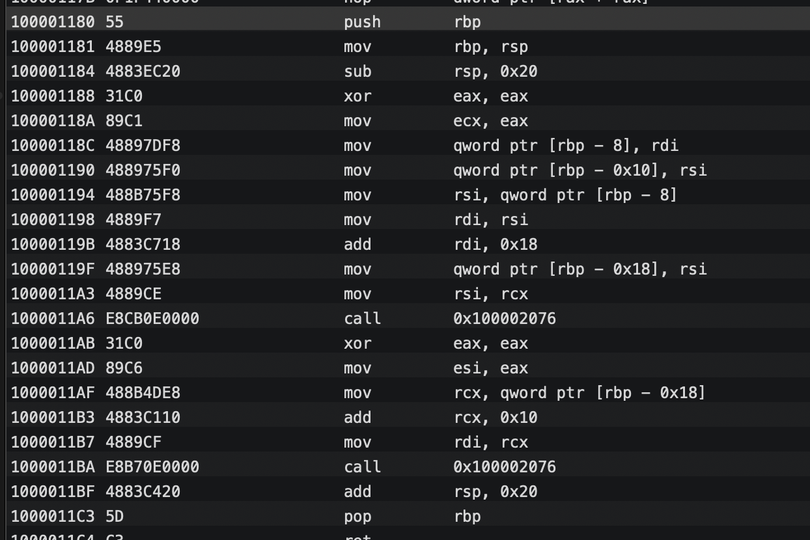

以我这点浅薄的汇编能力按行分析一下。。。

1.栈顶和栈基址寄存器处理。实例大小只有16个字节。利用异或重置寄存器等等。

2.分别取了把rdi寄存器和rsi寄存器的值，方法栈基址寄存器向前偏移`0x08`和`0x10`的指针赋值给在寄存器`rdi`和`rsi`。应该就是成员变量`name`的地址和`obj`的地址。

3.找到偏移为0x18这个成员变量的内存地址存放到rsi寄存器中。

4.然后竟然`call`了`0x100002076`查找一下竟然是`_objc_storestrong`的`stub`（此时我又检查了一遍`arm64`下的`mach-O`，竟然也是这样的。。。。）

5.重复对另一个最后一个成员变量，偏移为0x10这个做同样的操作。

5.重置栈顶寄存器，出栈。


这里分析下为啥这里会调用`_onjc_storeStong`:

1.当前内存需要释放没毛病，但是成员变量也是`OC`对象，因此也需要走一遍`release`的流程。所以这里通过`_objc_storestrong`来实现其释放。

2.通过对另一个类观察可以发现只有两个`NSStirng`的成员变量才会参与`cxx_destruct`的析构，所以这里只是利用了这个方法依次对`OC`变量的成员进行析构。

3.由于对成员变量调用了`release`，如果没有其它对象引用它则它也会被释放，这样就实现了`OC`对象的成员变量的依次释放。

所以析构的过程如下:


后来发现大佬sunnyxxx也写了一篇文章，从`LLVM`源码来分析的，也就进一步证实了这段汇编代码的产生的原因：https://blog.sunnyxx.com/2014/04/02/objc_dig_arc_dealloc/。


总结可知

1.只有含有`OC`类型成员变量的类才会在编译时注入`cxx_destruct`方法。

2.实例添加过多的`OC`类型成员变量会大大增加析构的流程。

3.可见`OC`对象的`OC`类型成员变量的析构是按高地址到低地址来的（从`ivars`列表反向顺序）。


### 动态链接信息

`LC_DYLD_INFO`也是`LINK EDIT`段的一部分，提取出来是方便`dyld`快速找到，而且位于符号表，字符表等信息之前。`dyld`通过它进行进行`rebase`，首先看一下结构:

```c
struct dyld_info_command {
   uint32_t   cmd;		/* LC_DYLD_INFO or LC_DYLD_INFO_ONLY */
   uint32_t   cmdsize;		/* sizeof(struct dyld_info_command) */
//rebase偏移。ASLR技术会导致slide的变化，dyld通过修正内部segment偏移
    uint32_t   rebase_off;	/* file offset to rebase info  */
    uint32_t   rebase_size;	/* size of rebase info   */
//绑定偏移，外部符号绑定时候使用    
    uint32_t   bind_off;	/* file offset to binding info   */
    uint32_t   bind_size;	/* size of binding info  */
//弱符号绑定偏移
    uint32_t   weak_bind_off;	/* file offset to weak binding info   */
    uint32_t   weak_bind_size;  /* size of weak binding info  */
//延迟加载符号绑定偏移    
    uint32_t   lazy_bind_off;	/* file offset to lazy binding info */
    uint32_t   lazy_bind_size;  /* size of lazy binding infs */
    uint32_t   export_off;	/* file offset to lazy binding info */
    uint32_t   export_size;	/* size of lazy binding infs */
};
```

苹果为了数据安全提供了[ASLR]()，所谓地址空间随机化即虽然每个`image`加载时虚拟地址是一整块，但是`ASLR`技术就使得起始地址并不唯一，每次都是随机的，这样即使知道`mach-o`的结构也不能根据起始地址+偏移来修改函数。所以我们再取mach-o`中数据时都需要通过`dyld`获取`slide`，再结合虚拟地址获取:

```c++
_dyld_get_image_vmaddr_slide(i)
```

#### Rebase Info

所以每次`dyld`加载`image`都需要先`rebase`，`dyld`中是通过寻找一块能容纳下所有`segment`的内存之后，

```c++
		uintptr_t lowAddr = (unsigned long)(-1);
		uintptr_t highAddr = 0;
	  //遍历segement，累加segment的的vm size
		for(unsigned int i=0, e=segmentCount(); i < e; ++i) {
      //取出segment虚拟地址
			const uintptr_t segLow = segPreferredLoadAddress(i);
      //取出segment vm size，这里限制必须以4KB向上取整。
			const uintptr_t segHigh = dyld_page_round(segLow + segSize(i));
			if ( segLow < highAddr ) {
				if ( dyld_page_size > 4096 )
					dyld::throwf("can't map segments into 16KB pages");
				else
					dyld::throwf("overlapping segments");
			}
			if ( segLow < lowAddr )
				lowAddr = segLow;
			if ( segHigh > highAddr )
				highAddr = segHigh;
				
			if ( needsToSlide || !imageHasPreferredLoadAddress || inPIE || !reserveAddressRange(segPreferredLoadAddress(i), segSize(i)) )
				needsToSlide = true;
		}
		if ( needsToSlide ) {
			// find a chunk of address space to hold all segments
      //找到一块可以容纳全部segment的内存地址并返回作为slide
			uintptr_t addr = reserveAnAddressRange(highAddr-lowAddr, context);
			slide = addr - lowAddr;
```

之后根据这逐个对segment进行地址偏移映射：

```c++
//获取原来的文件偏移
vm_offset_t fileOffset = (vm_offset_t)(segFileOffset(i) + offsetInFat);
//文件大小
vm_size_t size = segFileSize(i);
//计算rebase之后之后segment的address
uintptr_t requestedLoadAddress = segPreferredLoadAddress(i) + slide;
//利用mmap重新映射内存
void* loadAddress = xmmap((void*)requestedLoadAddress, size, protection, MAP_FIXED | MAP_PRIVATE, fd, fileOffset);
```

这样就解决了`ASLR`技术导致的内存偏移问题。而`rebase info`中则保留了segment是如何偏移的：

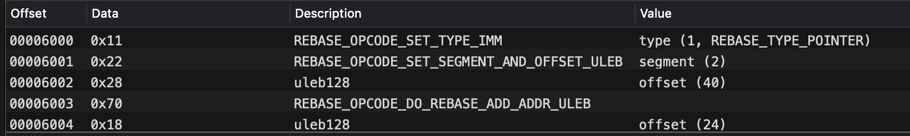

每一个`rebase info`都是一个字节的数即`0x00-0xFF`，分别表示操作数和数据，通过和`mask`按位与获取信息，高4位表示操作字，低4非表示立即数，具体的枚举可以参考`<mach-o/loader.h>`:

```c
#define REBASE_OPCODE_MASK					0xF0
#define REBASE_IMMEDIATE_MASK			  0x0F
```

这里分以一个0x11为例。 所以操作为`REBASE_OPCODE_SET_TYPE_IMM`，type为`REBASE_TYPE_POINTER`。而第二个`0x22`表示操作数为`REBASE_OPCODE_SET_SEGMENT_AND_OFFSET_ULEB,值为2，即表示对`segment 2`偏移，紧跟着是偏移值为数值。一般`DO_REBASE`命令时才会根据前面一段的重定位信息进行`rebase`。

而`codesign`则是另一个安全策略，用于验证`app`是没有被恶意篡改过的，简单说就是根据开发者的证书加密源代码数据的哈希，这样第一保证了确定是没有第三方动过App，第二保证了再审核过后开发者也不能动`App`。`codesign`是位于`mach-o`最后一段数据，但是其实它并不是对全部数据一次性的哈希然后加密，而是针对每个数据页进行的。

#### Bind info

而绑定信息则描述的是在通过`dyld`绑定之后的符号的信息，此时会根据这里找到源符号指针，然后把地址赋给源指针，这样动态绑定只需要绑定一次即可：

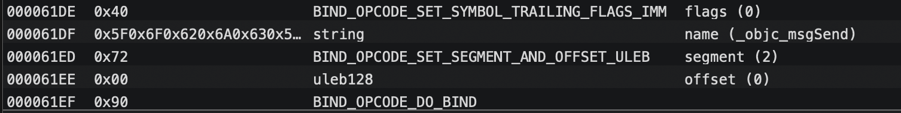

例如这里是`_objc_msgSend`在动态绑定完后`BIND_OPCODE_SET_SEGMENT_AND_OFFSET_ULEB`和`offset`共同标识了要写回的位置，即第二个`segment`的0偏移处，即`_got`的d一个函数指针，恰好就是`_objc_msgSend`的函数指针，所以这时候前面看到的`Non-Lazy symbol ptr`就不再是空指针了，而是指向了对象的内存，下一次访问该符号时便可直接把指针指向的数据插入。

`Lazy bind info`和`bind info`基本上是一样的就不在详述了。

#### Export Info

根据官方描述，它是一个树状结构，`terminal size`描述节点的大小，`chindren count`描述子节点的个数，flag描述节点的属性。`next node`描述下一个节点。大致可以简略如下:

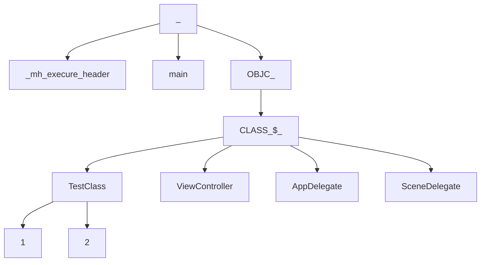

每个结点都通过`next node`指向下一个节点，每个节点都有`child count`描述有几个分支，`Node Label`描述节点的字符串。`Terminal size`描述节点最终大小，当且仅当叶子节点的值才大于0，此时`flag`存放了节点属性，`symbol offset`存放符号对应数据的偏移，例如`TestClass1`根据偏移找到数据为`objc_data`里的类信息。例如`mian`根据偏移找到的就是函数在`TEXT`段的汇编代码。

这样所有的符号字符就成了一个字典树，提高字符查找效率。之前一直好奇怎么通过符号找到指针，原来这样即可以通过这个来进行快速的查找。

## 探究的意义

1.我们观察一下`classlist`和`classrefs`，两者都是指针数组区别在于前者保存了所有存在的类，而后者则只保存了被引用的类（是符号被引用而不只是`import`），所以可以通过差集来判断哪些类存在但是未被使用，但是实践可以发现有一个坑点是仅仅通过`NSClassFromString`等`runtime`的方式使用的类也不会出现在这里，因为`mach-o`显示的只是编译后的信息，只是检查了代码中有没有对这些类符号进行使用。而`runtime`这些高级的东西，在编译时认为就是一坨字符串而已。

2.理解了动态加载的过程可以知道，移除不需要的库文件可以提高加载的速度。过度使用分类也会影响加载速度。

3.理解了符号在`mach-o`中如何找到函数指针的，我们就可以动态的改变`C`函数的实现，处理`Fishkook`这样的应用场景，甚至可以进行一些热更新的效果。

4.发现方法名成员变量名等等会存在于`mach-O`，是否应该考虑把类作为`namespace`,优化方法名和变量名长度来减少`mach-O`大小。

5.理解了成员变量和属性的区别可以帮助我们写出更高性能的代码。

6.理解了内存布局可以知道，对象时如何在内存中存在的，方法的调用原理，可以让我们写出更高效的代码。

7.以后写代码时注意抽象，和利用技巧压缩代码量也可以有效的减少`mach-O`的大小。


## 参考资料

https://developer.apple.com/library/archive/documentation/DeveloperTools/Conceptual/MachOTopics/0-Introduction/introduction.html#//apple_ref/doc/uid/TP40001519

https://developer.apple.com/library/archive/documentation/System/Conceptual/ManPages_iPhoneOS/man3/dyld.3.html

https://developer.apple.com/library/archive/documentation/Performance/Conceptual/CodeFootprint/Articles/MachOOverview.html

https://github.com/facebook/fishhook

http://opensource.apple.com/tarballs/dyld

https://github.com/opensource-apple/objc4

https://blog.sunnyxx.com/2014/04/02/objc_dig_arc_dealloc/