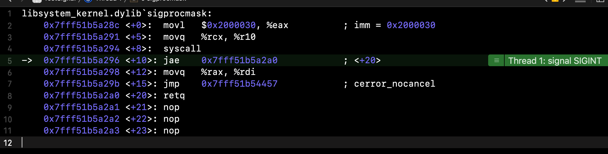
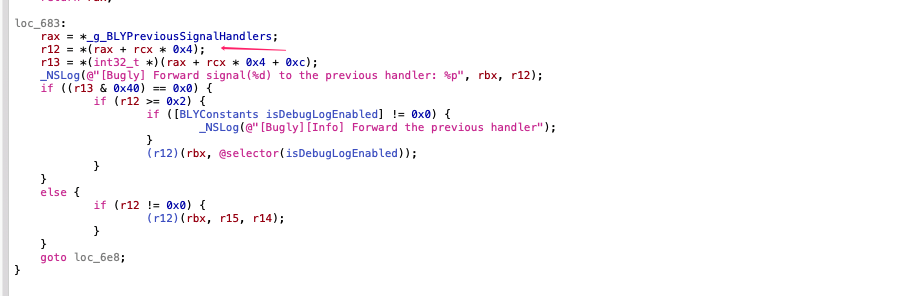

## 前言

最近为了复现一个1%概率左右的跨平台层的崩溃，在MSDK的TestApp中集成了一个`CrashHandler`来进行压力测试。借着解决问题的机会深入学习一下`Unix`的信号机制。并在本文讲述了如何实现一个[`CrashHandlerDemo`](https://github.com/joey520/Blogs/tree/master/TestSignal)。

<!--more-->

## 什么是信号

### 信号的定义

在上一次[讲Socket编程]()提到`SIGPIPE`时简单了解了一下`signal`函数，我们知道可以向进程注册一个指定的信号处理函数，以使进程在收到指定函数时触发该函数。那么信号到底是什么呢，UNIX环境高级编程中定义：<b>信号是软件中断，提供了一种处理异步事件的方法</b>。为什么说是软件的中断，因为信号触发的软件层进程执行的中断。即进程在执行时，收到信号时中断程序的运行执行中断处理函数（如果没有忽略该信号），然后再返回程序继续运行。为什么说是处理异步事件，因为信号是随机出现，进程是无法确定什么时候接收到信号，只能告诉内核在出现该信号时该如何处理，进程不会阻塞以等待信号，而是正常执行，直到信号发送过来。

所以可以理解信号就是一种进程通信手段用于通知进程发生了某个事件。举一个例子，在iOS13上不加蓝牙权限描述时打开App请求蓝牙权限就会崩溃，查看`crash log`可以看到：

```c
xception Type:  EXC_CRASH (SIGKILL)
Exception Codes: 0x0000000000000000, 0x0000000000000000
Exception Note:  EXC_CORPSE_NOTIFY
Termination Reason: TCC, This app has crashed because it attempted to access privacy-sensitive data without a usage description. The app's Info.plist must contain an NSBluetoothAlwaysUsageDescription key with a string value explaining to the user how the app uses this data.
Triggered by Thread:  1
```

可以看到崩溃的类型`SIGKILL`其实就当前进程在请求蓝牙权限时由于没有描述文件，内核发送一个[`SIGKILL`](https://en.wikipedia.org/wiki/Signal_(IPC))信号给当前进程。

### 信号集

`Unix`系统中利用`sigset_t`（信号集）来表示多个信号，在`darwin`系统中由于信号只有31种，因此采用一个`uint32_t`来表示`sigset_t`，说白了就是利用其不同的`bit`位来判断是否包含这个值的信号，系统也提供了一下几个函数进行信号集的处理：

```c
//sigemptyset用于清空信号集，这个宏命令就可以看到实现的原理了哈，很值得学习
#define	sigemptyset(set)	(*(set) = 0, 0)
int	sigemptyset(sigset_t *);
//sigfillset用于把信号集每一位都置为1，实现是按位取反
#define	sigfillset(set)		(*(set) = ~(sigset_t)0, 0)
int	sigfillset(sigset_t *);
```

<b>这里值得学习的一点是C语言的逗号运算符，`(*(set) = 0, 0)`第一个0是把指针指向`uint32_t`置为0，第二个0表示的是返回值。这种语法糖还是蛮有趣的。</b>

还有以下几个函数来进行信号集的增删改查:

```c
//sigismember用于判断set中是否包含某个信号
#define	sigaddset(set, signo)	(*(set) |= __sigbits(signo), 0)
#define	sigdelset(set, signo)	(*(set) &= ~__sigbits(signo), 0)
#define	sigismember(set, signo)	((*(set) & __sigbits(signo)) != 0)

__header_always_inline int
__sigbits(int __signo)
{
    return __signo > __DARWIN_NSIG ? 0 : (1 << (__signo - 1));
}
//因为Darwin系统中现在只有31个信号！所以在上面做了保护
#define __DARWIN_NSIG   32      /* counting 0; could be 33 (mask is 1-32) */
```

其实都是一些位域运算的封装，在系统源码中包括Runtime的源码中随处可见位运算的使用，作为源码必定需要足够高的性能，采用位域运算可以大大减少内存占用和处理效率。

### 信号传递控制

可以利用`sigprocmask`控制进程信号屏蔽集：

```c
//改变或检测信号屏蔽字,how描述如何处理。old_set用于检测当前进程的信号屏蔽字
//传入SIG_BLOCK表示将new_set指向的信号集<b>添加到</b>当前进程的信号屏蔽字，即阻塞这些信号
//传入SIG_UNBLOCK表示将new_set指向的信号集从当前进程的信号屏蔽字中移除，即释放这些信号
//传入SIG_SETMASK表示将new_set指向的信号集<b>作为</b>当前进程的信号屏蔽字（注意与SIG_BLOCK的区别）
//new_set传入的新的信号集
//old_set获取已存在的阻塞的信号集
int	sigprocmask(int how, const sigset_t * new_set, sigset_t * old_set);
```

被`sigprocmsk`阻塞的信号，无论发生多少次都会保存下来，可以通过`old_set`获取。但是设置为`SIG_UNBLOCK`时就会释放这些阻塞的信号。由于`sigset_t`只能通过每个bit保存一种信号的状态，所以无论接收到信号多少次，再次方法只会被传递一次。

`sigprocmask`一般只用于单线程的进程，因为它直接修改的进程的公共信号屏蔽集，所以对于多线程中使用需要在使用前进行声明和初始化，以保证数据的安全。

当系统阻塞了一些信号时，这些信号在触发之后就变成了未决的信号, 如何获取当前进程中未决的信号集呢，可以通过`sigpending`，我们用以下例子来实践一下信号的控制与未决信号的捕获：

```objective-c
sigset_t new_set, old_set, pending_set;
    sigemptyset(&new_set);
    sigemptyset(&old_set);
    sigemptyset(&pending_set);
    //屏蔽这3个信号
    sigaddset(&new_set, SIGINT);
    sigaddset(&new_set, SIGQUIT);
    sigaddset(&new_set, SIGABRT);
    //阻塞new_set信号集
    sigprocmask(SIG_BLOCK, &new_set, &old_set);
    printf("new set is %8.8d, old set is:%8.8d\n", new_set, old_set);
    sigpending(&pending_set);
    printf("Pending set is %8.8d.\n", pending_set);
	  //Kill函数即像指定的进程发送信号，并且kill -l可以查看到信号集合
    kill(getpid(), SIGINT);
    sigpending(&pending_set);
    printf("Pending set is %8.8d.\n", pending_set);
    kill(getpid(), SIGQUIT);
    sigpending(&pending_set);
    printf("Pending set is %8.8d.\n", pending_set);
    kill(getpid(), SIGABRT);
    sigpending(&pending_set);
    printf("Pending set is %8.8d.\n", pending_set);
    //释放信号
//    sigprocmask( SIG_UNBLOCK, &new_set, &old_set );
    if (sigismember(&pending_set, SIGINT)) {
        printf("SIGINT was came.\n");
    }
    if (sigismember(&pending_set, SIGQUIT)) {
        printf("SIGQUIT was came.\n");
    }
    if (sigismember(&pending_set, SIGABRT)) {
        printf("SIGABRT was came.\n");
    }
    NSLog(@"code run here");
```

运行之后结果如下:

```c
new set is 00000038, old set is:00000000
Pending set is 00000000.
Pending set is 00000000.
Pending set is 00000004.
Pending set is 00000036.
SIGQUIT was came.
SIGABRT was came.
2020-12-29 23:51:00.548057+0800 TestSignal[86096:15391848] code run here
```

`sigpending`成功捕获了未决的信号，如果我们把代码中注释的`sigprocmask`释放掉(`SIG_UNBLOCK`)会怎么样呢:

```c
new set is 00000038, old set is:00000000
Pending set is 00000000.
Pending set is 00000002.
Pending set is 00000006.
Pending set is 00000038.
```

程序运行到这里直接崩溃了，因为阻塞的信号被释放了，进程收到了`SIGINT`信号，并且进程被干掉了所以后面就没有执行了。通过查看奔溃的`frame`可以看到，崩在了`sigpromask`之后，那么看一下它到底做了什么：



要看懂这一段代码我们需要找到`systemcall.h`，路径为： 

```shell
/Applications/Xcode.app/Contents/Developer/Platforms/iPhoneOS.platform/Developer/SDKs/iPhoneOS.sdk/usr/include/sys
```

`systemcall.h`列举了所有系统调用的参数表，可以看到所有的系统调用接口全部用了一个数字来表示，根据苹果的注释可以知道该文件是由`xnu`源码中的`systemcalls.master`生成的。因此我们下载一下[xnu内核源码](https://github.com/apple/darwin-xnu)。利用`cat`工具打开`systemcalls.master`文件可以看到，这里只截取部分需要的信息如下：

```c
cat /Users/joey.cao/Desktop/Learning/LLVM/darwin-xnu-master/bsd/kern/syscalls.master
;	derived from: FreeBSD @(#)syscalls.master	8.2 (Berkeley) 1/13/94
//简要的看了眼makesyscalls.sh，它解析这个.master配置文件生成了一下代码
;System call name/number master file.
; This is file processed by .../xnu/bsd/kern/makesyscalls.sh and creates:
;	.../xnu/bsd/kern/init_sysent.c
;	.../xnu/bsd/kern/syscalls.c
;	.../xnu/bsd/sys/syscall.h
;	.../xnu/bsd/sys/sysproto.h
;	.../xnu/bsd/security/audit_syscalls.c
  
  //这个文件定义了系统调用参数与函数原型的映射表，每一个调用对应一个函数模型
 1	AUE_EXIT	ALL	{ void exit(int rval) NO_SYSCALL_STUB; }
...
48	AUE_SIGPROCMASK	ALL	{ int sigprocmask(int how, user_addr_t mask, user_addr_t omask); }
```

所以我们分析下上图`sigpromask`的堆栈，首先把`0x2000030`赋值给`eax`寄存器。由于`BSD`层在`Mach`层之上，`mach`层占用了前`0x2000000`。所以`BSD`层的系统调用需要从逻辑地址`0x2000000`开始。所以这里实际表明调用的系统调用参数为48（注意这里是16进制），即正好就是`SYS_sigpromask`，它的函数原型如下:

```c
#define	SYS_sigprocmask    48
48	AUE_SIGPROCMASK	ALL	{ int sigprocmask(int how, user_addr_t mask, user_addr_t omask); }
```

此时把参数`rcx`寄存器的值传入`r10`寄存器，作为调用函数的`syscall`的入参。然后可以看到是一个`jae`判断函数，判断的是`0x7fff51b5a2a0`下面`jmp`的返回值，我们查看`0x7fff51b5a2a0`这段函数地址，到底做了什么：

```shell
(lldb) image lookup --address 0x7fff51b54457
      Address: libsystem_kernel.dylib[0x00007fff51b54457] (libsystem_kernel.dylib.__TEXT.__text + 1095)
      Summary: libsystem_kernel.dylib`cerror_nocancel
```

正如注解所示，这里`jmp`的是`cerror_nocancel`。在`xnu`源码的`errno.c`中可以找到：

```c
//可以看到errno保存在一个全局变量里，所以永远只会保存最新的一次systemcall的结果
int errno;

int * __error(void)
{
	void *ptr = _os_tsd_get_direct(__TSD_ERRNO);
	if (ptr != NULL) {
		return (int*)ptr;
	}
	return &errno;
}
__attribute__((noinline)) cerror_return_t cerror_nocancel(int err)
{
	errno = err;
	int *tsderrno = (int*)_os_tsd_get_direct(__TSD_ERRNO);
	if (tsderrno) {
		*tsderrno = err;
	}
	return -1;
}
```

可以看到，这里`cerror_nocancel`把传入信号值并通过转换获取到对应的错误码并赋给了`errno`。这也就是为什么当系统出现错误时可以实时的通过`errno`获取，然后由于错误进程终止。

## 信号处理

在早期的`POSIX`系统中提供了不可靠的信号机制，而为了向后兼容需要这些旧的信号语义的程序，提供了`signal`函数，但是正如之前分析过的`signal`的实现来看，有一个非常大的问题就是`signal`函数只能传递一个函数指针，那么如果有多个地方调用了`signal`函数只有最后一次传入的函数指针才会被保存:

```c
void(*signal(int, void (*)(int)))(int);
```

不过在`4.4BSD`之后，以及`MACOS`和`FreeBSD`上其实现遵循了`sigaction`的函数定义，在苹果的[main page](https://developer.apple.com/library/archive/documentation/System/Conceptual/ManPages_iPhoneOS/man2/sigaction.2.html)上也可以找到相应的描述，这个是可靠的，因此可以认为在我们开发使用时`signal`函数对信号捕获是可靠的。`sigaction`方法提供了设置和检测信号的能力，并且能获取对信号已经设置的`action`，因此可以保全其它用户对信号捕获的处理：

```c
//signo表示需要检测或者修改的信号
//new_action表示要设置新的信号action
//old_action如果不为空，则会获取已经存在的针对signo的处理action
int	sigaction(int signo, const struct sigaction * new_action, struct sigaction * old_action);
```

`sigaction`的定义也是很复杂的，它不仅内部有一个`__sigaction_u`来保持信号处理函数指针，还利用`sa_mask`来设置屏蔽字，`sa_flags`来设置需要捕获的信号：

```c
struct  sigaction {
  //可以看到这里signalHandler是一个union做到了向前兼容旧的signal
	union __sigaction_u __sigaction_u;  /* signal handler */
	sigset_t sa_mask;               /* signal mask to apply */
	int     sa_flags;               /* see signal options below */
};
/* Signal vector template for Kernel user boundary */
struct  __sigaction {
	union __sigaction_u __sigaction_u;  /* signal handler */
	void    (*sa_tramp)(void *, int, int, siginfo_t *, void *);
	sigset_t sa_mask;               /* signal mask to apply */
	int     sa_flags;               /* see signal options below */
};
typedef struct __siginfo {
	int     si_signo;               /* signal number */
	int     si_errno;               /* errno association */
	int     si_code;                /* signal code */
	pid_t   si_pid;                 /* sending process */
	uid_t   si_uid;                 /* sender's ruid */
	int     si_status;              /* exit value */
	void    *si_addr;               /* faulting instruction */
	union sigval si_value;          /* signal value */
	long    si_band;                /* band event for SIGPOLL */
	unsigned long   __pad[7];       /* Reserved for Future Use */
} siginfo_t;
```

可以看到`__sigaction_u`是一个`union`，其实就是为了兼容旧的`signal`的处理函数：

```c
/* union for signal handlers */
union __sigaction_u {
	void    (*__sa_handler)(int);
	void    (*__sa_sigaction)(int, struct __siginfo *,
	    void *);
};
```

在支持`sigaction`的系统中，`sigaction`兼容`signal`函数，具体的实现可以参考`UNIX环境搞基编程`这本书，一句话说就是把上面`union`里的`__sa_handler`指向对应的`signalHandler`。由于这里仅仅只是一个`union`两种处理函数是不能共存的，所以切记不要冲突了。

## 实现一个`CrashHandler`

### 异常的捕获

异常也是一种常见的处理机制，例如OC中的`NSException`，不仅在系统代码会产生异常，开发者也可以在出错时主动产生异常来获取到错误信息。异常触发实质上是调用`NSAssertionHandler`:

```objective-c
- (void)handleFailureInMethod:(SEL)selector object:(id)object file:(NSString *)fileName lineNumber:(NSInteger)line description:(nullable NSString *)format,... NS_FORMAT_FUNCTION(5,6);
```

对于异常的捕获很简单，系统已经封装的很完美了，只需要调用`NSSetUncaughtExceptionHandler`传入一个按下面模板的函数指针即可：

```objective-c
typedef void NSUncaughtExceptionHandler(NSException *exception);
```

特别注意的是，有可能在你注册`handler`之前已经有人注册了，所以需要先调用`NSGetUncaughtExceptionHandler`来判断是否已经有注册了，如果有则保存下来，等`exception`触发时再通知到先前注册的`handler`。如果每一个新注册的人都能这样进行异常的传递，那么所有的`exception handler`才能都被触发。

```objective-c
    if (NSGetUncaughtExceptionHandler()) {
        preExceptionHandler = NSGetUncaughtExceptionHandler();
    }
    NSSetUncaughtExceptionHandler(ExceptionHandler);
```

### 信号的捕获

信号控制已经了解的足够充分了，但是在进行信号捕获时仍然需要注意一些细节。例如保存上一次的`sa_sigaction`，虽然`sa_action`已经做到了向前兼容`sa_handler`，但是想做的够保险，还是需要根据`sa_flag`来判断，以及自己在注册`sa_action`时注意更新`sa_flag`。

 还有一点需要注意的是应该为每个`signal`保存不同的`sa_sigaction`或`sa_handler`，因为你也不知道之前调用者对不同的`signal`采用了不同的处理，或者多个用户各自监听了不同的信号。所以最保险的方法就是存储下每个`signal`对应的处理函数：

```objective-c
   for (NSNumber *signalValue in needCatchedSignals) {
        int signo = signalValue.intValue;
        //首先获取old_action
        struct sigaction old_action;
        bzero(&old_action, sizeof(sigaction));
        //获取旧的action
        int ret = sigaction(signo, NULL, &old_action);
        if (ret < 0) {
            printf("sigaction old action failed: %s\n", strerror(errno));
        }
#if DEBUGLOG
        printf("old_action sa_mask: %8.8d\n", old_action.sa_mask);
        printf("old_action sa_flags: %8.8d\n", old_action.sa_flags);
#endif
        //如果已经有注册的sigaction
        if (old_action.sa_flags & SA_SIGINFO) {
            //把已有的处理函数指针保存下来
            preSignalActions[signo] = old_action.sa_sigaction;
        }
        //注意sa_handler和sa_sigaction是不能共存的
        else if (old_action.sa_handler) {
            preSignalHandlers[signo] = old_action.sa_handler;
        }
        //注册新的action
        struct sigaction new_action;
        bzero(&new_action, sizeof(sigaction));
        sigemptyset(&new_action.sa_mask);
        new_action.sa_sigaction = SignalAction;
        //设置SA_SIGINFO标记位
        new_action.sa_flags = SA_NODEFER | SA_SIGINFO;
        ret = sigaction(SIGALRM, &new_action, NULL);
        if (ret < 0) {
            printf("sigaction new action failed: %s\n", strerror(errno));
        }
    }
```

虽然已经做了很多考虑，但是仍然不能确保其它用户是否规范的使用`signal`，只能自求多福吧。。。

### Bugly的实现

[Bugly](https://bugly.qq.com/v2/)是腾讯出的一款用于统计用户崩溃等功能的第三方SDK，可以捕获到非常全的崩溃信息，尤其是崩溃日志非常详细，此次我们主要为了追踪一个已知但是偶现的bug所以还不需要那么齐全的堆栈。不过查看下`Bugly`的实现总是好的，首先查看下符号，大致就能推测出一些功能的实现逻辑，对于`Signal`进行了捕获处理:

```c
//可以知道有一个BLYCrashSignalHandler的OC类
0000000000083fd0 (__DATA,__objc_data) external _OBJC_CLASS_$_BLYCrashSignalHandler
0000000000083ff8 (__DATA,__objc_data) external _OBJC_METACLASS_$_BLYCrashSignalHandler
...
0000000000085d78 (__DATA,__bss) non-external _g_BLYSignalHandlerInstalled
0000000000085d80 (__DATA,__bss) non-external _g_BLYSignalStack
//果然也保存了了已有的Signalhandlers
0000000000085d98 (__DATA,__bss) non-external _g_BLYPreviousSignalHandlers
0000000000085da0 (__DATA,__bss) non-external _gSignalHandlerForward
```

对于`exception`也进行了捕获处理:

```c
//封装了一个exception类
0000000000084340 (__DATA,__objc_data) external _OBJC_CLASS_$_BLYCrashUserException
0000000000084368 (__DATA,__objc_data) external _OBJC_METACLASS_$_BLYCrashUserException
  //也有一个OC的BLYCrashUncaughtExceptionHandler类
0000000000084390 (__DATA,__objc_data) external _OBJC_CLASS_$_BLYCrashUserExceptionHandler
00000000000843b8 (__DATA,__objc_data) external _OBJC_METACLASS_$_BLYCrashUserExceptionHandler
0000000000084070 (__DATA,__objc_data) external _OBJC_CLASS_$_BLYCrashUncaughtExceptionHandler
//保存上一次的excptionHandler并传递
0000000000085dc0 (__DATA,__bss) non-external _g_BLYPreviousUncaughtExceptionHandler
0000000000085dc8 (__DATA,__bss) non-external _gUncaughtExceptionHandlerForward
```

为了进一步确认它的实现，我们使用了一个非常好用的逆向工具[Hopper DIsassembler](https://www.hopperapp.com)。只关注一些实现例如上一次的action的通知的逻辑:



先分析一下这一段代码，把`_g_BLYPreviousSignalHandlers`保存到`rax`寄存器，通过其它的代码可以看到Bugly的是在`UIVIewController`分类`+ (void)load`的时候就开始注册捕获信号了，这是一个非常早的时机。此时把信号对应的处理函数保存到了`_g_BLYPreviousSignalHandlers`这个静态数组中，然后`r12`这里是以信号值`rcx`按4字节对齐来偏移寻找到信号对应的处理函数。然后调用该函数，并把三个参数传入。可以看到思路和我们基本是一样的。


## 参考资料

UNIX环境高级编程（https://item.jd.com/12720738.html）

https://en.wikipedia.org/wiki/Signal_(IPC)

进入内核态究竟是什么意思？ - 灵剑的回答 - 知乎 https://www.zhihu.com/question/306127044/answer/555327651

https://www.cnblogs.com/bakari/p/5520860.html

https://github.com/apple/darwin-xnu

https://developer.apple.com/library/archive/documentation/System/Conceptual/ManPages_iPhoneOS/man2/syscall.2.html

https://developer.apple.com/library/archive/documentation/System/Conceptual/ManPages_iPhoneOS/man2/sigaction.2.html

https://bugly.qq.com/v2/

https://www.hopperapp.com