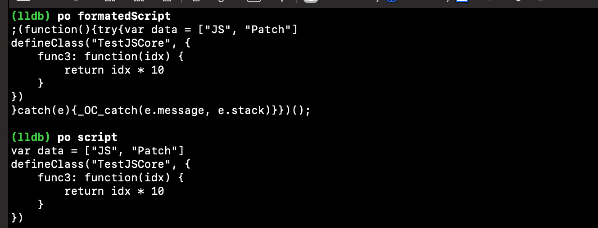
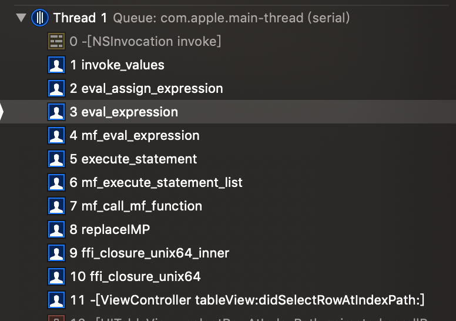
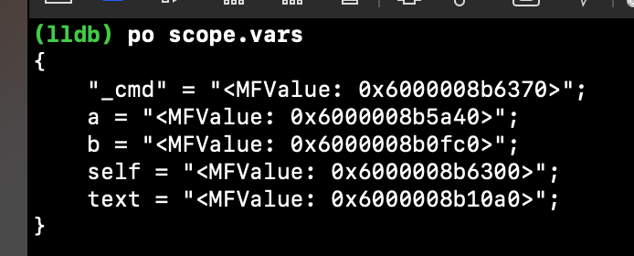
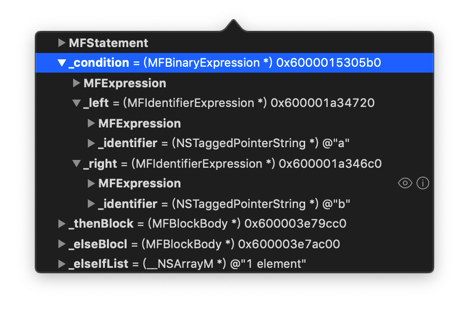

## 前言

之前一直听说过[libffi](https://github.com/libffi/libffi)大名，但是并没有时间去真正了解，也了解过一些热修复的软件，但是很好奇它们是如何做到函数不参与编译而无中生有注入到执行序列的。本文对两种热修复软件[JSPatch](https://github.com/bang590/JSPatch)和[mangoFix](https://github.com/YPLiang19/Mango)如何执行利用脚本文件执行代码进行了分析。

<!--more-->


## 函数的本质

无论是OC的方法还是C函数。 本质上都是程序段的汇编实现，也就是说一段机器指令来指导CPU完成某个任务。所以要进行方法调用必定需要的是一段特定的汇编指令。即使是OC中的Block，我们知道也会在编译时生成一个2级命名函数，最终调用到的就是这个函数。

而且在调用时必须指明方法签名，因为函数签名决定了到底是调用哪个方法，怎么调用。

但是那些热修复工具注入的方法并没有参与编译又是如何做到无中生有的呢?

## JSPatch的实现

热修复中最鼎鼎有名的当属[JSPatch](https://github.com/bang590/JSPatch)。它主要的原理是通过JSScriptCore和Runtime来运行时修改原来的代码，比如方法替换等等。所以也就是它需要在运行时注入原来的二进制文件中没有方法。那么又是如何做到的呢?

### JSContext

JSPatch依赖js的语法规则。在`startEngine`中创建了一个JSContext对象，并注入了多个基础方法，比如`defineClass`，`callI`等。为了避免冲突还加了一些前缀。 这些最基本的方法就是整个JSPatch引擎的核心部分。

先要了解一下JSContext。`JavaScript高级程序设计`给出的定义如下:

```
执行环境是JS中最为重要的一个概念，执行环境定义了变量或函数有权访问的其他数据，决定了它们各自的行为。每个执行环境都有一个与之关联的`变量对象`，环境中定义的所有变量和函数都保存在这个对象中。代码中是无法访问这个变量对象的，但是解析器在处理数据时会用到。Web浏览器中，全局执行环境会被认为是window对象，因此所有的全局变量和函数都是作为window对象的属性和方法创建的。每个函数在被调用时也会创建自己的执行环境 ......  
```

可以把这个东东认为是一个平台，js脚本的运行必须依赖它，同时还可以向其中注入函数，就像`startEngine`中做的那样。此时这些环境中就有了一些函数，在后续执行js脚本时就可以直接调用到它们了。 当然最厉害的是这些函数是直接调用源生的方法，同样的源生代码通过执行JS脚本也可以调用JS中的方法。 也就是说此时JSContext形成了一个桥:

```m
JSScript -----------》JSContext 《--------------Native
```

那么这个桥又是如何搭建起来的呢，先看看JS如何调用OC：

```objective-c
    context[@"_OC_defineClass"] = ^(NSString *classDeclaration, JSValue *instanceMethods, JSValue *classMethods) {
        return defineClass(classDeclaration, instanceMethods, classMethods);
    };
```

JSContext中注入的方法可以转换成OC的Block。 并且会按参数顺序传递到Block的参数中。那么就可以直接调用到OC了。

那么OC又是如何调用JS，通过的是`evaluateScript`这个方法来执行JS脚本。 所以就形成了OC调用JS再调用到OC。

不过这些还没到重点，如何把这个方法JS的方法注入到OC的类里呢？JSPatch会解析js脚本，拿到传入的方法参数。格式化之前和之后的效果如下:



然后取出第二个参数即一个JS方法体转换成JSValue（即下图中的参数）绑定到类身上。然后就开始超级长的逻辑通过runtime把方法替换到`msgForward`。 然后在Hook住msgForward。当原来的类调用到被Hook的方法时就会转到被hook的`msgForward`中。 然后取出JSValue拿到JS的方法，并传入参数进行执行，如此就实现了方法的替换。

JS方法的调用很简单，就是通过下面这个接口。

```objective-c
//传入参数列表调用JS方法
- (JSValue *)callWithArguments:(NSArray *)arguments;
```

当然由于JSPatch是一个要涵盖所有情况的开源库，整个过程是非常复杂，而且细节很多的，需要考虑非常多的情况。 

不过我们只需要知道其实是通过JSContext来实现方法互调就可以了。 也就是这种无中生有的方式依赖的是JSContext。JSContext提供了不编译代码就可以执行的方式。 


## MangoFix的实现

还有一种热修复的方案可以做到运行时注入代码，但是不需要使用JSContext。 [mangoFix](https://github.com/YPLiang19/Mango)利用Yacc解析器来进行文本文件的解析，然后动态插入方法。

关于yacc的部分，放着下次再学习。先看一下MangoFix是怎么把方法注入的。

由于这个代码写的很多文件，看起来并不是那么方便，搜索一下看到还是利用了NSInvocation来进行调用的。所以打一个符号断点。 直接跑一把Demo，然后查看堆栈来进行回溯。可以看到调用栈如下：



大致可以知道就是利用libffi，把原始方法进行替换，换成了下面这个方法。就是在replaceIMP这个方法之后进还是经过组装得到NSInvocation进行动态调用:

```c++
static void replaceIMP(ffi_cif *cif, void *ret, void **args, void *userdata){
}
```

还是直奔主题libffi吧！


## Libffi

[libffi](https://github.com/libffi/libffi)是一个开源软件。可以实现C的动态调用。它可以运行时动态调用到某个C函数，也可以Hook C函数到指定的函数。

### 调用模板

在libffi中有一个调用模板`ffi_cif`，可以理解是对一次调用的描述，类似OC中的方法签名，结构如下:

```c
typedef struct {
  ffi_abi abi; //ABI
  unsigned nargs; //参数个数
  ffi_type **arg_types; //参入类型，类似iOS中的typeEncoding
  ffi_type *rtype; //返回值类型
  unsigned bytes; 
  unsigned flags;
#ifdef FFI_EXTRA_CIF_FIELDS
  FFI_EXTRA_CIF_FIELDS;
#endif
} ffi_cif;
```

通过它来描述一次方法调用所需要的关键信息：ABI，参数个数，返回值类型，函数签名。（放到OC里就是方法签名）。

`ffi_call`可以动态调用方法，需要传入调用模板，函数指针，参数已经保存返回值的地址：

```c
		//参数类型
    ffi_type **types;
    //typeEncoding
    types = malloc(sizeof(ffi_type *) * 2) ;
    //两个int
    types[0] = &ffi_type_sint;
    types[1] = &ffi_type_sint;
    //返回值类型
    ffi_type *retType = &ffi_type_sint;
    //设置参数
    void **args = malloc(sizeof(void *) * 2);
    int x = 1, y = 2;
    args[0] = &x;
    args[1] = &y;
    int ret;
    //ffi调用模板
    ffi_cif cif;
    //初始化模板，传入 ABI, 参数个数， 返回值类型和方法签名
    ffi_prep_cif(&cif, FFI_DEFAULT_ABI, 2, retType, types);
    // 动态调用fun1。 做一下类型转换避免编译器警告
    ffi_call(&cif, (void (*)(void))fun1,  &ret, args);
    NSLog(@"--- %d", ret);

//输出
2020-04-05 23:56:26.480321+0800 LibffiDemo[57553:1397731] --- 3
```

有没有感觉这玩意和NSInvocation很相像。 是的，因为这是函数调用的共同性。函数调用必须要约定好，称之为调用惯例(Calling Convention)。必须函数的参数和返回值对应的上，这样调用时取的参数内存才不会出现错误，返回时也有内存可以存放返回结果。 所以其实并不care谁来调用，只要准备好了调用条件就可以。

不过上面这个例子只是动态调用了一个本地的函数，还不能完全体现libffi的强大。在OC里我们可以通过IMP的替换来Hook方法，实现的原理即是同上面一样满足OC方法的调用约定即可。如下:

```c
void hookOCFunc(id self, SEL _cmd, ...) {
}
```

只要保证必须的两个参数self 和_cmd。 剩下的参数可以利用c的可变参数来实现。 这样就可以做到调用`hookOCFunc`来替换原有的实现了。不过缺点也有，比如如何确定返回值。 因此通常采用采用Hook的方式是替换成msgForward，这样就可以轻易的拿到NSInvocation，然后把returnValue传入。 比如JSPatch，Aspects都是这么做的，简化一下就是如下:

```objc
+ (void)testHookedOC {
    Class cls = object_getClass(self);
    IMP msgForwardIMP = _objc_msgForward;
  	//把原类的forwardInvocation替换成自己的hookMsgForward函数
		class_replaceMethod(cls, @selector(forwardInvocation:), (IMP)hookMsgForward, "v@:@");

    //再把要调用的test替换为forward。 所以此时调用test时最终调到的是hookMsgForward
    SEL selector = @selector(test4444);
    Method method = class_getInstanceMethod(cls, selector);
    char *typeDescription = (char *)method_getTypeEncoding(method);
    if (typeDescription == NULL) {
        typeDescription = "v@:@";
    }
    if (!class_addMethod(cls, selector, msgForwardIMP, typeDescription)) {
        class_replaceMethod(cls, selector, msgForwardIMP, typeDescription);
    }

    //调用一下。可以发现直接走到了hookMsgForward
    NSLog(@"--- %@", [self test4444]);
}
//这样做的好处是，可以直接获取到一个NSInvocation。 通过它可以进行返回指定传递等等。
//并且通过这个NSInvocation还可以方法的拿到参数列表
void hookMsgForward(id self, SEL _cmd, NSInvocation *invocation) {
  //如果是OC对象，可以利用 __autoreleasing来避免栈对象的释放，导致内存问题。
    __autoreleasing NSString *a = @"cao";
    [invocation setReturnValue:&a];
}

//输出
2020-04-06 16:00:30.400570+0800 LibffiDemo[88311:3227571] --- cao
```

但是这里有一个问题，它很依赖`msgForward`这个，而`msgForward`又是一个类唯一的，所以当多个工具都去`Hook msgForward`时就会出现问题，只会响应最后一个。因为`msgForward`这个selector只能对应到一个实现。举个例子，如果JSPatch和Aspect一起混用，就会因为他们都`Hook msgForward`而出错。

libffi同样提供了类似的Hook方式，并且不需要多做一道方法的替换，它可以直接把方法的函数指针替换到另一个函数，并且能够拿到相应的调用信息。 这样每个方法就是独立的了，然后在那个方法中利用`ffi_call`就可以调用到任意方法了。

### 面向切面

`libffi`更强大的地方是可以把任意函数转换到一个指定的函数，实现一个AOP的效果:

`ffi_prep_closure_loc`可以把函数调用封装成一个闭包，并且把指定到一个函数，这个函数会根据实际调用的规则传入参数，返回值信息和一个附带信息(userdata):

```c
//    替换方法。 由于替换的类方法，这里需要取到metaClass
    SEL sel = @selector(test:name:);
    Method m = class_getClassMethod(self, sel);
    const char *typeEncoding = method_getTypeEncoding(m);

    ffi_type **types;
    //构建参数类型
    types = malloc(sizeof(ffi_type *) * 2);
    //两个参数，第一个为int，第二个为NSSting *
    types[0] = &ffi_type_sint;
    types[1] = &ffi_type_pointer;
    //返回值类型
    ffi_type *retType = &ffi_type_void;
    //创建函数调用模板
    ffi_cif cif;
    ffi_prep_cif(&cif, FFI_DEFAULT_ABI, 2, retType, types);

    //声明一个函数指针
    void *imp = NULL;
    //创建closure,就是一个函数闭包。 它包含了一个函数指针。
    ffi_closure *closure = ffi_closure_alloc(sizeof(ffi_closure), (void **)&imp);

    //该方法通过closure把 函数原型，函数实体，上下文已经函数指针关联起来。
    //第一个参数closure
    //第二个参数是调用模板
    //第三个是Hook后的函数指针
    //第四个是传入的userdata。 你可以传入任何数据，作为传递时的调用。 这样在外部调用是就会把self作为userdata传递过去
    //第五个是之前闭包的指针。
    ffi_prep_closure_loc(closure, &cif, ffi_hookFunc, (__bridge void *)(self), imp);
    
    //释放闭包
    ffi_closure_free(closure);

    //如果当前没有这个方法，尝试添加，如果有的话替换IMP。 
		//此时imp就指向了ffi封装好的那个方法。并且在调用是把会userdata传入
    if (!class_addMethod(object_getClass(self), sel, imp, typeEncoding)) {
        class_replaceMethod(object_getClass(self), sel, imp, typeEncoding);
    }
```

这样，当方法调用时就会调用的是:

```c
//此时userdata传入的就是上面绑定的self。所以可以通过这里拿到全部的信息
void ffi_hookFunc(ffi_cif *cif, void *ret, void **args, void *userdata) { 
    //在此处在做消息转发， 利用ffi_call就可以任意调用其它函数了。 例如block等等
}
```

其实这么一看好像和`msgSwizle`没啥区别啊。如果在上面那一段里，不做`ffi_prep_closure_loc`，直接方法替换到`ffi_hookFunc`也依然可以做到调用到`ffi_hookFunc`的呀？

不过OC方法就有一个限制了，一定的默认有两个参数`self`, `_cmd`。也就是你Hook的C函数必须带这两个参数，如上面的例子。并且为了方便拿到消息转发的信息，又必须通过`msgForward`。 所以这么看下来libffi的通用性更广一点。还可以对单纯的C函数进行Hook。

### Libffi的实现原理

想更详细的了解实现原理可以参考[戴铭老师的课程](https://time.geekbang.org/column/article/98154)。但是核心可以归纳为一句话:

<b>如果少了编译过程，直接在运行时去动态地调用函数，就需要先生成动态调用相应寄存器和栈状态的汇编指令。而要达到事先生成相应寄存器和栈的目的，就不能使用遵循调用惯例的高级编程语言，而需要使用汇编语言。</b>

libffi的核心在于能通过`ffi_call`调用其他方法。实质上调用的是`ffi_call_SYSV`这个汇编实现:

```c
//在arm64下，这些参数按从左到右保存在x0 ... x5寄存器中
//在x86_64下，分别存放到di,si...中。
extern void ffi_call_SYSV (void *stack, void *frame,
                  void (*fn)(void), void *rvalue,
                  int flags, void *closure);
```

汇编源码主要做了一下6件事:

1.分配栈帧(stack，frame)。以及保存后续参数。

2.把参数转移到寄存器，并修改栈顶寄存器(sp)开辟栈空间。

3.把参数存放到寄存器，存放完毕释放上下文，留下栈里的参数。

4.调用fn执行的指令地址 (call x9)，即调用传入的参数。

5.函数执行完成时，就重新读取 rvalue 和 flags，回收栈内存。

6.保存返回值。

其实和msgSend非常类似，msgSend其实也是进行动态调用，把一个c函数的指针调用(msgSend)转换成真正需要调用的函数指针。

msgSend的具体原理可以参考[这篇文章](https://www.mikeash.com/pyblog/friday-qa-2017-06-30-dissecting-objc_msgsend-on-arm64.html)。


## MangoFix怎么做到无中生有的

在了解了libffi，就知道了Mongfix大致的执行过程。 本质上也是利用libffi进行了转换，但是仍然未能理解是如何做到动态把方法注入的。

经过代码一步一步调试，发现非常牛逼。它是在前面利用yacc解析语句后生成了多个`MFExpression`。 以它Demo中的例子，在mg文件中有一下语句:

```c
- (void)ifStatementExample{
	int a = 2;
	int b = 2;

	NSString *text;
	if(a > b){
		text = @"执行结果: a > b";
	}else if (a == b){
		text = @"执行结果: a == b";
	}else{
		text = @"执行结果: a < b";
	}
	self.resultView.text = text;
}
```

解析生成了5个MFStatement。其实相当于5条语句。 语句的类型有：

```c
MFStatementKindExpression //执行语句
MFStatementKindDeclaration //声明语句
...//以及几个if, siwtch之类的逻辑语句
```

这5条语句由yacc解析得到。此时需要执行就需要通过利用libffi拦截的方法，把参数传入`MFScopeChain`，注意这个`MFScopeChain`可以理解为执行环境（函数栈）。

`MFScopeChain`是一个链表结构可以保存多信息。并且可以把变量值保存下来。这里重点看一下执行的过程:

第一条语句是声明语句即 `int a = 2`，于是调用处理声明语句的方法。 只是把yacc解析的到statement强转为`MFDeclaration`。然后把值传入到一个封装的MFValue。 并存入Scope。

第二句还是声明语句，即`int b = 2`，同样的处理，相当于把b入栈。

第三句为类型声明语句，即上面的 `	NSString *text;`。此时也需要创建一个MFValue入栈（不过是给了一个默认值，就是开辟了）

第四句为if条件语句，即上面的逻辑判断。 这里就开始真的逻辑处理了，此时看一下Scope可以看到，已经有了保存了执行需要的变量：



和调用栈上的变量一样。此时只需要根据逻辑语句取出变量进行处理。解析的过程非常复杂，条件语句封装成对象如下:



相当于对 if (a==b)这一句进行了封装。然后判断。 比较过程如下:

```c
static void eval_gt_expression(MFInterpreter *inter, MFScopeChain *scope, MFBinaryExpression *expr){
	eval_expression(inter, scope, expr.left);
	eval_expression(inter, scope, expr.right);
	MFValue *leftValue = [inter.stack peekStack:1];
	MFValue *rightValue = [inter.stack peekStack:0];
	BOOL gt = gt_value(expr.left.lineNumber, leftValue, rightValue);
	MFValue *resultValue = [MFValue new];
	resultValue.type = mf_create_type_specifier(MF_TYPE_BOOL);
	resultValue.uintValue = gt;
	[inter.stack pop];
	[inter.stack pop];
	[inter.stack push:resultValue];
}
```

可以看到就是分别取出a和b然后进行并把结果放入栈。比较时很巧妙哈，采用的宏文本替换来利用编译器解决:

```c
//根据比较符来调用不同宏命令
compare_number_func(lt, <)
compare_number_func(le, <=)
compare_number_func(ge, >=)
compare_number_func(gt, >)
//利用文本替换把运算符插入，然后利用编译器计算结果
#define number_value_compare(sel,oper)\
switch (value2.type.typeKind) {\
case MF_TYPE_BOOL:\
return value1.sel oper value2.uintValue;\
case MF_TYPE_U_INT:\
return value1.sel oper value2.uintValue;\
case MF_TYPE_INT:\
return value1.sel oper value2.integerValue;\
case MF_TYPE_DOUBLE:\
return value1.sel oper value2.doubleValue;\
default:\
NSCAssert(0, @"line:%zd == 、 != 、 < 、 <= 、 > 、 >= can not use between %@ and %@",lineNumber, value1.type.typeName, value2.type.typeName);\
break;\
}
```

如此就可以进行计算了。

yacc解析时把if相关的语句编译进了一起，所以如果`if case`不满足，会继续执行下面的case直到找到结果为止。

第五句是执行语句，把结果赋值给 `self.resultView.text`。

可见MangoFix也无法做到无中生有，相反它构建了一个解释器系统，利用yacc解析文本，然后利用解释器系统调用对应的方法，然后通过runtime修改到OC上。


## 参考资料

https://github.com/libffi/libffi

http://sealiesoftware.com/blog/archive/2008/10/30/objc_explain_objc_msgSend_stret.html

https://github.com/YPLiang19/Mango

http://blog.cnbang.net/tech/3219/

https://blog.csdn.net/ayu_ag/article/details/50706429

https://time.geekbang.org/column/article/98154

https://www.mikeash.com/pyblog/friday-qa-2017-06-30-dissecting-objc_msgsend-on-arm64.html