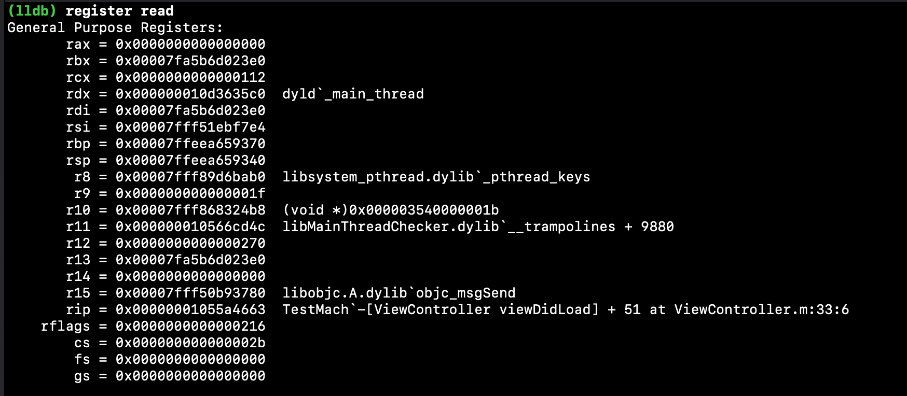

## 前言

最近看到一个有趣的问题，我们知道方法调用的本质是msgSend，反汇编时也可以看到实际调用的是msgSend，那么为啥堆栈中显示的反而是实际调用的方法，而不是msgSend呢？

<!--more-->


## 堆栈是什么

先理解下堆栈是什么。在计算机的内存上存在一种内存结构叫栈，地址是从上向下生长的，还有一种叫对堆内存是从下向上生长的。栈的空间由计算机来维护当出栈时就会销毁掉，并释放栈上的内存，因此方法调用需要在栈上分配临时变量，栈销毁时即释放栈上空间，而用户自己申请的需要长时间持有的对象内存就需要手动在堆上分配并手动释放。

每一次函数调用都需要开辟一个新的调用栈（内联函数，尾调用除外）。因此必须有寄存器记住栈顶（sp）和栈基址(bp)。初次之外还需要ip寄存器（指令计数器）等等，以及各种入参的寄存器(di,si,dx,cx,r8,r9)，返回值寄存器(ax)等等，以及代码执行中使用的通用寄存器等等。可以认为每一个栈都是通过这些寄存器来进行描述的。

以一个简单例子看看`x86_84`下堆栈的样子:


这是一个没有加任何一句代码的`viewDidLoad`的方法的反汇编。可以看到：

1.首先需要把栈基址寄存器入栈，它决定了当前方法的起始内存。此次栈的bp就是上一个栈的sp。

2.栈顶寄存器减少`0x20`。这是由于栈是向下生成的，给栈开辟了`0x20`的空间，即这个栈需要32字节的空间。

3.分别把两个参数`self`, `_cmd`，压入栈中。一般rdi为第一个参数，rsi为第二个参数。


4.由于这里调用了`[super viewDidLoad]`，所以实际还需要产生一个`objc_super`，这个结构体占用16个字节，因此加起来就是栈的的总空间32个字节。先把`-0x8(%rbp)`(self)转移到rsi,再取出rsi(self)转移到`-0x20(%rbp)`(即receiver上)。

再通过当前指令地址ip进行位移找到`class`数据存放的内存转移到`-0x18(%rbp)`即`super_class。

```c++
struct objc_super {
    __unsafe_unretained _Nonnull id receiver;
    __unsafe_unretained _Nonnull Class super_class;
};
```

```shell
//查看class内存可以看到，其实是取出了数据段存放的类信息数据指针
image lookup --address 0x00000001017ff3d8
      Address: TestThreads[0x00000001017ff3d8] (TestThreads.__DATA.__objc_data + 0)
      Summary: (void *)0x000000010429b400: ViewController
```

<b>可以看到这里虽然命名为`super_class`实际传入的是当前的对象的类`class`</b>。这是就涉及到msgSendSuper的实现了:

```assembly
/********************************************************************
 * id objc_msgSendSuper2
 ********************************************************************/

	ENTRY _objc_msgSendSuper2
	UNWIND _objc_msgSendSuper2, NoFrame
	
	// objc_super->class is superclass of class to search
	
// search the cache (objc_super in %a1)
	movq	class(%a1), %r10	// cls = objc_super->class
	movq	receiver(%a1), %a1	// load real receiver
	movq	8(%r10), %r10		// cls = class->superclass //去class的superClass作为参数入参
	CacheLookup NORMAL, CALL	// calls IMP on success
	...
```

可以看到，确实是取的class,然后去后isa后的8个字节即superClass才执行的。也就是`msgSendSuper`实际是在汇编实现时直接从当前对象类的父类开始进行方法查找的。

6.分别把`objc_super`和`_cmd`转移到寄存器rdi和rsi上作为`msgSendSuper`方法的入参进行调用。

7.更新栈顶寄存器，出栈基址寄存器，重置返回值寄存器。

## Mach中堆栈

由[官方文档](https://developer.apple.com/library/archive/documentation/Darwin/Conceptual/KernelProgramming/About/About.html#//apple_ref/doc/uid/TP30000905-CH204-TPXREF101)可知，Mach最基本的功能之一是进程/线程的通信和调度。不过在Mach中引入了task的概念，它是一种和进程相似的资源管理单元，但是比进程更轻量级。一个任务就是一个独立的资源分配单位，内部包含了多个线程。它是和BSD的进程一一对应的，不过Mach内核是不需要知道上层进程的信息的。这样可以保证微内核足够的简单与高效。

通过`mach_task_self()`可以拿到当前任务所处进程对应的task的端口。一下几个`<mach/mach_init.h>`中声明的方法，可以获取到内核线程和host。Host可以看做机器内核本身，

```c
xtern mach_port_t mach_host_self(void); //获取当前host
extern mach_port_t mach_thread_self(void); //获取当前的mach线程
extern kern_return_t host_page_size(host_t, vm_size_t *); //获取host的页大小。
```

### Mach Host

Host是就是机器内核，通过它可以获取到系统内核的信息:

```c
    //获取Host句柄
    host_t myhost = mach_host_self();
    kernel_version_t version;
    //获取Cpu version
    kern_return_t kr = host_kernel_version(myhost, version);
    mach_msg_type_number_t count = HOST_BASIC_INFO_COUNT;      // size of the buffer
    host_basic_info_data_t hinfo;
    //获取host信息
    kr = host_info(myhost,              // the host name port
                   HOST_BASIC_INFO,     // flavor
                   (host_info_t)&hinfo, // out structure
                   &count);             // in/out size
    //获取虚拟内存页大小，单位为Byte
    vm_size_t size;
    kr = host_page_size(myhost, &size);
    //获取CPU类型转换的名称。这些定义都可以再meachine.h中找到
    char *cpuTypeName = malloc(100);
    char *cpuSubTypeName = malloc(100);
    slot_name(hinfo.cpu_type, hinfo.cpu_subtype, &cpuTypeName, &cpuSubTypeName);
```

所以通过Host可以做一些系统状态的监测。通过Host还可以拿到进程的句柄等等信息。

### Task

task是内核资源分配的独立单元，每个task管理一块独立的虚拟空间。`<mach/task.h>`中声明了task的接口。

task的threads中包含了全部的线程，通过下面方法可以获取当前task下的所有线程:

```c
 kern_return_t ret = task_threads(mach_task_self(), &threads, &thread_count);
```

在Mach内核启动时会通过`thread_bootstrap()`初始化一个线程模板。之后的线程创建`thread_create()`都是通过这个模板来创建。

### Thread

内核的线程为`thread_t`。它映射到BSD层就是pthread，pthread比内核thread提供了更多接口和特性，比如线程名等等:

```c
//通过mach thread获取Pthread
pthread_t pthread = pthread_from_mach_thread_np(thread);
char name[100];
pthread_getname_np(pthread, name, sizeof(name));
```

在`<mach/thread_act.h>`定义了thread的行为。通过下面接口获取到线程的信息：

```c
kern_return_t thread_get_state
(
	thread_act_t target_act,      //线程编号
	thread_state_flavor_t flavor, //特性
	thread_state_t old_state,  //获取当前的线程状态
	mach_msg_type_number_t *old_stateCnt //线程状态个数
);
```

在系统中有一个兼容多平台的宏定义`_STRUCT_MCONTEXT64`。它是一个结构体，这里以64位darwin系统为例：

```c
#define _STRUCT_MCONTEXT64      struct __darwin_mcontext64
_STRUCT_MCONTEXT64
{
	_STRUCT_X86_EXCEPTION_STATE64   __es; //异常状态
	_STRUCT_X86_THREAD_STATE64      __ss; //线程状态
	_STRUCT_X86_FLOAT_STATE64       __fs; //浮点状态
};
```

通过上面的`thread_get_state`可以把线程状态信息拷贝到``__ss``中。线程状态(``__ss``)说白了就是堆栈信息。也就是寄存器信息。每个线程有自己独立的一套寄存器信息，发送线程切换时会优先保存下寄存器信息。重新获取时间片后才回复寄存器信息。例如64位Darwin系统，64位为了避免冲突寄存器加了r前缀：

```c
#define	_STRUCT_X86_THREAD_STATE64	struct __darwin_x86_thread_state64
_STRUCT_X86_THREAD_STATE64
_STRUCT_X86_THREAD_STATE64
{
	__uint64_t	__rax;
	__uint64_t	__rbx;
	__uint64_t	__rcx;
	__uint64_t	__rdx;
	__uint64_t	__rdi;
	__uint64_t	__rsi;
	__uint64_t	__rbp; //栈基址寄存器
	__uint64_t	__rsp; //栈顶寄存器
	__uint64_t	__r8;
	__uint64_t	__r9;
	__uint64_t	__r10;
	__uint64_t	__r11;
	__uint64_t	__r12;
	__uint64_t	__r13;
	__uint64_t	__r14;
	__uint64_t	__r15;
	__uint64_t	__rip; //指令计数器
	__uint64_t	__rflags;
	__uint64_t	__cs;
	__uint64_t	__fs;
	__uint64_t	__gs;
};
```

还是以上一个例子:


这是在当前执行`[super viewDidLoad] `前的寄存器信息，此时IP寄存器正指向下一条要执行的指令:


可以看到其它的寄存器也还有一些不相干的信息，说明寄存器不会每个堆栈执行完都全部清理，一般只需要使用时候正确取值即可。所以本次调用栈不相干的寄存器保存的可能是之前某一次调用栈取值的数据。这里rdx是一般第3个参数才会使用到它，而它第一次被使用到是在起启动主程序时候，之后到断点前再也没有被使用过，所以保存了数据。

通过``thread_get_state``方法可以获取这一时刻该线程的状态。例如:

```c
kern_return_t fetchMachineContext(thread_t thread, _STRUCT_MCONTEXT *machineCxt) {
    mach_msg_type_number_t state_count = x86_THREAD_STATE64_COUNT;
  //把x86_64结构的线程状态拷贝到__ss指针
    kern_return_t ret = thread_get_state(thread, x86_THREAD_STATE64, (thread_state_t)&machineCxt->__ss, &state_count);
    return ret;
}
```

可以看到其实这个thread_state_t就是一个指针，指向的是那个寄存器结构体的数据。如此一来就可以拿到这一时刻该线程的执行状态了。

### Thread调用帧链

前面知道了栈帧的结构，那么在调用堆栈上，这些栈帧是怎么进行内存布局的呢。[KSCrash](https://github.com/kstenerud/KSCrash)给出了结构定义，

无论是i386，还是x86还是arm64。调用帧结构如下:

```c
typedef struct FrameEntry
{
    /** The previous frame in the list. */
    struct FrameEntry* previous; //上一个调用帧的指针
    /** The instruction address. */
    uintptr_t return_address; //当前栈返回地址即BP
} FrameEntry;
```

因此可知调用链就是一个链表结构。<b>这里特别要注意一点，帧的地址就是栈基址寄存器的地址。而每个帧的返回地址指针就是上一个栈的基址寄存器</b>。

内核为了能在出现异常时回溯调用过程，会把整个调用链的堆栈保存下来。在`<mach/vm_map.h>`提供了一些处理虚拟内存的方法，比如下面这个方法可以可以读取内存地址指向内存数据。

```
kern_return_t vm_read_overwrite
(
	vm_map_t target_task, //虚拟内存所处的task
	vm_address_t address, //传入一个内存地址
	vm_size_t size, //虚拟内存大小（要返回内存大小）
	vm_address_t data, //虚拟内存数据
	vm_size_t *outsize //真正返回的数据大小
);
```

[KSCrash](https://github.com/kstenerud/KSCrash)对这个方法进行了非常好的，封装，实现了一套mach内核的操作接口。KSCrash已经不单单只是一个崩溃收集工具，简直就是无数小工具的瑰宝。

通过链表的遍历，依次取出每一个帧的信息，主要是return_address，即每一个调用栈入口:

```c
        //栈帧是一个链表式结构
        FrameEntry frame = {0};
        //拷贝调用帧的数据
        //首先通过machineCxt中保存的最后栈的栈基址获取最后一个调用栈的帧信息
        ret = copySafely((const void *)framePtr, (void *)&frame, sizeof(frame));
        if (ret != KERN_SUCCESS) {
            printf("copy stack frames failed\n");
            continue;
        }
        //按需要栈个数来往回回溯调用栈
         for (; i < kBacktraceCount; i ++) {
            //把上一个帧的指针（栈基址寄存器）入栈
            backtrace[i] = frame.return_address;
            //重新把上一个帧的数据拷贝入帧
            //栈不一定有50个，碰到空栈，表明前面已经没有数据了
            if (backtrace[i] == 0 || frame.previous == 0 ||
                copySafely(frame.previous, &frame, sizeof(frame)) != KERN_SUCCESS) {
                break;
            }
        }
```

这样就可以把整个调用栈回溯到backtrace数组中了，不过他们都只是指针，还需要通过Dyld转成符号信息:

```c
        //此时backtrace里已经是从最近的指令地址回溯的每一个栈基址寄存器指针
        //利用Dyld依次寻找每一个地址最近的符号信息
        for (int j = 0; j < i; j ++) {
          //依次取出每一个调用帧的地址指针
            uintptr_t bp = backtrace[j];
          //利用Dyld获取指针的符号信息
            Dl_info info;
            dladdr((void *)bp, &info);
          //计算地址偏移
            uintptr_t offset = bp - (uintptr_t)info.dli_saddr;
          //这里是模拟系统backtrace的格式进行输出
            NSString *str = [NSString stringWithFormat:@"%d %-30s  0x%08" PRIxPTR " %s + %lu\n" , j, lastPathEntry(info.dli_fname), (uintptr_t)bp, info.dli_sname, offset];
            printf("%s\n", [str cStringUsingEncoding:NSUTF8StringEncoding]);
        }
```

如此一来就可以拿到线程的栈调用情况，以及各个线程。

## 地址符号信息的获取

前面已经知道如何获取每个调用栈的栈基址，要转换成对应的符号信息还需要通过dladdr在dyld中查找地址对应的符号信息，如此这些地址指针就可以转换可读的函数名了。

dyld的实现是通过传入的地址找到对应的image，然后在image中查找与地址最相近的符号信息。为什么是最相近呢，因为例如一个函数，符号表中之后保存该函数的符号（例如字符串表中的位置。程序段的位置，所属库文件路径等等）。所以假如传入的是函数中的某个地址，不一定存在这样的符号，因此只能找最近的符号。

在dyld的``findClosestSymbol``中可以看的具体的实现

```c++
const char* ImageLoaderMachO::findClosestSymbol(const mach_header* mh, const void* addr, const void** closestAddr)
{
	//1.找到linkedit base，符号表，字符串表，和Index Table。 这一段省略
  // no symbol table => no lookup by address
	if ( (symtab == NULL) || (dynSymbolTable == NULL) || !linkEditBaseFound )
		return NULL;

	const uint8_t* linkEditBase = unslidLinkEditBase + slide;
	const char* symbolTableStrings = (const char*)&linkEditBase[symtab->stroff];
	const macho_nlist* symbolTable = (macho_nlist*)(&linkEditBase[symtab->symoff]);

	uintptr_t targetAddress = (uintptr_t)addr - slide;
	const struct macho_nlist* bestSymbol = NULL;
	// first walk all global symbols
	const struct macho_nlist* const globalsStart = &symbolTable[dynSymbolTable->iextdefsym];
	const struct macho_nlist* const globalsEnd= &globalsStart[dynSymbolTable->nextdefsym];
  //遍历符号表
	for (const struct macho_nlist* s = globalsStart; s < globalsEnd; ++s) {
 		if ( (s->n_type & N_TYPE) == N_SECT ) {
      //如果是找到的第一个，符号地址<=目标地址，注意这里的地址并不是函数栈中遍历的地址。
      //而是指汇编实现中的地址，因此若是同一个函数的实现，内部指令地址一定大于栈基址
			if ( bestSymbol == NULL ) {
				if ( s->n_value <= targetAddress )
					bestSymbol = s;
			}
      //如果已经找到了一个符号。但是新的符号更接近目标地址。
			else if ( (s->n_value <= targetAddress) && (bestSymbol->n_value < s->n_value) ) {
				bestSymbol = s;
			}
		}
	}
	// next walk all local symbols
  //遍历Local Symbols
	const struct macho_nlist* const localsStart = &symbolTable[dynSymbolTable->ilocalsym];
	const struct macho_nlist* const localsEnd= &localsStart[dynSymbolTable->nlocalsym];
	for (const struct macho_nlist* s = localsStart; s < localsEnd; ++s) {
    //调试符号不处理
 		if ( ((s->n_type & N_TYPE) == N_SECT) && ((s->n_type & N_STAB) == 0) ) {
			if ( bestSymbol == NULL ) {
				if ( s->n_value <= targetAddress )
					bestSymbol = s;
			}
			else if ( (s->n_value <= targetAddress) && (bestSymbol->n_value < s->n_value) ) {
				bestSymbol = s;
			}
		}
	}
  
  	if ( bestSymbol != NULL ) {
#if __arm__
		if (bestSymbol->n_desc & N_ARM_THUMB_DEF)
			*closestAddr = (void*)((bestSymbol->n_value | 1) + slide);
		else
			*closestAddr = (void*)(bestSymbol->n_value + slide);
#else
      //由于ASLR需要加上slide
		*closestAddr = (void*)(bestSymbol->n_value + slide);
#endif
      //返回符号名
		return &symbolTableStrings[bestSymbol->n_un.n_strx];
	}
	return NULL;
}

```

可以发现会优先处理本地符号，再处理外部符号。

## MsgSend的堆栈

但是这里依旧没有解决开头的问题，为什么msgSend并不在调用栈链里呢？因为msgSend这个方法是调用最频繁的方法，必须做到最大的优化。其中之一避免调用栈的开销，因此runtime把它以纯汇编的形式实现，相当于内嵌在当前的调用栈里执行，即它共用的是当前调用栈的空间，而不需要新开辟一个调用栈。以前面的例子：


查看此时的栈帧信息:



然后通过LLDB的`si`指令级别的步入，然后进入msgSend的调用栈:


可以看到msgSend的调用中不会入栈bp。并且完全使用寄存器，即不会对栈空间产生任何影响。

此时我们查看一下栈帧信息:

 

可以发现仍然是原来的`viewDidLoad`的栈基址，也就是当前还是处于`viewDidLoad`的调用帧里面。

所以msgSend并没有产生新的栈帧，所以在不会出现在backtrace里。

而OC的方法本质上是C的实现，在编译时通过IMP指针绑定到方法列表中而已。利用clang可以将其转换成Cpp：

```shell
xcrun -sdk iphonesimulator13.2 clang -rewrite-objc ViewController.m
```

转换后的Cpp代码如下:

```c++
static void _I_ViewController_test(ViewController * self, SEL _cmd) {
     NSLog((NSString *)&__NSConstantStringImpl__var_folders_64_2_nlwt_s6kq250l7_t5mfdzwrh9_pg_T_ViewController_a7c035_mi_0, __PRETTY_FUNCTION__);
 }

 
static void _I_ViewController_viewDidLoad(ViewController * self, SEL _cmd) {
     ((void (*)(__rw_objc_super *, SEL))(void *)objc_msgSendSuper)((__rw_objc_super){(id)self, (id)class_getSuperclass(objc_getClass("ViewController"))}, sel_registerName("viewDidLoad"));
     ((void (*)(id, SEL))(void *)objc_msgSend)((id)self, sel_registerName("test"));

 }
```

而这些方法由于不是系统特定的，无法得知其实现（即使是一些Foundation库自带的方法其实也没必要想msgSend这样来优化不开辟新栈)。所以这些OC方法在在转成汇编实现时必定要先开辟栈空间，所以就可以在backtrace中追溯到实际调用的方法了。


## 参考资料

https://opensource.apple.com

https://github.com/apple/darwin-xnu

https://developer.apple.com/library/archive/documentation/Darwin/Conceptual/KernelProgramming/About/About.html#//apple_ref/doc/uid/TP30000905-CH204-TPXREF101

https://developer.apple.com/library/archive/documentation/Darwin/Conceptual/KernelProgramming/scheduler/scheduler.html#//apple_ref/doc/uid/TP30000905-CH211-BABCHEEB

能否用简单通俗的话说一说什么是微内核？ - 余天升的回答 - 知乎 https://www.zhihu.com/question/20105717/answer/13993808

https://en.wikipedia.org/wiki/Microkernel

https://github.com/kstenerud/KSCrash

汇编过程调用是怎样操作栈的？ - 北极的回答 - 知乎 https://www.zhihu.com/question/49410551/answer/115870825

https://stackoverflow.com/questions/310974/what-is-tail-call-optimization